Author: Hiroyuki Nakazato
Summary: Databricks SQL on Azure ワークショップ
Id: docs
Environments: Web
Status: Published
Feedback Link: https://github.com/microsoft/azure-databricks-sql-workshop-ja

# Databricks SQL on Azure ワークショップ
## 始める前に
Duration: 00:10:00

このワークショップでは、Microsoft Azure のサービスと Microsoft Power BI を組み合わせて、以下のデータ分析プラットフォームをステップ バイ ステップで構築します。

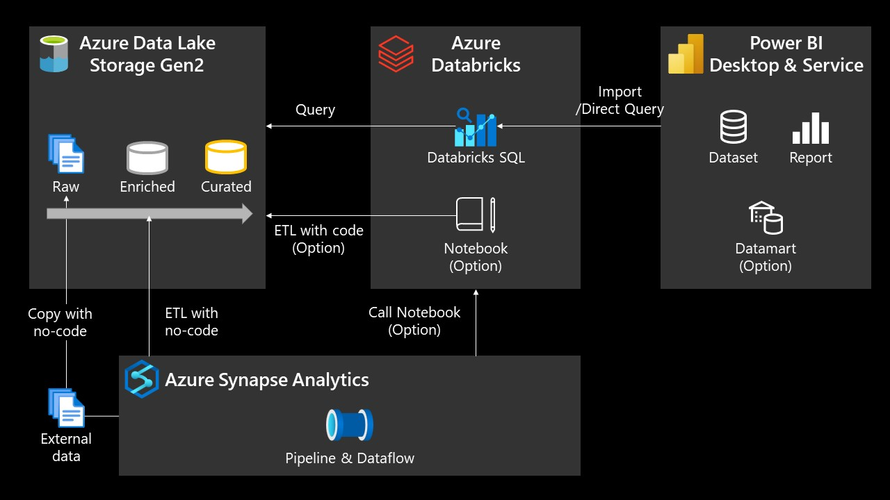

### **🎯 学習内容**
ワークショップを通じて以下の内容を学びます。

- Azure Synapse Analytics のコピー アクティビティを用いた外部データのコピー
- Azure Synapse Analytics のマッピング データ フローを用いた CSV から Delta Lake への変換
- Databricks SQL から Azure Data Lake Storage Gen2 (ADLS Gen2) への接続
- Databricks SQL を用いた ADLS Gen2 上のデータのクエリ
- Databricks SQL のダッシュボードを用いたデータの可視化
- Power BI Desktop と Databricks SQL を用いたデータの可視化

### **🔰 難易度**
- ワークショップのドキュメントには画面キャプチャ付きの詳細な手順を記載していますので、Azure にはじめて触れる方でも安心して進めて頂けます。
- Python や Spark のプログラムは分からないという方もご安心ください。できるだけ多くのスキル レベルの方に取り組んで頂けるよう、極力プログラムを書かずに進められるように構成しています。データの加工 (ETL) には、Azure Synapse Analytics のノーコード・ローコード ETL 機能である Synapse パイプラインとデータフローを主に用います。

### **📢 前提条件**
ワークショップ実施にあたっての前提条件は以下の通りです。

**前提条件** | **備考**
--- | ---
有効な **Azure サブスクリプション** を持っていること | 有効な Azure サブスクリプションを持っていない場合、[Azure の無料アカウント](https://azure.microsoft.com/ja-jp/free/) の利用を検討してください
受講者のうち少なくとも 1 人が Azure サブスクリプションまたはリソース グループの **所有者** ロールまたは **ユーザー アクセス管理者** ロールを持っていること | 他の受講者にロールを割り当てる必要があるためです
ワークショップで利用するリージョン (特段の希望がなければ東日本リージョン) の以下のクォータの値が **`24 vCPU × 受講者数`** 以上になっていること<ul><li>リージョンの vCPU の合計<li>Standard EDSv4 ファミリ vCPUs<li>リージョンのスポット vCPU の合計</ul> | <ul><li>例えば受講者が 5 人の場合は **`24 vCPU × 5 人 = 120 vCPU`** が必要です<li>クォータの確認方法およびクォータの増加リクエスト方法は [VM ファミリの vCPU クォータの増加](https://learn.microsoft.com/ja-jp/azure/quotas/per-vm-quota-requests) を参照してください<li>Databricks SQL の最小スペック (`XXS`) の仮想ウェアハウスを起動する際に 1 人あたり 16 vCPU を使用します。前提条件で 1 人 24 vCPU としているのは起動に失敗しないよう余裕を持たせるためです</ul>
Power BI Desktop をインストール済みであること (Windows ユーザーのみ) | <ul><li>Power BI Desktop は [Microsoft Power BI のダウンロード](https://powerbi.microsoft.com/ja-jp/downloads/) から入手できます<li>後半の章で Power BI Desktop を用いたデータの可視化を行いますが、Power BI Desktop は現状 Windows でのみ利用可能です。macOS などをお使いの場合、Power BI Desktop を扱う章はスキップしてください</ul>

<aside class="negative">
<b>⚡ クォータの増加リクエスト</b>

クォータの増加リクエストは処理されるのに早い場合は数分から数十分、場合によってはもっと時間が掛かる場合があるため、ワークショップ開始前に完了させておくことをお勧めします。

これからワークショップを始めようという方でクォータの増加リクエストを行っていない場合は、リクエストを行ってから次の章に進みましょう。

クォータの増加はワークショップ中盤の **[Databricks SQL から ADLS Gen2 への接続 #1]** までに完了している必要がありますが、その章に辿り着くまでに 1 時間程度は掛かります。いまリクエストを行うと、その章までにクォータの増加が完了していることがある程度期待できます。
</aside>

### **💮 フィードバック**
ワークショップのコンテンツは以下の GitHub リポジトリで管理しています。コンテンツに不備を発見した場合はワークショップ講師にお伝え頂くか、以下の GitHub リポジトリの Issue または Pull Request でお知らせ頂けるとありがたいです。

[https://github.com/microsoft/azure-databricks-sql-workshop-ja](https://github.com/microsoft/azure-databricks-sql-workshop-ja)

## ワークショップで利用するサービスの説明
Duration: 00:20:00

この章では、ワークショップで利用する Microsoft の各種サービス・機能について説明します。これらの概要について既に十分ご存じの場合はスキップして次の章にお進みください。

### **🔎 主に利用するサービス・機能**
ワークショップで主に利用するサービス・機能は以下の通りです。それぞれの概要について以降に記載します。

**サービス名または機能名** | **概要**
--- | ---
Azure Data Lake Storage Gen2 | ビッグデータ分析に最適化されたクラウド オブジェクト ストレージ
Databricks SQL | Azure Databricks に搭載されたデータ分析機能
Synapse パイプラインおよびマッピング データ フロー | Azure Synapse Analytics に搭載されたデータ統合機能
Microsoft Power BI | データの分析・可視化を行う BI 用サービス

### **Azure Data Lake Storage Gen2**
Azure Data Lake Storage Gen2 は、Azure のマネージド型のクラウド オブジェクト ストレージである Azure Storage の一機能です。略称は ADLS Gen2 です。

ADLS Gen2 は汎用性の高いオブジェクト ストレージである Blob Storage の機能をベースに構築され、ビッグ データ分析に最適化されています。Azure ストレージ アカウントをデプロイする際に階層型名前空間のオプションをオンにすると ADLS Gen2 の機能が利用できます。

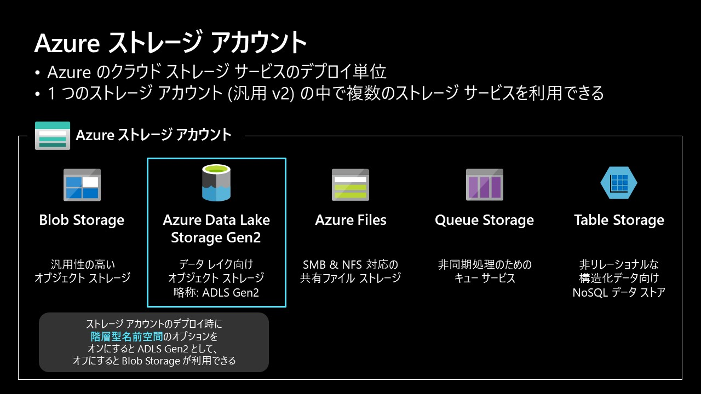

<aside class="positive">
<b>💡 階層型名前空間について</b>

ADLS Gen2 の特長の一つは階層型名前空間です。Blob Storage や他のオブジェクト ストレージでは、ファイル名にスラッシュを使用して階層型のディレクトリ構造を模倣しています。

一方で ADLS Gen2 では、ファイルが実際のディレクトリの配下に編成されています。そのため、ディレクトリの名前変更や移動、削除などの操作は、そのディレクトリに対するアトミックなメタデータ操作になります。他のオブジェクト ストレージではファイル数分の操作が必要になります。

ビッグ データ分析ではディレクトリの名前変更や移動、削除などの操作を相応の頻度で行いますが、ADLS Gen2 ではこれらの操作を効率的に行えます。
</aside>

### **Azure Databricks**
Azure Databricks は Apache Spark ベースのフル マネージド サービスで、レイクハウス プラットフォームを実現できます。

レイクハウスは、データ レイクとデータ ウェアハウスからなる造語です。データ レイクの高い経済性、データ ウェアハウスの高い処理性能を併せ持ちます。レイクハウスでは、あらゆるデータをデータ レイク に集約し、Delta Lake や Apache Parquet などの分析に最適化した形式に変換して保持します。

Azure Databricks は Data Lake Storage をメインのデータ ストアとして、データ エンジニアリング、データ サイエンスと機械学習、そしてデータ分析のユースケースをカバーします。

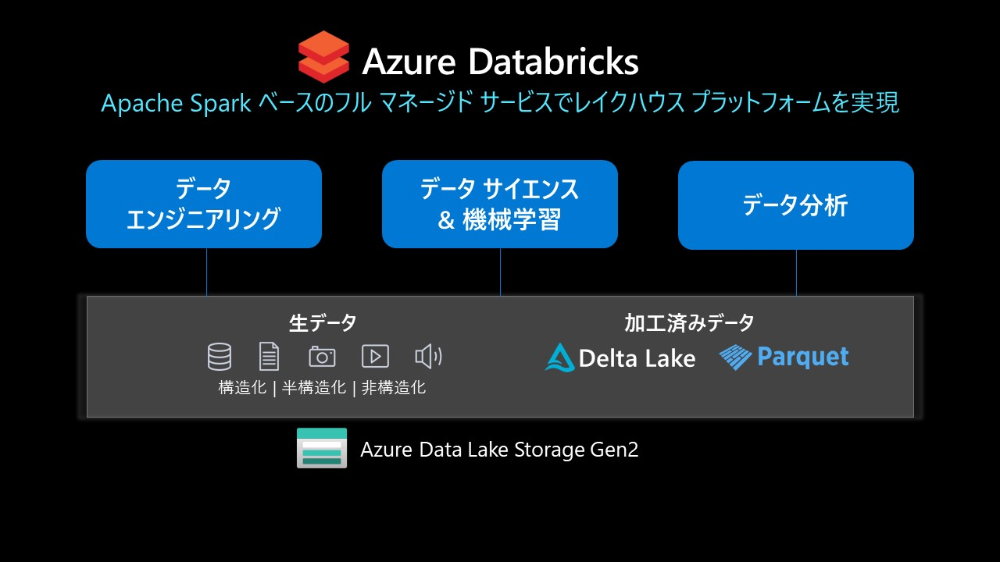

### **Databricks SQL**
Databricks SQL は Azure Databricks に搭載されているデータ分析のための機能で、2021 年 12 月に一般提供になりました。特徴として、クラウド ストレージ上のデータを標準的な SQL で分析できます。さらに SQL の結果を OSS のメジャーなダッシュボード ツール Redash をベースとしたリッチなダッシュボードで可視化できます。

優れた UI/UX を持つだけでなく、2021 年 11 月に[ビッグデータ向けのベンチマークの TPC-DS 100TB クラスで世界記録を更新](https://www.databricks.com/jp/blog/2021/11/02/databricks-sets-official-data-warehousing-performance-record.html)するなど、非常に高い処理性能を兼ね備えています。

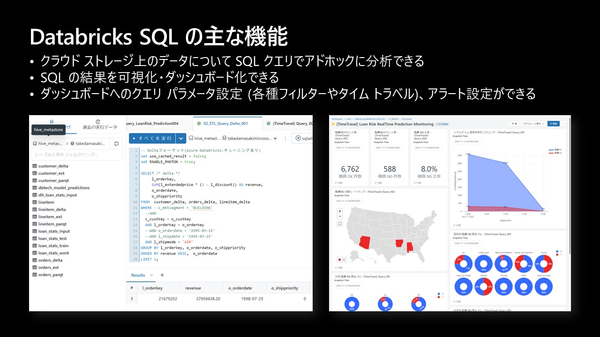

### **Azure Synapse Analytics**
Azure Synapse Analytics は、エンドツーエンドの分析のための統合クラウド ネイティブ プラットフォームです。図の左側にあるようなオンプレミス、クラウドなど様々なデータを集約し、Synapse スタジオという専用の UI で集中的に分析できます。

さらに Microsoft Purview や Azure Databricks などの Microsoft の他のサービスとのシームレスな連携機能も特長です。専用 SQL プールやサーバーレス SQL プールなどの分析ランタイムを備えています。

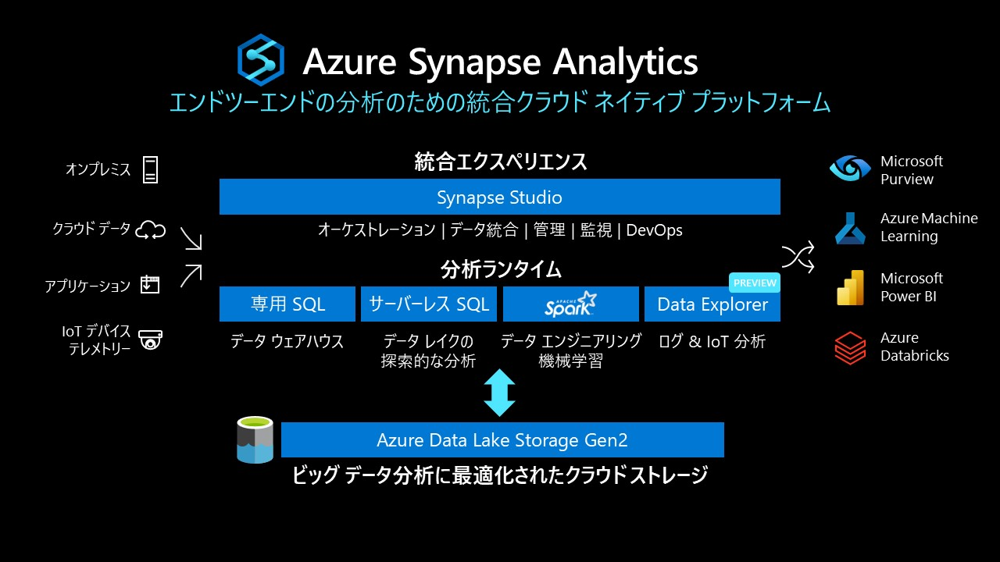

### **Synapse パイプライン**
Synapse パイプラインは Azure Synapse Analytics に搭載されたデータ統合機能で、データのコピーや ETL 処理をスケジュールやイベント ベースのトリガーで実行できます。100 以上の組み込みのコネクターを提供しており、Azure の主要なデータ ストアはもちろん、Azure 以外のデータ ストアについてもサポートされています。

コピー アクティビティという機能を用いてオンプレミスや他のクラウドからデータを Azure にコピーし、後述するマッピング データ フローで ETL (Extract / Transform / Load) を行うユーザーが多いです。

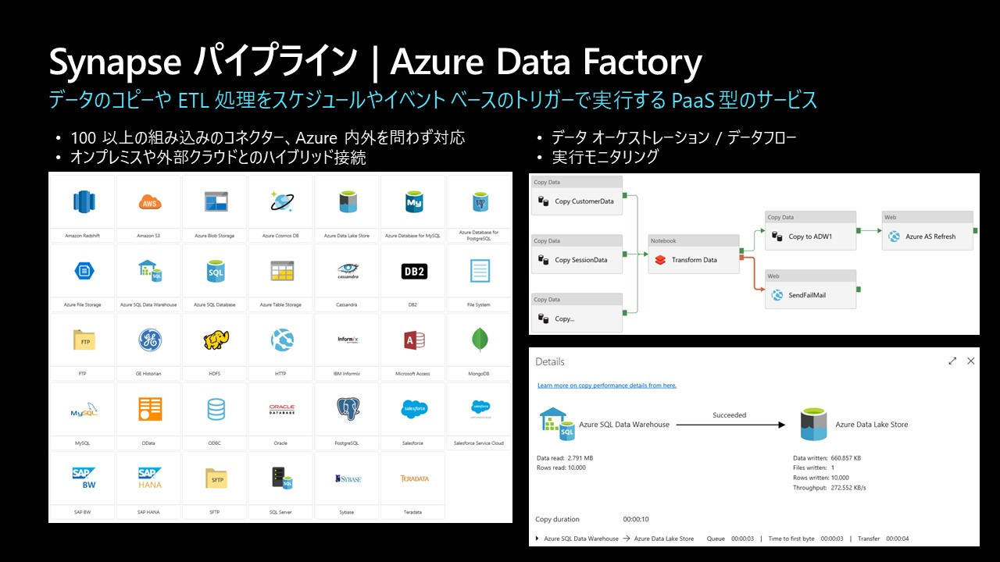

### **マッピング データ フロー**
マッピング データ フローは、変換 (Transformation) と呼ばれるパーツを組合わせて、ノーコードで ETL 処理を作成できる Azure Synapse Analytics の機能です。Synapse パイプラインから呼び出す形で利用します。略称はデータ フローです。

データ フローの処理は Microsoft マネージドの Spark クラスター上で実行されるため、大規模なデータを扱うことができます。

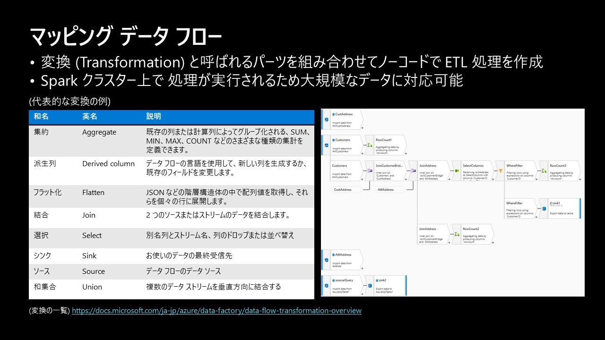

### **Microsoft Power BI**
Microsoft Power BI はデータを分析・可視化して洞察を得るための BI (Business Intelligence) ツールです。Power BI は大きく Power BI Desktop、Power BI サービス、そして Power BI モバイル / ブラウザから構成されます。

本ワークショップの後半で Power BI Desktop から Databricks SQL に接続してレポートを作成します。

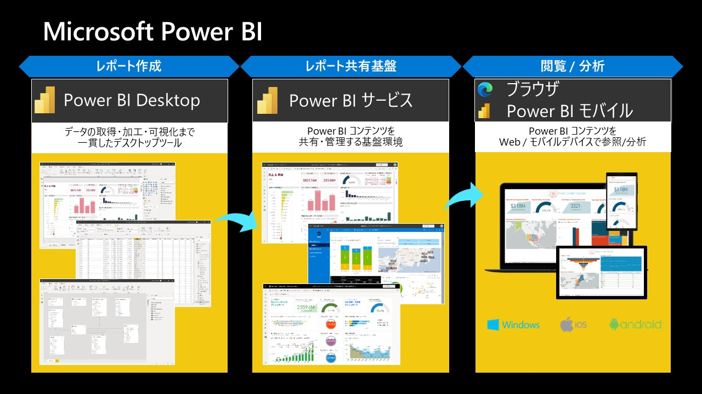

### **🎉 まとめ**
この章では、ワークショップで利用する Microsoft の各種サービス・機能について学びました。**[Next]** を選択して次の章に進みましょう。

## リソース グループ作成
Duration: 00:10:00

この章では、ワークショップで利用するリソース グループを作成し、受講者に必要な権限を付与します。

リソース グループとは Azure 上のリソースをまとめて管理するためのものです。リソース グループを指定して複数のリソースをまとめて削除したり、リソース グループ別に課金を確認できたりします。

### **🤔 複数人でワークショップを受講する場合の考慮点**
複数人でワークショップを受講する場合、リソース グループの作成にあたって以下 2 つの選択肢があります。

**権限** | **対応**
--- | ---
代表者のみがリソース グループを作成できる権限を持ち、他の方が権限を持っていない場合 | **全員で 1 つのリソース グループを共有**し、その中に受講者全員の Azure リソースを作成する
受講者全員がリソース グループを作成できる権限を持つ場合 | **1 人 1 つのリソース グループを作成**し、その中に各受講者の Azure リソースを作成する

どちらの方法を選んでも問題ありません。講師と、あるいは参加者同士で相談して、どちらの方法にするかを決めてください。なお、リソース グループ名や Azure リソース名はサブスクリプション内、あるいはグローバルでの一意性が求められることが多いです。この後の手順でも名前が重複しないようガイドしていきますが、この点を意識してセットアップ作業を進めていきましょう。

<aside class="positive">
<b>💡 Azure リソースの名前付け規則</b>

名前付け規則 (命名規則やネーミング ルールとも呼ばれます) は開発者にとって主要な関心事の一つです。Azure では名前付け規則のガイドとなるドキュメントを公開しています。

自身のプロジェクトで Azure を利用する際には、これらのドキュメントを参考にしつつ、自身のプロジェクトの事情にマッチした名前付け規則を定めるのが良いでしょう。

- [名前付け規則を定義する - Cloud Adoption Framework | Microsoft Learn](https://learn.microsoft.com/ja-jp/azure/cloud-adoption-framework/ready/azure-best-practices/resource-naming)
- [Azure リソースの省略形の例 - Cloud Adoption Framework | Microsoft Learn](https://learn.microsoft.com/ja-jp/azure/cloud-adoption-framework/ready/azure-best-practices/resource-abbreviations)
</aside>

### **1. リソース グループの作成**
**(注: 全員で 1 つのリソース グループを共有する場合は代表者 1 人が実施します)**

(1) Azure ポータル ([https://portal.azure.com](https://portal.azure.com)) にサインインします。必要に応じて画面右上の歯車アイコン > **[言語と地域]** からポータルの表示言語を日本語に変更します。

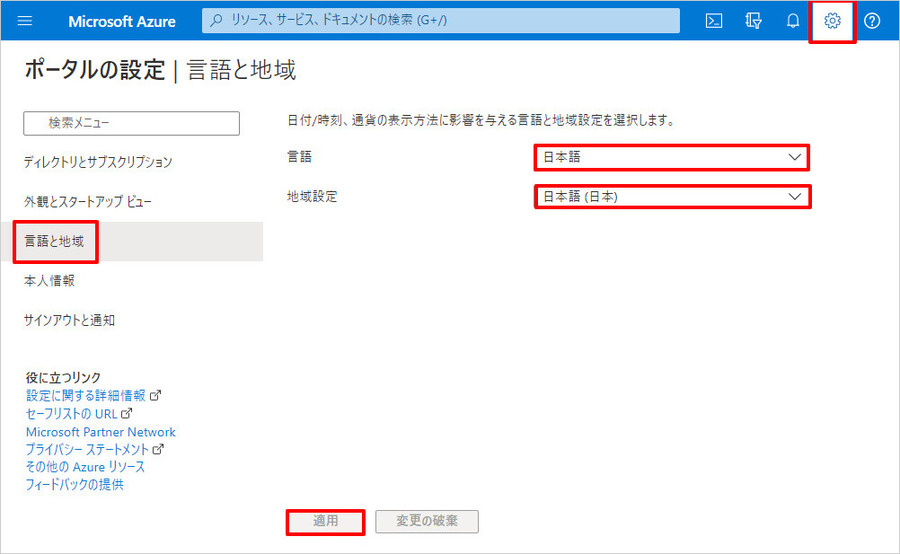

(2) Azure ポータル上部の検索バーに **[リソース グループ]** と入力します。検索結果の **[サービス]** 内の **[リソース グループ]** をクリックします。

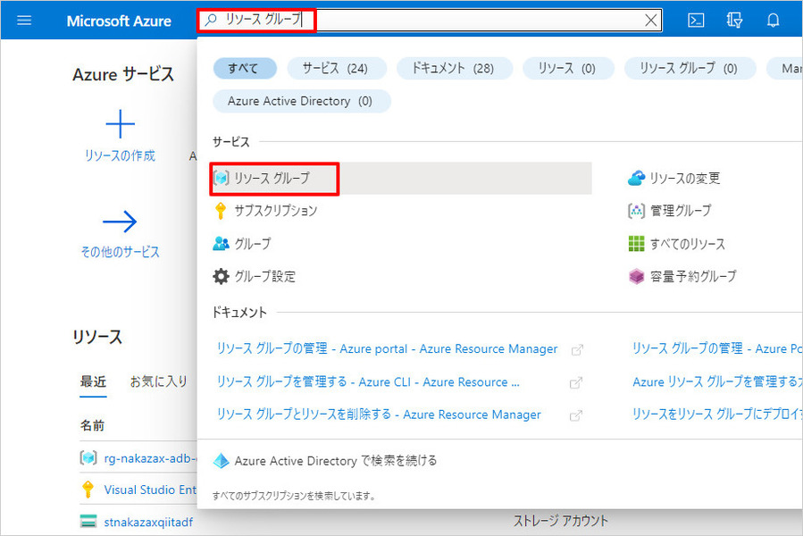

(3) **[作成]** をクリックします。

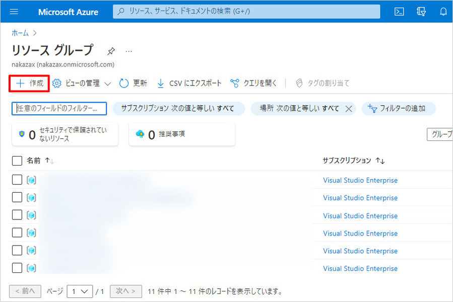

(4) リソース グループの作成画面で以下の項目を設定し、**[確認および作成]** をクリックします。

**項目** | **設定値**
--- | ---
サブスクリプション | 任意のサブスクリプションを選択します。
リソース グループ | サブスクリプション内で一意の任意の名前を入力します。このワークショップでは **`rg-adb-ws-{yyyyMMdd}`** (**`{yyyyMMdd}`** はワークショップの実施日で置換) を使用します。<br>注: 1 人 1 つのリソース グループを作成する場合は **`rg-adb-ws-{yyyyMMdd}-{lastname}`** (**`{lastname}`** は受講者の姓で置換) を使用します。<br><br>例: **`rg-adb-ws-20221205`** または **`rg-adb-ws-20221205-smith`**
リージョン | 任意のリージョンを選択します。このワークショップでは **`Japan East`** を選択します。

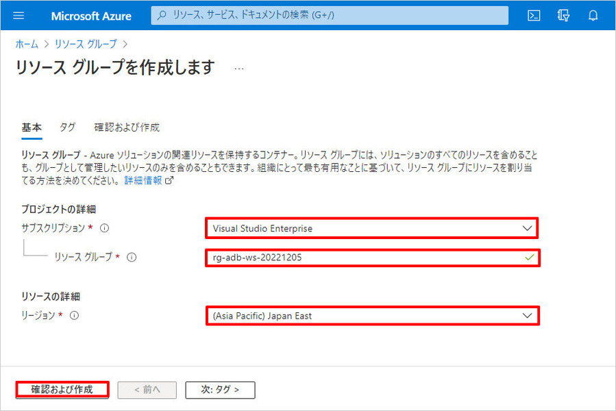

(5) **[確認および作成]** 画面で検証結果に問題がなければ、**[作成]** をクリックします。通常、すぐに作成が完了します。

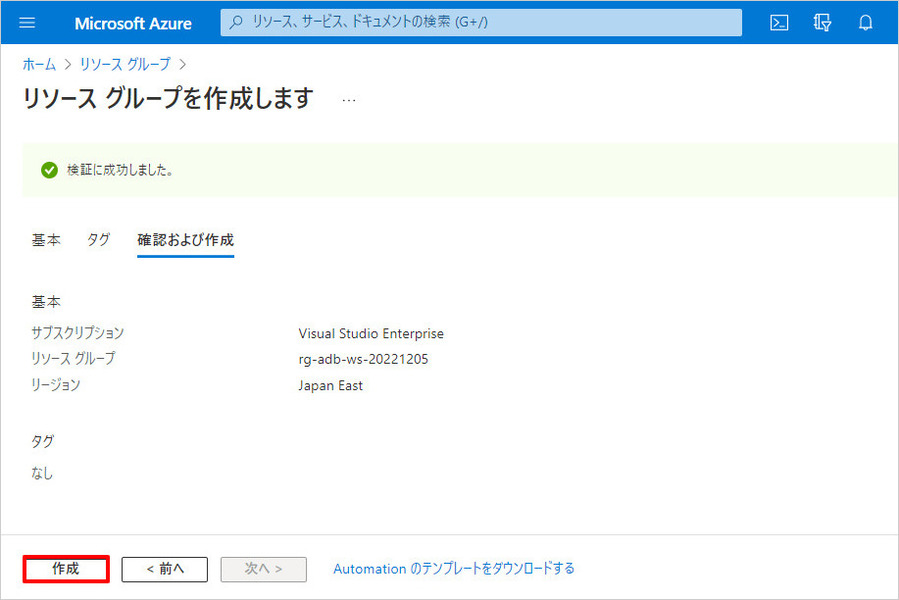

### **2. リソース グループへのロールの割り当て**
**(注: 全員で 1 つのリソース グループを共有する場合は代表者 1 人が実施します)**

(1) 先ほど作成したワークショップ用リソース グループにアクセスします。

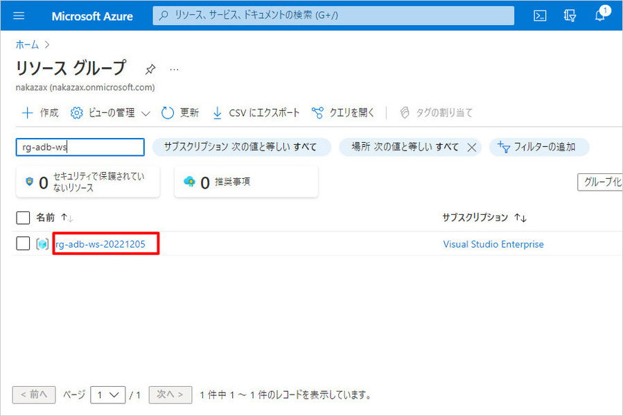

(2) ワークショップ用リソース グループの左側メニューから **[アクセス制御 (IAM)]** > **[追加]** > **[ロールの割り当ての追加]** をクリックします。

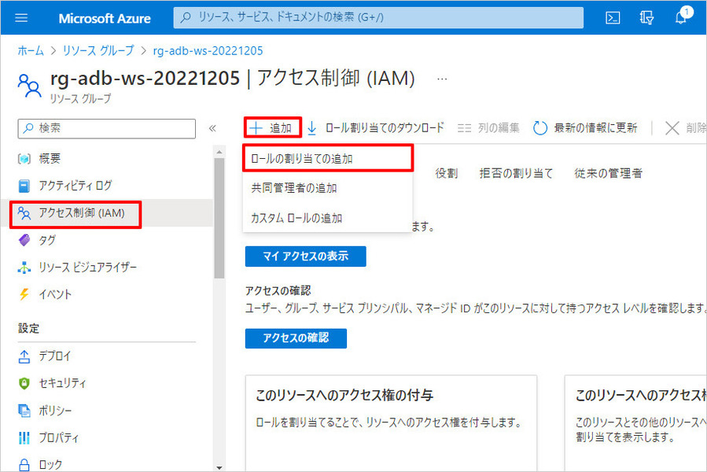

(3) ロールの割り当ての追加画面で **[所有者]** を選択し **[次へ]** をクリックします。


(4) **[+ メンバーを選択する]** をクリックします。

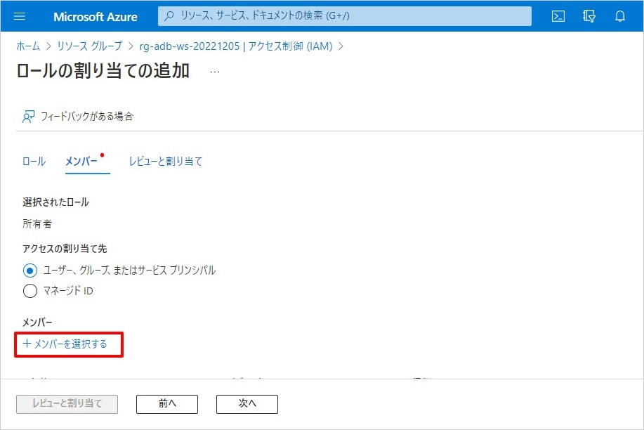

(5) メンバーの選択欄が画面右側に表示されるので、すべてのワークショップ受講者を選択し、**[選択]** をクリックします。

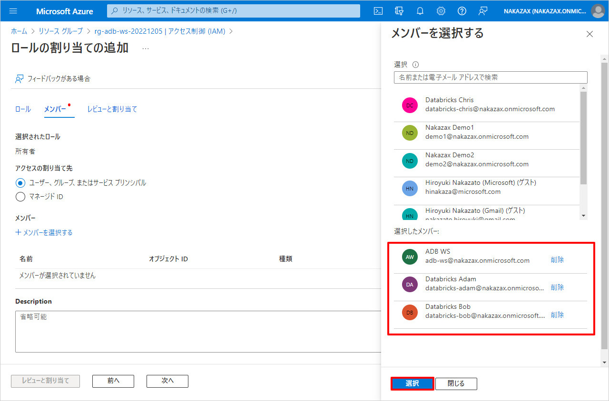

(6) **[レビューと割り当て]** をクリックします。

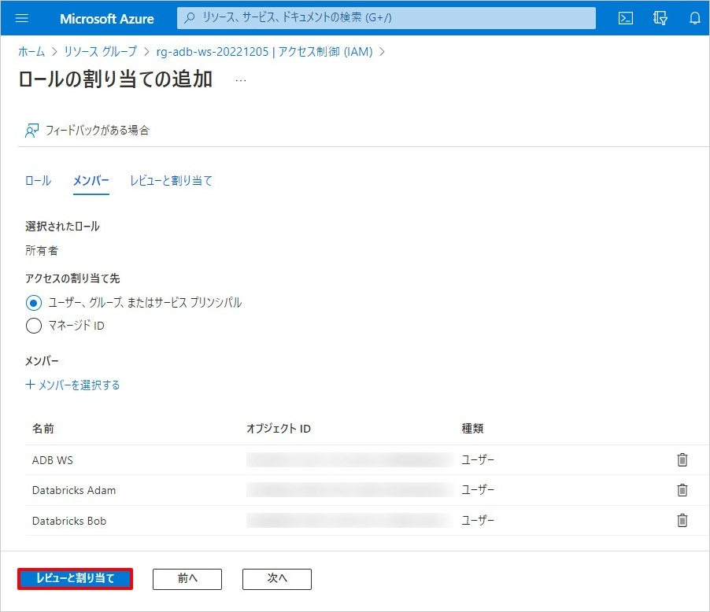

(7) 再度、**[レビューと割り当て]** をクリックします。

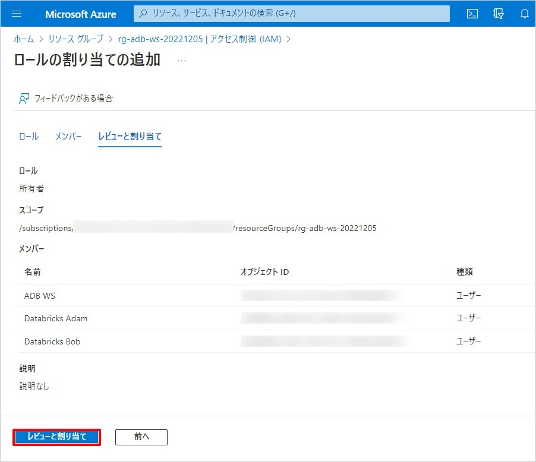

(8) リソース グループの **[アクセス制御 (IAM)]** > **[ロールの割り当て]** を選択し、参加者全員に **[所有者]** のロールが割り当てられていることを確認します。

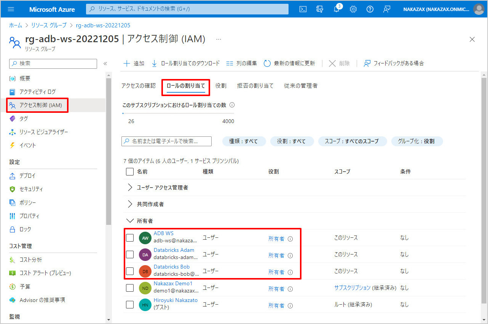

### **🎉 まとめ**
この章では、ワークショップで利用するリソース グループを作成し、参加者全員に **[所有者]** のロールを割り当てました。次の章に進みましょう。

## Azure リソース作成
Duration: 00:20:00

この章では、ワークショップで利用する Azure リソースを作成します。

### **1. Azure Synapse Analytics ワークスペース & Azure ストレージ アカウントの作成**
**(注: ここから先の手順はワークショップの受講者全員が実施します)**

(1) Azure ポータル ([https://portal.azure.com](https://portal.azure.com)) にサインインし、検索バーに **[リソース グループ]** と入力してリソース グループ一覧に移動し、ワークショップで利用するリソース グループが表示されることを確認します。

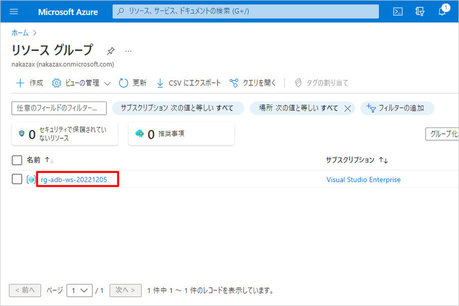

(2) Azure ポータル上部の検索バーに **[synapse]** と入力します。検索結果の **[サービス]** 内の **[Azure Synapse Analytics]** をクリックします。

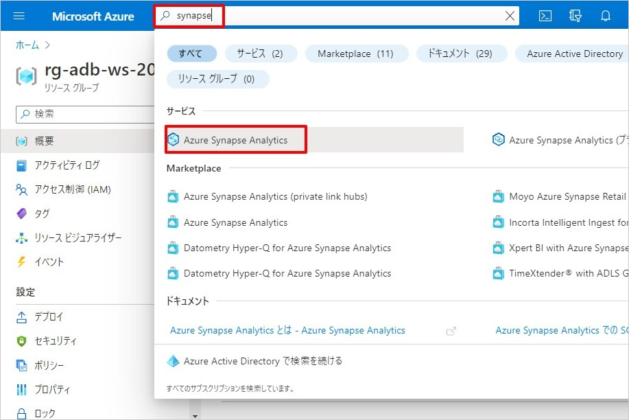

(3) **[作成]** をクリックします。

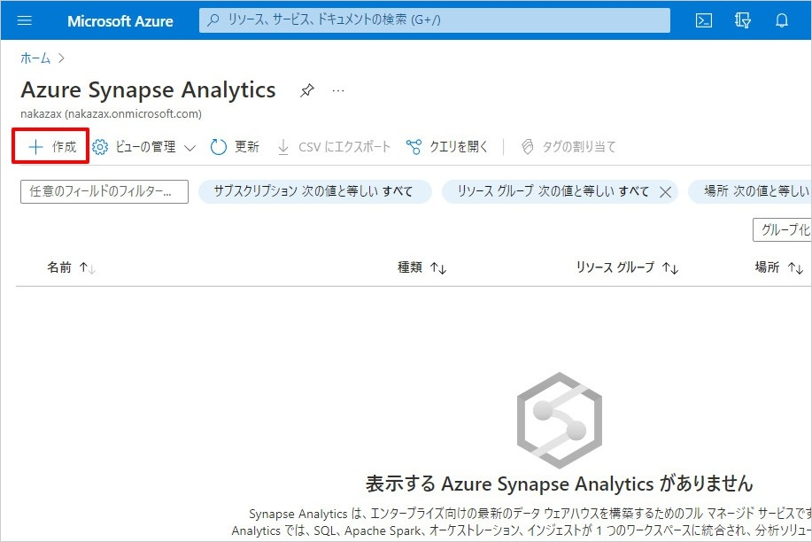

(4) Synapse ワークスペースの作成画面で以下の項目を設定し、**[次へ: セキュリティ]** をクリックします。

**項目** | **設定値**
--- | ---
サブスクリプション | 任意のサブスクリプションを選択します。
リソース グループ | 先の手順で作成したリソース グループ **`rg-adb-ws-{yyyyMMdd}`** を選択します。
マネージド リソース グループ | 空白のままにします。
ワークスペース名 | グローバルに一意の任意の名前を入力します。このワークショップでは **`syn-adb-ws-{lastname}-{yyyyMMdd}`** (**`{lastname}`** は受講者の姓で置換、**`{yyyyMMdd}`** はワークショップの実施日で置換) を使用します。<br><br>例: **`syn-adb-ws-smith-20221205`**
地域 | 任意のリージョンを選択します。このワークショップでは **`Japan East`** を選択します。
Data Lake Storage Gen2 を選択する | **[サブスクリプションから]** を選択します。
アカウント名 | **[新規作成]** を選択し、グローバルに一意の任意の名前を入力します。このワークショップでは **`stadbws{lastname}{yyyyMMdd}`** を使用します。<br><br>例: **`stadbwssmith20221205`**
ファイル システム名 | **[新規作成]** を選択し、任意の名前を入力します。このワークショップでは **`synapse`** を使用します。

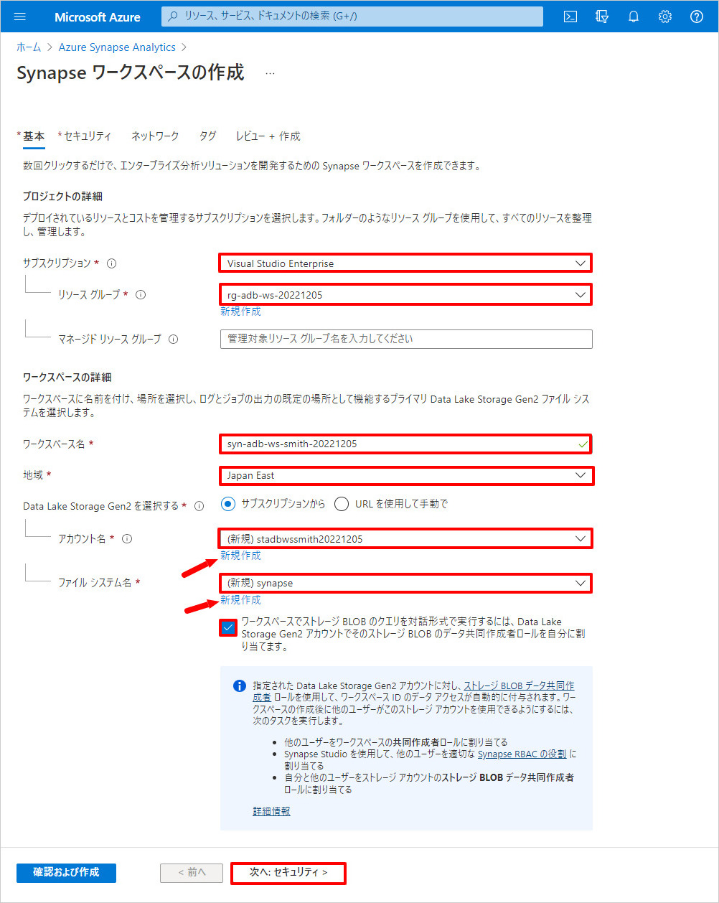

<aside class="positive">
<b>💡 Synapse ワークスペースと Azure ストレージ アカウントの命名の制約</b>

以下の制約を守ったリソース名にする必要があることに注意してください。

- Synapse ワークスペースとストレージ アカウントはグローバルで一意な名前でなければならない
- Synapse ワークスペース名は 50 文字以内、小文字・数字・ハイフンが利用可能
- ストレージ アカウントは 23 文字以内、小文字・数字が利用可能 (ハイフンなどの記号は利用不可)
</aside>

(5) **[セキュリティ]** 画面で以下の項目を設定し、**[確認および作成]** をクリックします。

**項目** | **設定値**
--- | ---
認証方法 | **[Azure Active Directory (Azure AD) 認証のみを使用する]** を選択します。<br>備考: 本ワークショップでは SQL プールは利用しません。余分な入力を省くため、最もシンプルな認証方法を選択します。

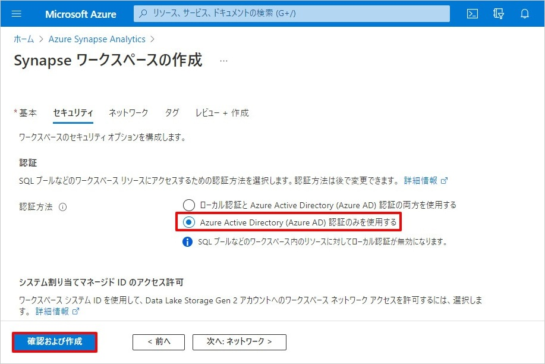

(6) **[確認および作成]** 画面で検証結果に問題がなければ、**[作成]** をクリックします。通常 3-5 分で作成が完了します。次のステップに進みましょう。

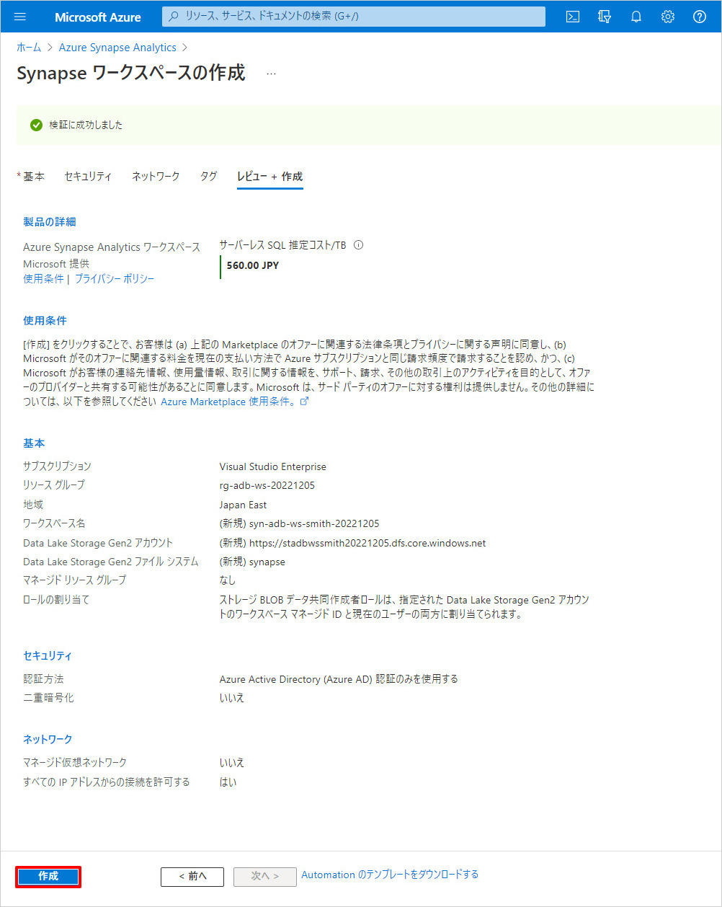

### **2. Azure Databricks ワークスペース作成**
(1) Azure ポータル上部の検索バーに **[databricks]** と入力します。検索結果の **[サービス]** 内の **[Azure Databricks]** をクリックします。

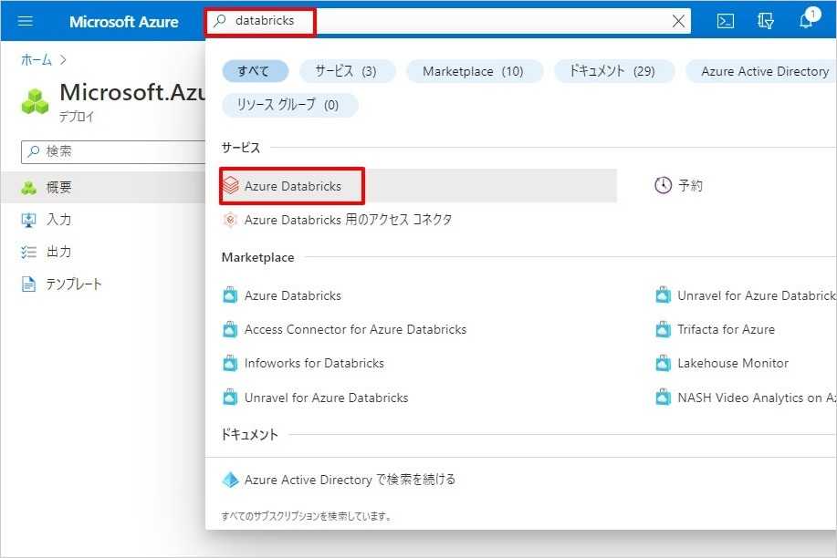

(2) **[作成]** をクリックします。

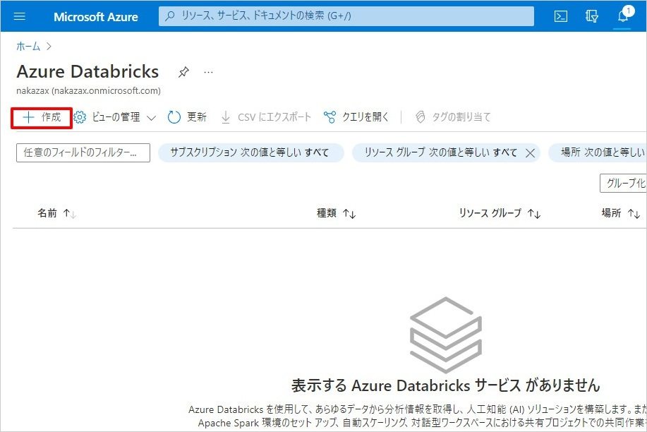

(3) Azure Databricks サービスの作成画面で以下の項目を設定し、**[確認および作成]** をクリックします。

**項目** | **設定値**
--- | ---
サブスクリプション | 任意のサブスクリプションを選択します。
リソース グループ | 先の手順で作成したリソース グループ **`rg-adb-ws-{yyyyMMdd}`** を選択します。
ワークスペース 名 | サブスクリプション内で一意の任意の名前を入力します。このワークショップでは **`adb-ws-{lastname}-{yyyyMMdd}`** を使用します。<br><br>例: **`adb-ws-smith-20221205`**
リージョン | 任意のリージョンを選択します。このワークショップでは **`Japan East`** を選択します。
価格レベル | **`Premium`** を選択します。

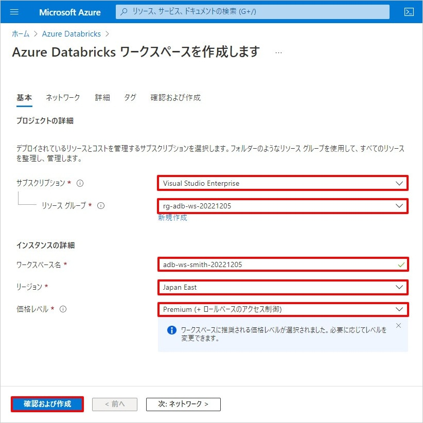

<aside class="positive">
<b>💡 Azure Databricks の価格レベル</b>

Azure Databricks には、以下の 2 つの価格レベルがあります。詳細は [Azure Databricks Pricing - Databricks](https://www.databricks.com/jp/product/azure-pricing) を参照してください。

- **Standard** - Databricks の基本的な機能を利用できる価格レベルです。
- **Premium** - Azure Databricks の最上位の価格レベルで、Databricks のすべての機能を利用できます。本ワークショップで扱う Databricks SQL は Premium レベルで利用可能な機能です。
</aside>

(4) **[確認および作成]** 画面で検証結果に問題がなければ、**[作成]** をクリックします。通常 3-5 分で作成が完了します。次のステップに進みましょう。

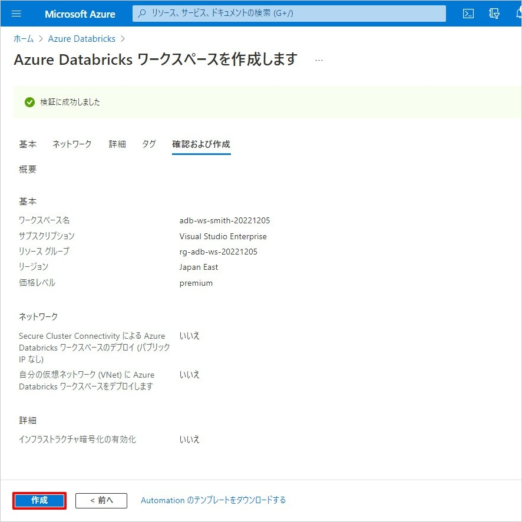

### **3. Azure Key Vault の作成**
後続の手順でシークレット文字列をセキュアに扱えるように、Azure Key Vault を作成します。

(1) Azure ポータル上部の検索バーに **[key vault]** と入力します。検索結果の **[サービス]** 内の **[キー コンテナー]** をクリックします。

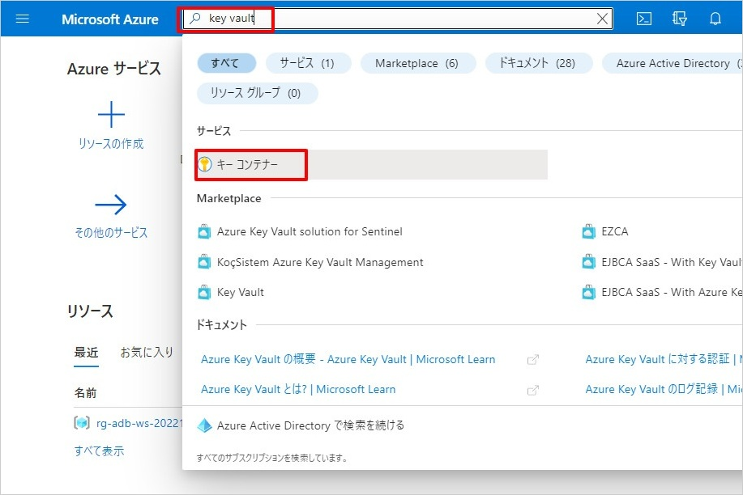

(2) **[作成]** をクリックします。


(3) キー コンテナーの作成画面で以下の項目を設定し、**[確認および作成]** をクリックします。

**項目** | **設定値**
--- | ---
サブスクリプション | 任意のサブスクリプションを選択します。
リソース グループ | 先の手順で作成したリソース グループ **`rg-adb-ws-{yyyyMMdd}`** を選択します。
Key Vault 名 | グローバルに一意の任意の名前を入力します。このワークショップでは **`kv-adb-ws-{lastname}-{yyyyMMdd}`** を使用します。<br><br>例: **`kv-adb-ws-smith-20221205`**
地域 | 任意のリージョンを選択します。このワークショップでは **`Japan East`** を選択します。
価格レベル | 標準を選択します。
削除されたコンテナーを保持する日数 | **`7`** に変更します。
消去保護 | **`消去保護を無効にする`** を選択します。

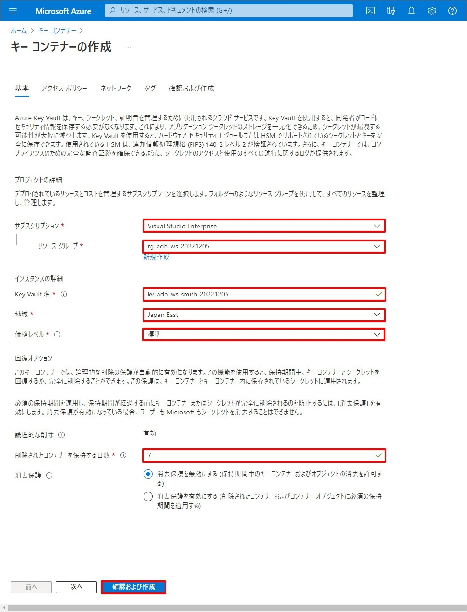

(4) **[確認および作成]** 画面で検証結果に問題がなければ、**[作成]** をクリックします。通常 1-2 分で作成が完了します。

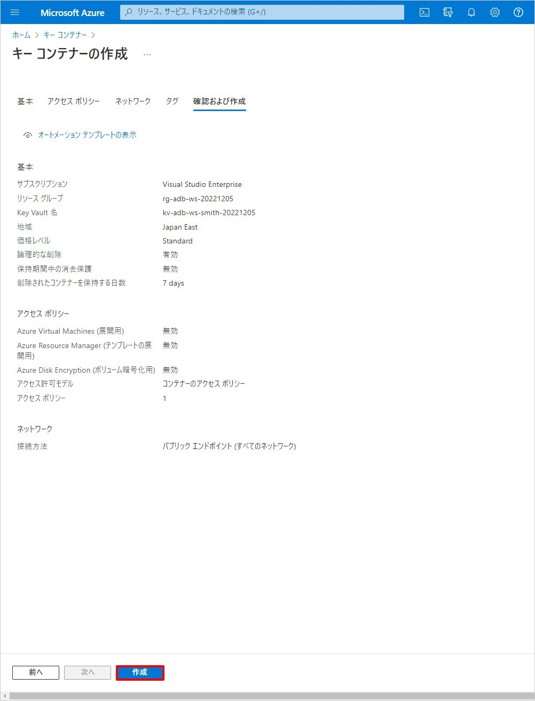

### **🎉 まとめ**
この章では以下の Azure リソースを作成しました。問題なく作成できていることを確認して、次の章に進みましょう。

1. Azure Synapse Analytics ワークスペース
2. Azure ストレージ アカウント (ADLS Gen2)
3. Azure Databricks ワークスペース
4. Azure Key Vault

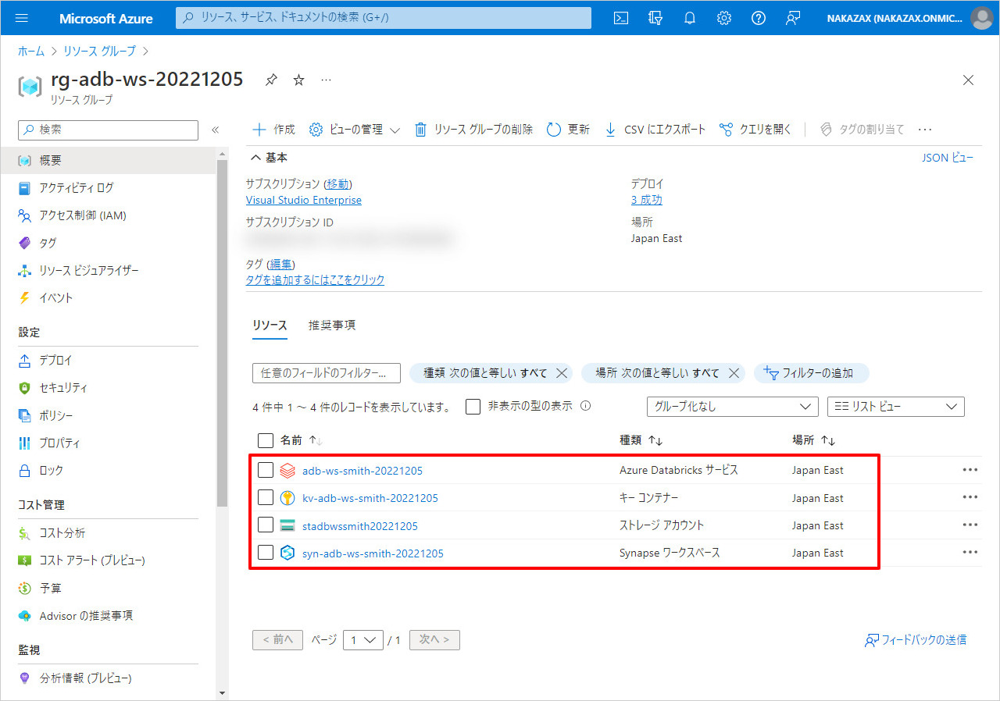

## データの概要
Duration: 00:10:00

この章では、分析対象として利用する E コマースのサンプル データの概要を確認します。

### **🔎 分析対象として利用するデータの概要**
Kaggle に公開されている E コマースのサンプル データ「[Brazilian E-Commerce Public Dataset by Olist](https://www.kaggle.com/datasets/olistbr/brazilian-ecommerce)」を利用します。データ スキーマは以下の通りです。


(\* Brazilian E-Commerce Public Dataset by Olist は [クリエイティブ・コモンズ 表示 - 非営利 - 継承 4.0 国際 (CC BY-NC-SA 4.0)](https://creativecommons.org/licenses/by-nc-sa/4.0/deed.ja) の下で提供されています)

上記データ スキーマのうち、本ワークショップでは主に以下の 2 つのデータセットを利用します。

- `olist_orders_dataset` : 注文データ
- `olist_order_items_dataset` : 注文明細データ

[Kaggle のデータセットの説明のページ](https://www.kaggle.com/datasets/olistbr/brazilian-ecommerce?select=olist_orders_dataset.csv)にアクセスして、上記のデータセットの概要 (どのような列があるか、各列のデータ型や値の例など) を確認しましょう。

## データの配置
Duration: 00:40:00

この章では、Synapse パイプラインのコピー アクティビティを用いて、分析対象のデータを Azure Data Lake Storage (ADLS) Gen2 に配置します。

### **🔎 データ変換の流れ**
この章で実現するデータ変換の流れは以下の通りです。

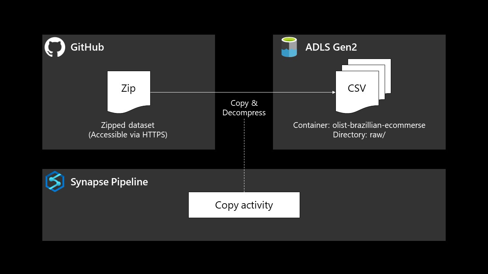

### **1. ストレージ アカウントのコンテナー作成**
はじめに、分析対象のデータを格納するための領域 (コンテナー) をストレージ アカウントに作成します。

(1) Azure ポータルにアクセスし、ワークショップで利用するリソース グループを選択します。リソース グループから自身が利用するストレージ アカウントを選択します。

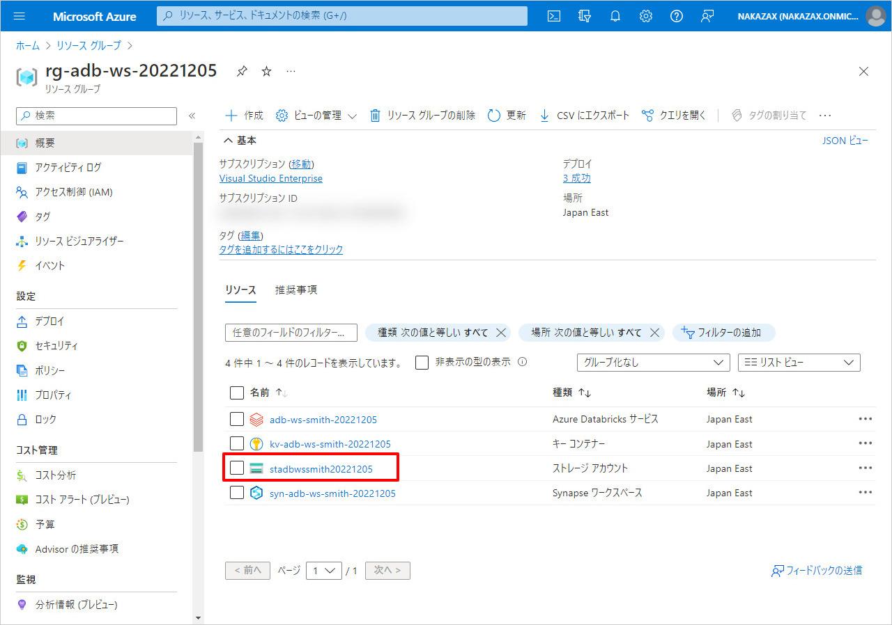

(2) 左側メニューの **[ストレージ ブラウザー (プレビュー)]** > **[BLOB コンテナー]** > **[+ コンテナーを追加する]** をクリックします。画面右側に **[新しいコンテナー]** が表示されますので、以下の設定を行い、**[作成]** をクリックします。

**項目** | **設定値**
--- | ---
名前 | **`olist-brazilian-ecommerce`** と入力します。
パブリック アクセス レベル | 既定の **`プライベート (匿名アクセスはありません)`** を選択します。

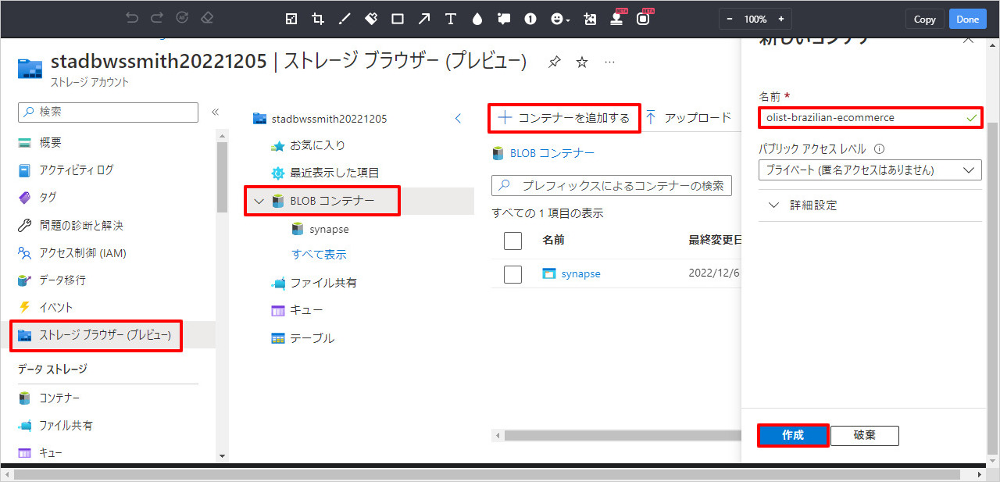

### **2. Synapse Studio への接続**
(1) Azure ポータルにアクセスし、ワークショップで利用するリソース グループを選択します。リソース グループから自身が利用する Synapse ワークスペースを選択します。

(2) 左側メニューの **[概要]** が選択されていることを確認し、画面中央の **[Synapse Studio を開く]** の中の **[オープン]** というリンクをクリックします。別タブで **Synapse Studio** が開きます。

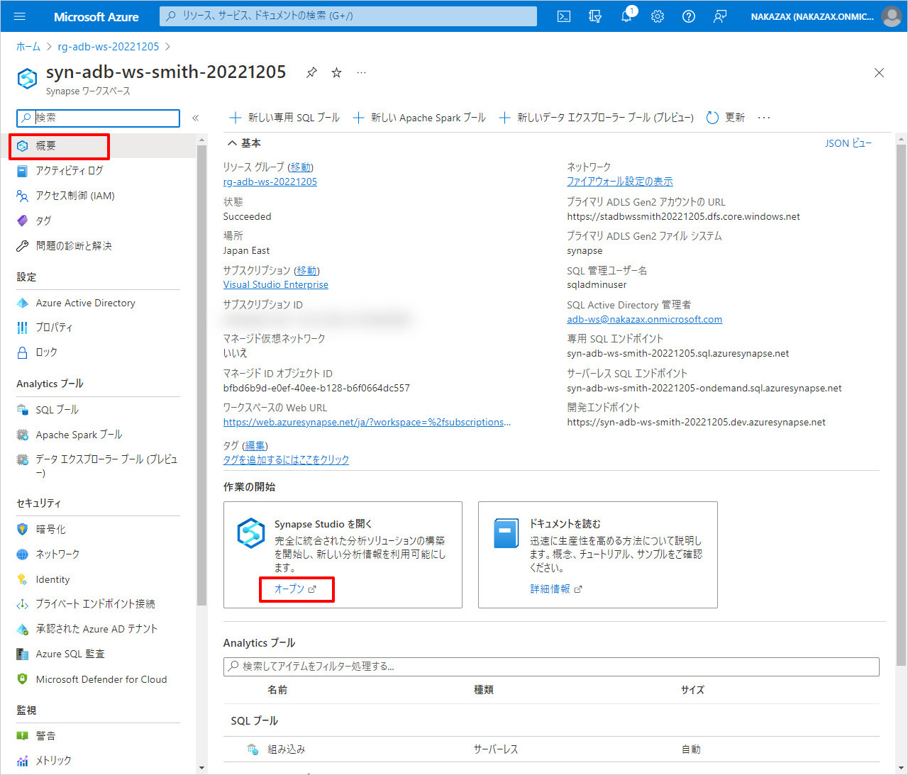

(3) はじめて Synapse Studio に接続する際、画面上部にオプションの cookie 使用についての通知が表示されるので、特に問題がなければ **[同意]** をクリックします。


<aside class="positive">
<b>💡 Synapse Studio の「ハブ」</b>

Synapse Studio の左側メニューは既定では折りたたみされており、画面左上の `>>` を選択すると表示されます。Synapse Studio では左側メニューの一つ一つの機能を **ハブ** と呼びます。以降の手順では「Data ハブ」、「Develop ハブ」、「Integrate ハブ」などと呼称します。


</aside>

### **3. コピー アクティビティによるデータの配置**
分析対象のデータを Zip にまとめたファイルを [GitHub リポジトリ](https://github.com/microsoft/azure-databricks-sql-workshop-ja/blob/main/assets/olist-brazillian-ecommerse-dataset.zip)に格納していますので、そちらを ADLS Gen2 にコピーします。

具体的な手順として、Synapse Studio にてリンク サービス、データセット、パイプラインを作成し、パイプラインにコピー アクティビティを定義して、パイプラインを実行します。

<aside class="positive">
<b>💡 Synapse パイプラインの用語</b>

これから扱う Synapse パイプラインの用語について簡単に説明します。詳細は [データセット - Azure Data Factory & Azure Synapse | Microsoft Learn](https://learn.microsoft.com/ja-jp/azure/data-factory/concepts-datasets-linked-services?tabs=data-factory) を参照してください。

- リンク サービス: Synapse が外部リソースに接続するために必要な接続情報を定義する
- データセット: コピー アクティビティなどのパイプライン アクティビティで利用するデータの入出力先 (テーブルやファイルなど) を定義する
- パイプライン: 1 つ以上のパイプライン アクティビティを組み合わせて、データの加工や移動を行う処理を定義する

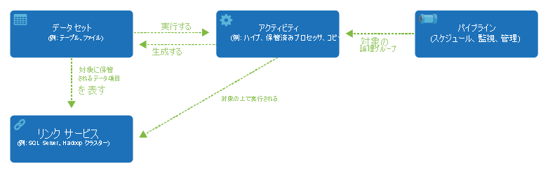
</aside>

#### **3-1. リンク サービスの作成**
まずはコピー元の Zip ファイルがある GitHub リポジトリの接続情報を定義したリンク サービスを作成します。

(1) Synapse スタジオで **[Manage]** ハブ > **[Linked services]** > **[+ 新規]** をクリックします。

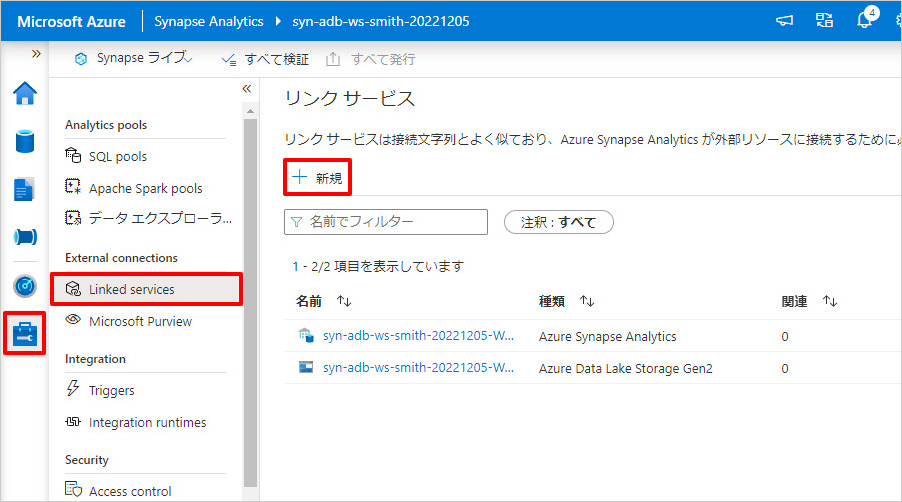

(2) 検索ボックスに `http` と入力します。候補として **[HTTP]** が表示されるので選択し **[続行]** をクリックします。

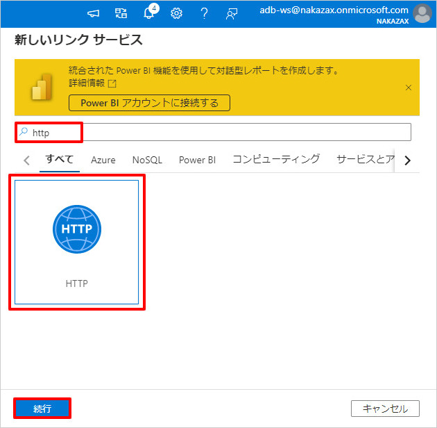

(3) 新しいリンク サービスの作成画面で以下の項目を設定し、**[テスト接続]** をクリックします。**接続成功** と表示されたら **[作成]** をクリックします。

**項目** | **設定値**
--- | ---
名前 | 任意の名前を入力します。このワークショップでは **`HttpGitHubAdbWorkshop`** を入力します。
ベース URL | **`https://github.com/microsoft/azure-databricks-sql-workshop-ja/`** を入力します。
認証の種類 | **`匿名`** を選択します。


(4) 画面上部の **[すべて発行]**　(保存に相当する操作) をクリックします。確認画面が表示されるので **[発行]** をクリックします。

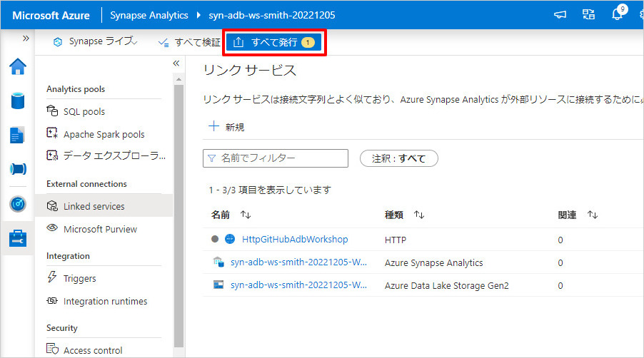

これでリンク サービスの作成は完了です。以降、データセットとパイプラインを作成していきますが、作業結果が途中で消えてしまわないように、キリの良いタイミングでこまめに **[すべて発行]** を実行するようにしましょう。

#### **3-2. データセット (コピー元) の作成**
続いてコピー元とコピー先のデータセットを作成します。まずはコピー元 (GitHub に格納された Zip ファイル) に対応するデータセットを作成します。

(1) Synapse スタジオで **[Data]** ハブにアクセスした後、**[+]** ボタンをクリックし、**[統合データセット]** を選択します。

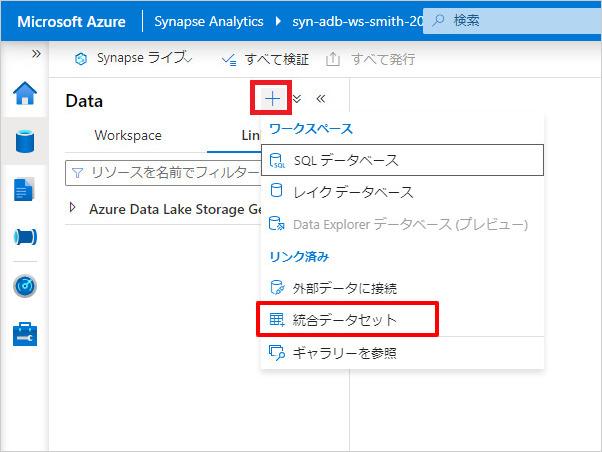

(2) 検索ボックスに `http` と入力します。候補として **[HTTP]** が表示されるので選択し **[続行]** をクリックします。

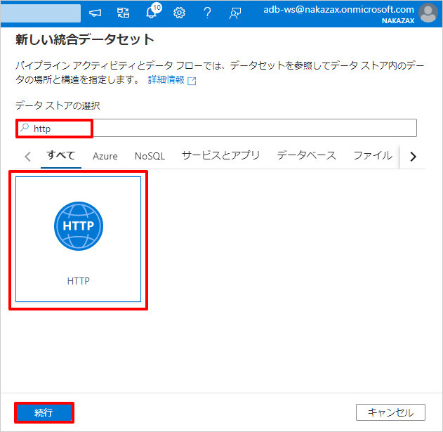

(3) 形式の選択画面で **[バイナリ]** を選択し **[続行]** をクリックします。

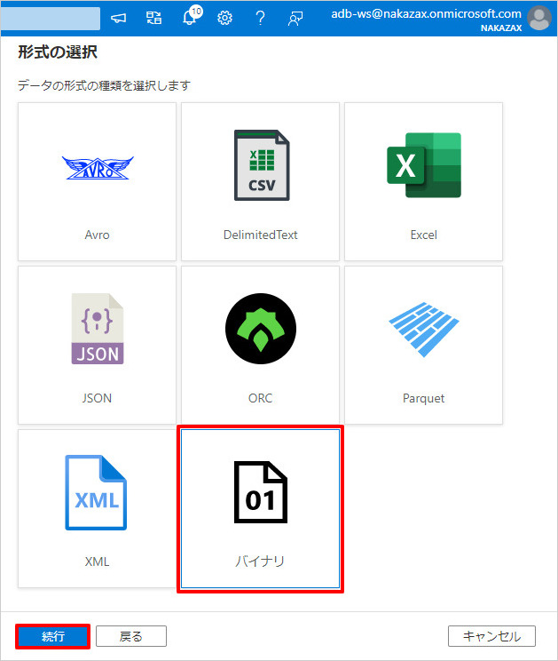

(4) プロパティの設定画面で以下の項目を設定し、**[OK]** をクリックします。

**項目** | **設定値**
--- | ---
名前 | 任意の名前を入力します。このワークショップでは **`CopySourceDataset`** を入力します。
リンク サービス | 先ほど作成したリンク サービス **`HttpGitHubAdbWorkshop`** を選択します。
相対 URL | **`raw/main/assets/olist-brazillian-ecommerse-dataset.zip`** を入力します。

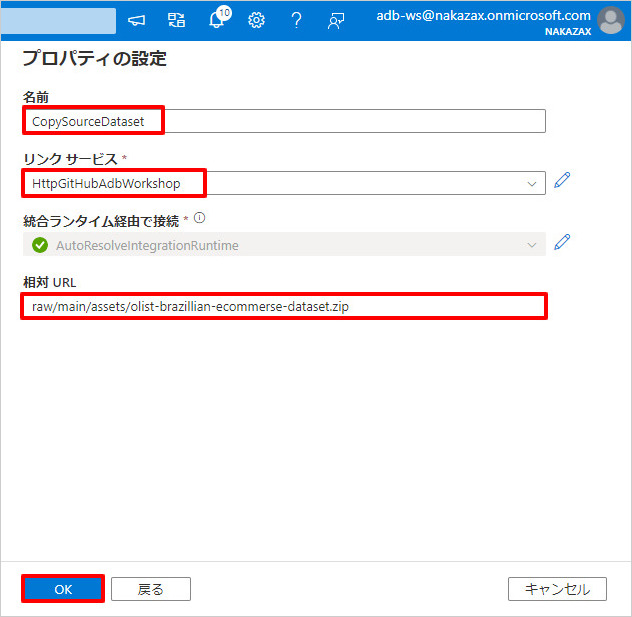

(5) 作成されたデータセットの **[接続]** タブの **[圧縮の種類]** を `ZipDelfate (.zip)` に変更します。

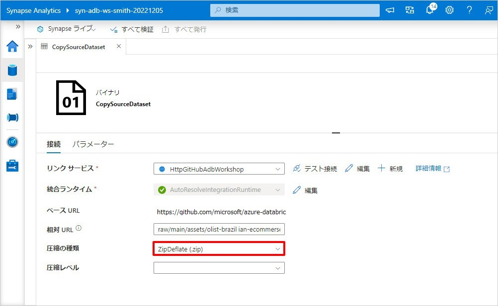

これでコピー元のデータセットの作成は完了ですので、発行しておきましょう。

#### **3-3. データセット (コピー先) の作成**
続いてコピー先 (ADLS Gen2 の CSV ファイル群) に対応するデータセットを作成します。

(1) Synapse スタジオで **[Data]** ハブにアクセスした後、**[+]** ボタンをクリックし、**[統合データセット]** を選択します。

(2) 検索ボックスに `gen2` と入力します。候補として **[Azure Data Lake Storage Gen2]** が表示されるので選択し **[続行]** をクリックします。

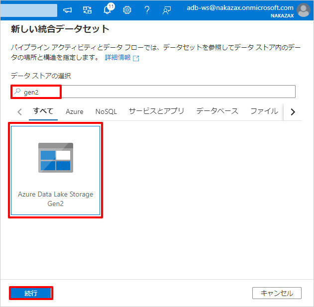

(3) 形式の選択画面で **[バイナリ]** を選択し **[続行]** をクリックします。

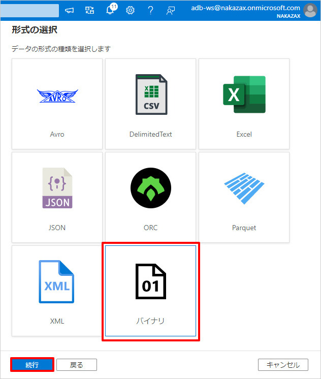

(4) プロパティの設定画面で以下の項目を設定し、**[OK]** をクリックします。

**項目** | **設定値**
--- | ---
名前 | 任意の名前を入力します。このワークショップでは **`CopyTargetDataset`** を入力します。
リンク サービス | **`{Synapse ワークスペース名}-WorkspaceDefaultStorage`** を選択します。
ファイル パス | コンテナ名に **`olist-brazillian-ecommerce`**、フォルダ名に **`raw`** を入力します。(ファイル名は空白のままで OK です)

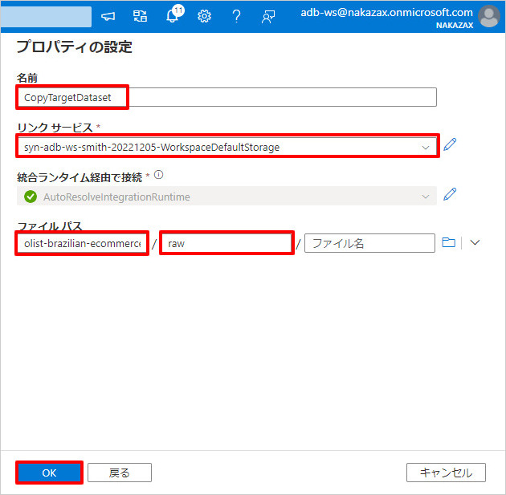

これでコピー先のデータセットの作成は完了です。発行しておきましょう。

<aside class="positive">
<b>💡 Azure Synapse Analytics のプライマリ ADLS Gen2 アカウント</b>

前章で Synapse ワークスペースを作成する際に、既存あるいは新規の ADLS Gen2 のストレージ アカウントとファイル システムを指定しました。Synapse はこれらを **プライマリ ADLS Gen2 アカウント** および **プライマリ ADLS Gen2 ファイル システム** として扱います。

プライマリ ADLS Gen2 アカウントに対応するリンク サービス (`{Synapse ワークスペース名}-WorkspaceDefaultStorage`) は Synapse ワークスペース作成時に自動的に作成されます。プライマリ ADLS Gen2 ファイル システムには Synapse の管理用の情報が保存されます。
</aside>

<aside class="positive">
<b>💡 データ レイクを設計する際のストレージ アカウントの分け方</b>

本ワークショップでは手順の簡単化のため Synapse のプライマリ ADLS Gen2 アカウントをデータの永続化先として利用しますが、実際の利用シーンではストレージ アカウントごとにネットワーク セキュリティ設定やアクセス制御 (IAM)、冗長性、アクセス層などを設定します。そのため利用者や扱うデータ、アクセス パターンなどのニーズに合わせてストレージ アカウントを必要に応じて複数個作成・管理するのが一般的です。

データ レイクを設計する際のストレージ アカウントの分け方については一大トピックになるため本ワークショップでは詳しく触れませんが、実際に設計する際には以下のドキュメントをヒントにしつつ、皆さんのニーズに合わせて検討頂くのが良いと思います。

- [Azure Data Lake Storage - Cloud Adoption Framework | Microsoft Learn](https://learn.microsoft.com/ja-jp/azure/cloud-adoption-framework/scenarios/cloud-scale-analytics/best-practices/data-lake-overview)
- [What's Data Lake ? Azure Data Lake best practice - Speaker Deck (Microsoft MVP for Data Platform の Ryoma Nagata さんのスライド)](https://speakerdeck.com/ryomaru0825/whats-data-lake-azure-data-lake-best-practice)
</aside>

#### **3-4. パイプラインの作成と実行**
最後にコピー アクティビティを含むパイプラインを作成した後、パイプラインを実行します。

(1) Synapse スタジオで **[Integrate]** ハブにアクセスした後、**[+]** ボタンをクリックし、**[パイプライン]** を選択します。

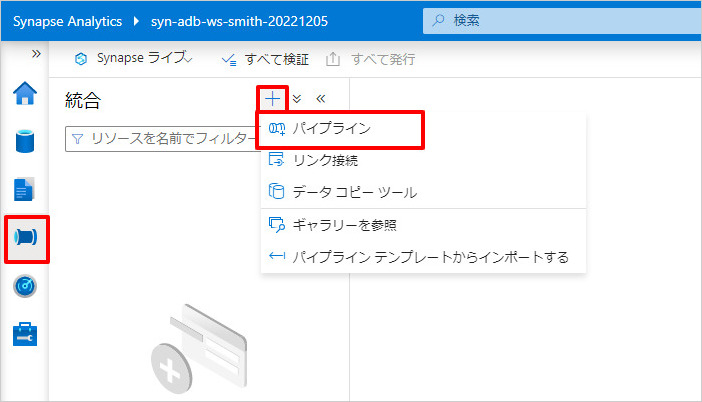

(2) パイプラインのプロパティで **[名前]** に `CopyAndUnzipDataset` を入力します。作業領域を広くするため以下の画面キャプチャ内の赤枠で囲んだボタンをクリックしてプロパティを折りたたみます。

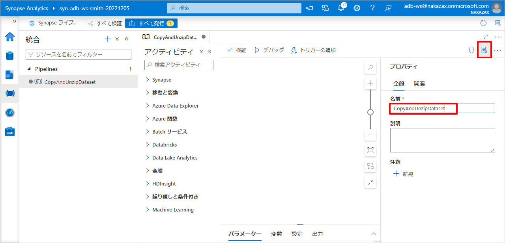

(3) パイプラインのアクティビティ一覧の **[移動と変換]** セクションを展開し **[データのコピー]** を右側のキャンバスにドラッグ & ドロップします。

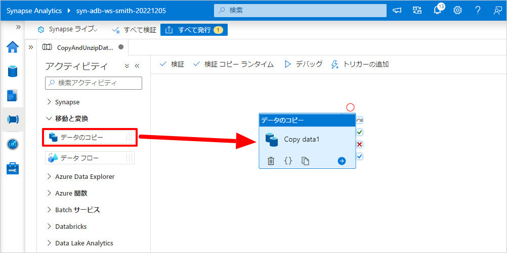

(4) キャンバス上のコピー アクティビティを選択し、**[ソース]** タブを開き、以下の項目を設定します。

**項目** | **設定値**
--- | ---
ソース データセット | 先ほど作成した **`CopySourceDataset`** を選択します。
zip ファイル名をフォルダーとして保持する | チェックを外します。


(5) 続いて **[シンク]** タブを開き、以下の項目を設定します。

**項目** | **設定値**
--- | ---
シンク データセット |先ほど作成した **`CopyTargetDataset`** を選択します。

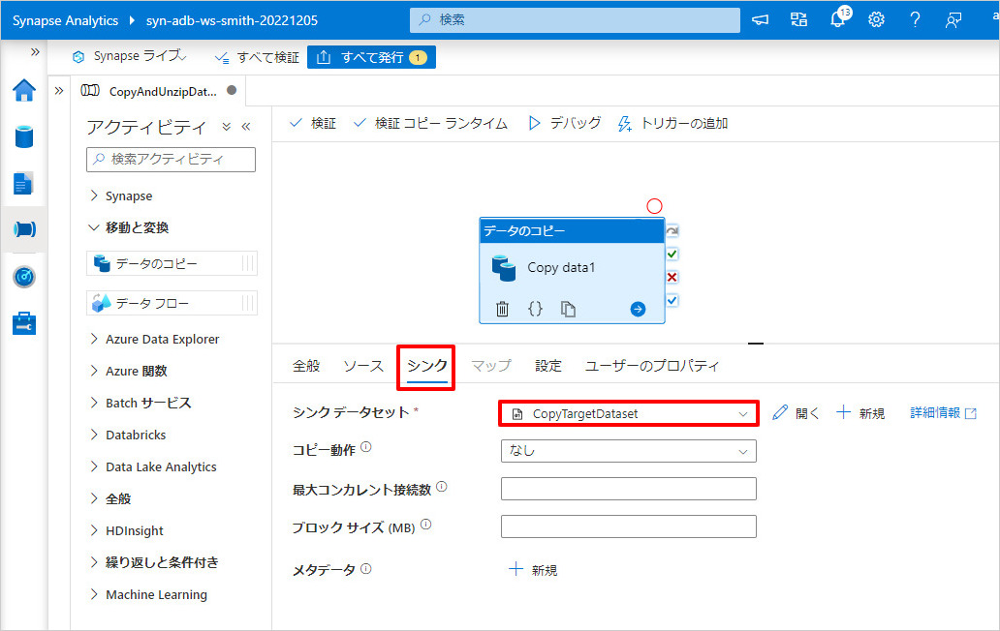

(6) 以上でパイプラインの作成は完了です。画面上部の **[デバッグ]** をクリックします。パイプラインが実行されますので、以下の画面キャプチャ内の赤枠で囲んだボタンを定期的にクリックして表示を更新し、状態が `成功` になるまで待ちます。

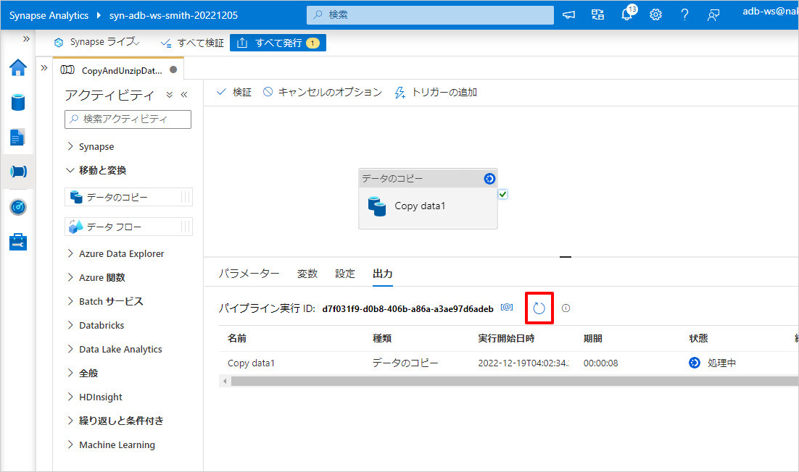

(7) 状態が `成功` になったらパイプラインの実行結果を確認します。以下の画面キャプチャ内の赤枠で囲んだアイコン (マウスを近づけると表示されます) をクリックします。


(8) パイプラインの実行結果が表示されます。コピー元、コピー先のデータ サイズ、ファイル数が以下キャプチャの内容と一致することを確認します。問題なければ右上の **[×]** をクリックして閉じます。

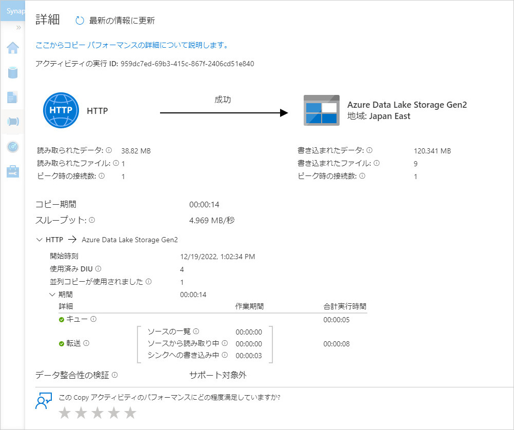

(9) Synapse スタジオの **[Data]** ハブを開き、以下キャプチャの通り、ADLS Gen2 に CSV ファイル群がコピーされていることを確認します。

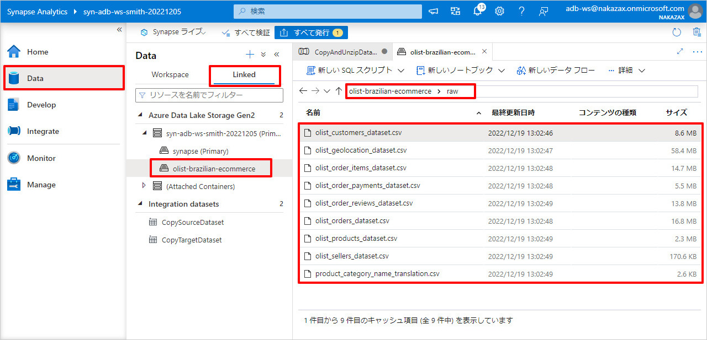

以上でパイプラインの作成と実行は完了です。発行しておきましょう。

### 4. **(オプション) 手動でのデータ配置**
以下は Synapse パイプラインのコピー アクティビティではなく手動でデータを配置する手順です。コピー アクティビティでデータを配置済みの場合、この手順はスキップしてください。

(1) 以下 URL にアクセスし、**[Download]** をクリックし、データセットの Zip ファイルをダウンロードします。
[https://github.com/microsoft/azure-databricks-sql-workshop-ja/blob/main/assets/olist-brazillian-ecommerse-dataset.zip](https://github.com/microsoft/azure-databricks-sql-workshop-ja/blob/main/assets/olist-brazillian-ecommerse-dataset.zip)

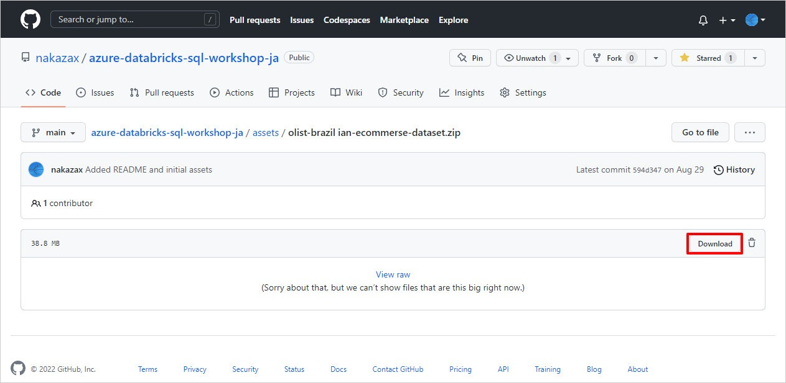

(2) Zip ファイルを展開します。

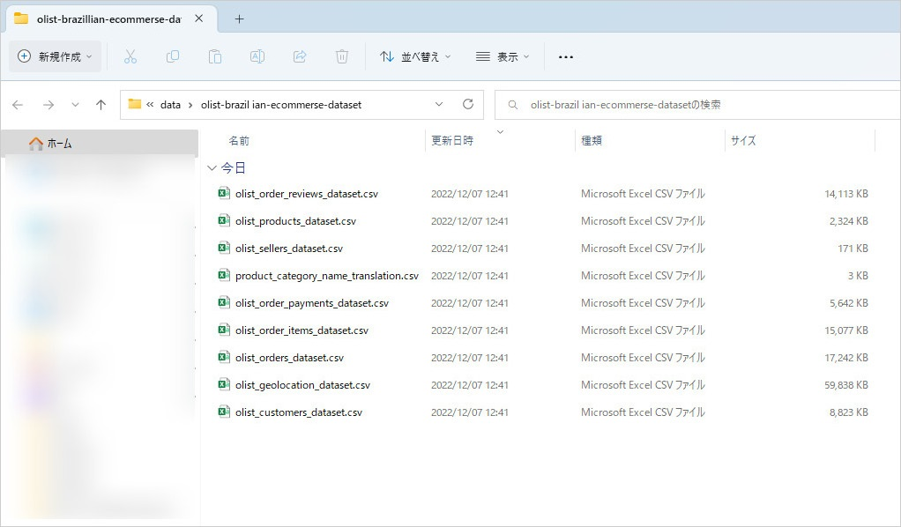

(3) Azure ポータルで自身が利用するストレージ アカウントで、左側メニュー **[ストレージ ブラウザー (プレビュー)]** にアクセスし、コンテナー `olist-brazilian-ecommerce` を選択します。

(4) **[ディレクトリの追加]** を選択します。画面右側に **[ディレクトリの追加]** が表示されますので、**[名前]** に **`raw`** と入力し、**[保存]** をクリックします。

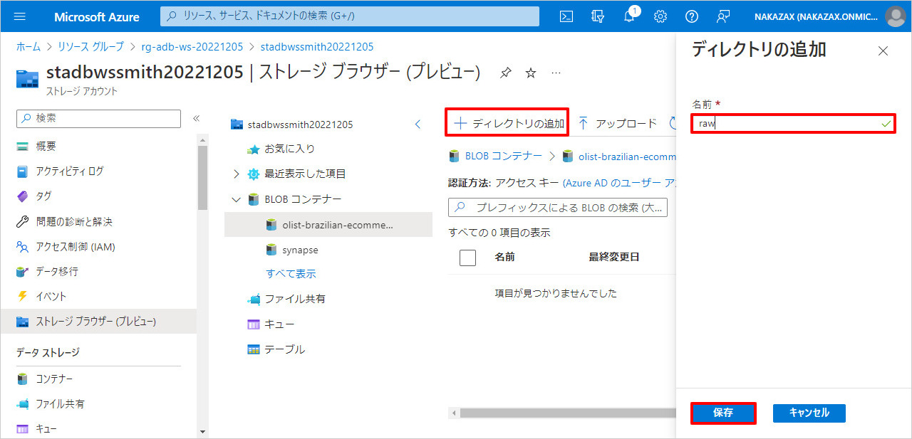

(5) `raw` ディレクトリを選択します。**[アップロード]** > **[ファイルの参照]** をクリックし、手元にダウンロード & 展開した CSV ファイル群をアップロードします。

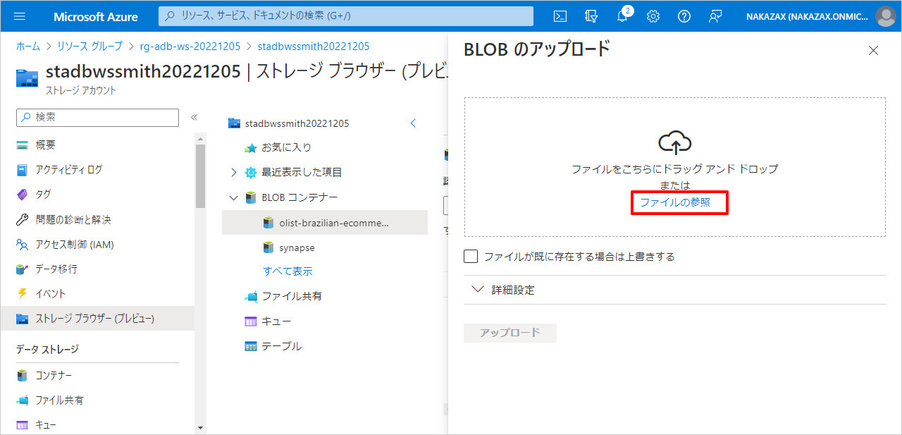

(一度に複数ファイルをアップロードできます)

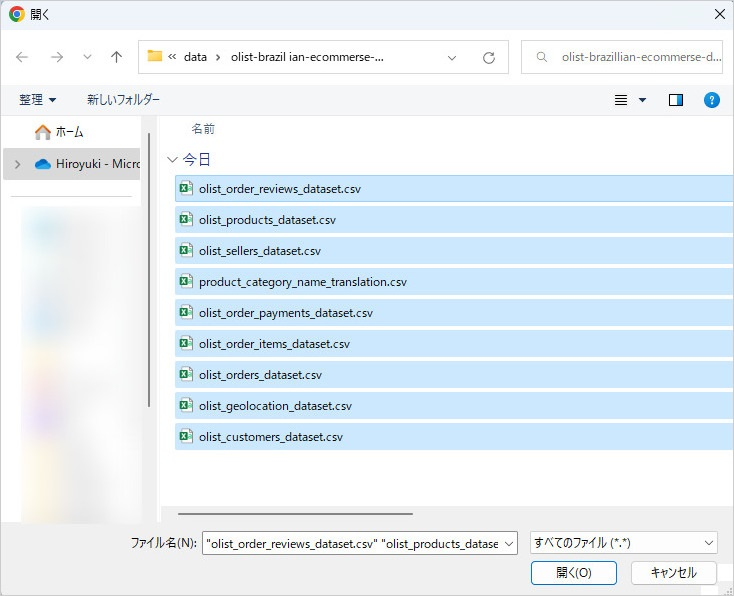

(6) アップロードした CSV ファイル群が以下のように表示されます。
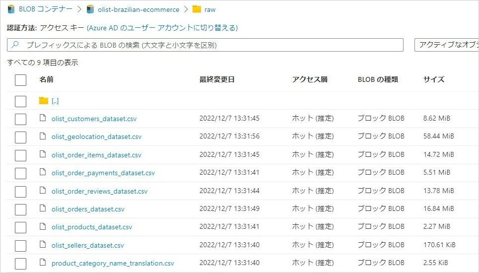

### **🎉 まとめ**
この章では、分析対象として利用するデータの内容を確認し、Azure Data Lake Storage (ADLS) Gen2 に配置しました。内容的にはここで一区切りになります。ここまで休憩を取らずに進めている場合、少し休憩を取ってリフレッシュしてから、次の章に進みましょう。

## Databricks ワークスペースへの接続
Duration: 00:10:00

この章では、Databricks ワークスペースに接続し、必要に応じて表示言語を日本語に変更します。

### **1. Databricks ワークスペースに接続**
(1) Azure ポータルにアクセスし、ワークショップで利用するリソース グループを選択します。リソース グループから自身が利用する Azure Databricks サービスを選択します。

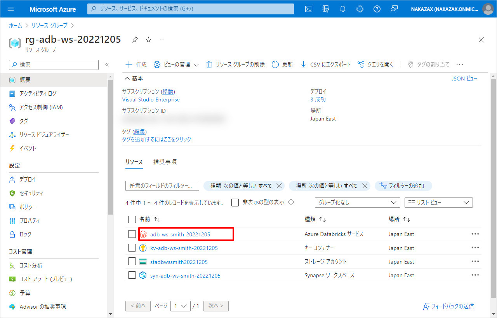

(2) 画面中央の **[ワークスペースの起動]** をクリックします。別タブで Azure Databricks ワークスペースが開きます。


(3) 利用目的に関するアンケートが表示されますが、必須ではないため **[Finish]** をクリックします。

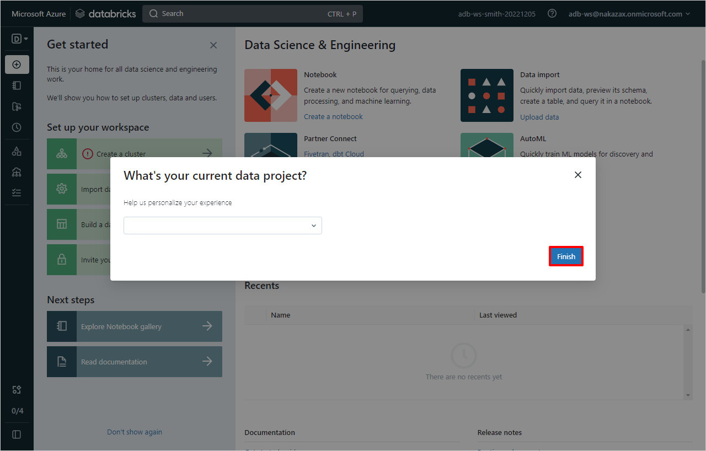

### **2. Databricks ワークスペースの日本語化 (オプション)**
Databricks ワークスペースの表示言語を日本語に変更します。英語のままでもワークショップの進行的には問題ありませんので、必要に応じて実施してください。

(1) 画面右上のユーザー名をクリックし、**[User Settings]** をクリックします。

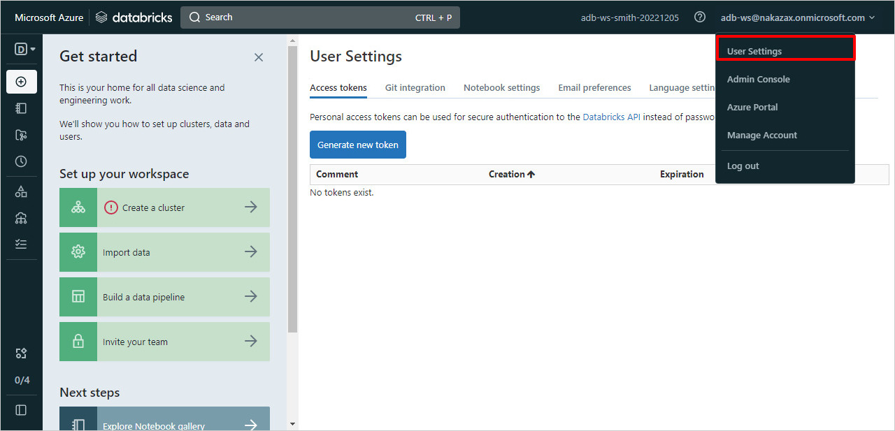

(2) **[Language settings]** タブを選択し、**[Change your language]** のリスト ボックスから **[日本語]** を選択します。

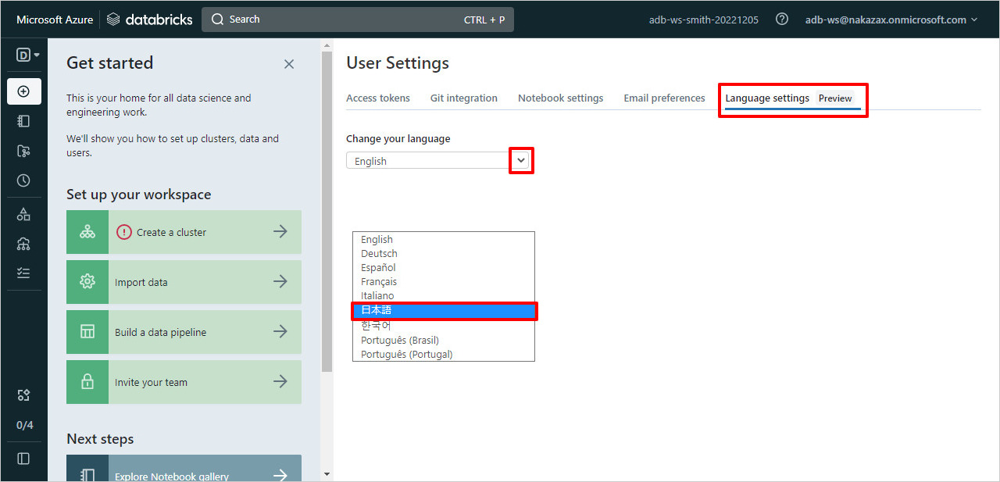

(3) 自動的に画面が更新され、日本語の表示に変更されます。


### **🎉 まとめ**
この章では、Databricks ワークスペースに接続し、必要に応じて表示言語を日本語に変更しました。次の章に進みましょう。

## Databricks SQL から ADLS Gen2 への接続 #1
Duration: 00:30:00

この章では、Databricks SQL から ADLS Gen2 に接続し、前の章で配置した CSV ファイル群に対して SQL クエリを実行します。

### **🤔 Databricks SQL から ADLS Gen2 に接続する際の認証方式について**
Databricks SQL から ADLS Gen2 に接続する際、以下 4 つの認証方式が利用できます。

1. Unity Catalog による資格情報の管理
2. Azure サービス プリンシパル
3. SAS トークン
4. アカウント キー

各認証方式の詳細については以下ドキュメントを参照してください。<br>
[https://learn.microsoft.com/ja-jp/azure/databricks/external-data/azure-storage](https://learn.microsoft.com/ja-jp/azure/databricks/external-data/azure-storage)

商用環境では Unity Catalog による資格情報の管理、または Azure サービス プリンシパルを利用することが推奨されています。いずれの方式もセットアップにあたって Azure Active Directory の操作が必要となります。

本ワークショップでは、受講者が Azure Active Directory の操作に必要な権限を持っていない可能性があるため、ストレージ アカウントのアカウント キーを用いた認証方式を利用します。まずは本章でアカウント キーを Databricks SQL でそのまま利用して接続確認を行い、次の章で Key Vault にシークレットとして格納する方法を試します。

<aside class="positive">
<b>💡 シークレット</b>

ストレージ アカウントのアカウント キーや接続文字列、パスワードのような機密情報を**シークレット**と呼びます。シークレットは、Azure Key Vault に格納して管理することが推奨されています。Key Vault にシークレットを格納することで、シークレットの管理が容易になり、シークレットの盗難や漏洩のリスクを低減することができます。

Key Vault の概要については以下ドキュメントを参照してください。<br>
[https://learn.microsoft.com/ja-jp/azure/key-vault/general/overview](https://learn.microsoft.com/ja-jp/azure/key-vault/general/overview)
</aside>

### **1. アカウント キーの取得**
(1) テキスト エディターを開き、以下のスニペットをコピー & ペーストし、`{storage-account}` を以前の章で作成したストレージ アカウント名に置き換えます。(置換後の文字列に `{}` を含める必要はありません)

```
spark.hadoop.fs.azure.account.key.{storage-account}.dfs.core.windows.net {account-key}
```

(2) Azure ポータルにアクセスし、ワークショップで利用するリソース グループを選択します。リソース グループから自身が利用するストレージ アカウントを選択します。

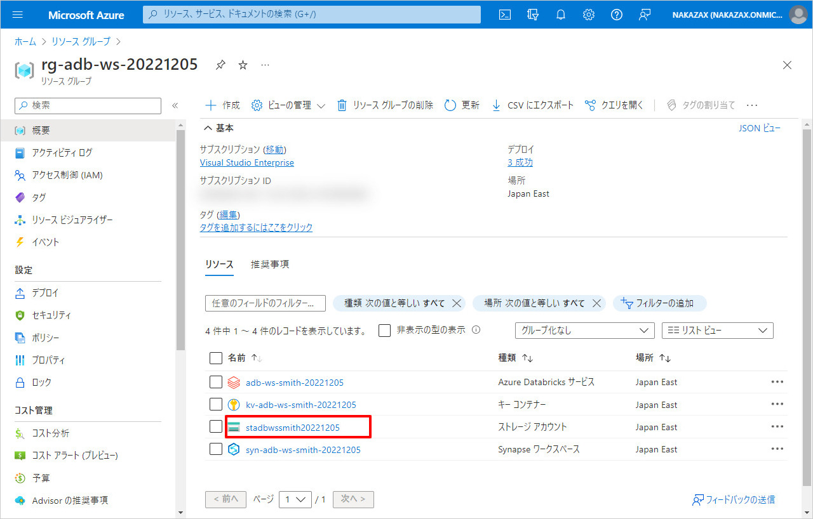

(3) 左側メニューの **[アクセス キー]** をクリックします。**[Key1]** の右横の **[表示]** をクリックし、アカウント キーをコピーします。

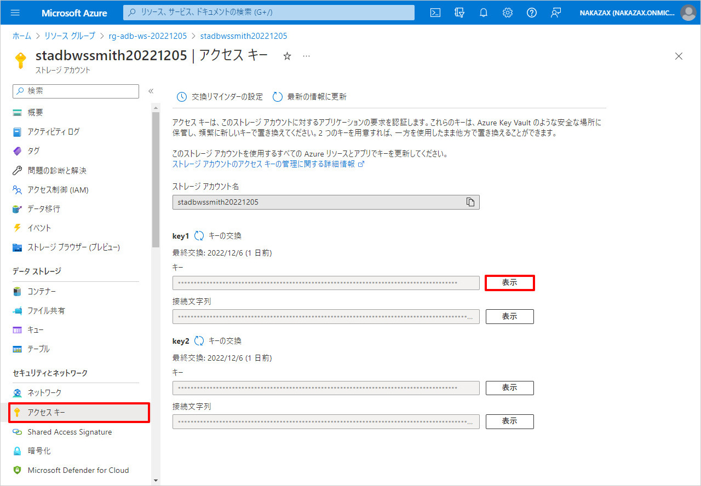

(キーの右端のアイコンをクリックすることで、アカウント キーをコピーできます)

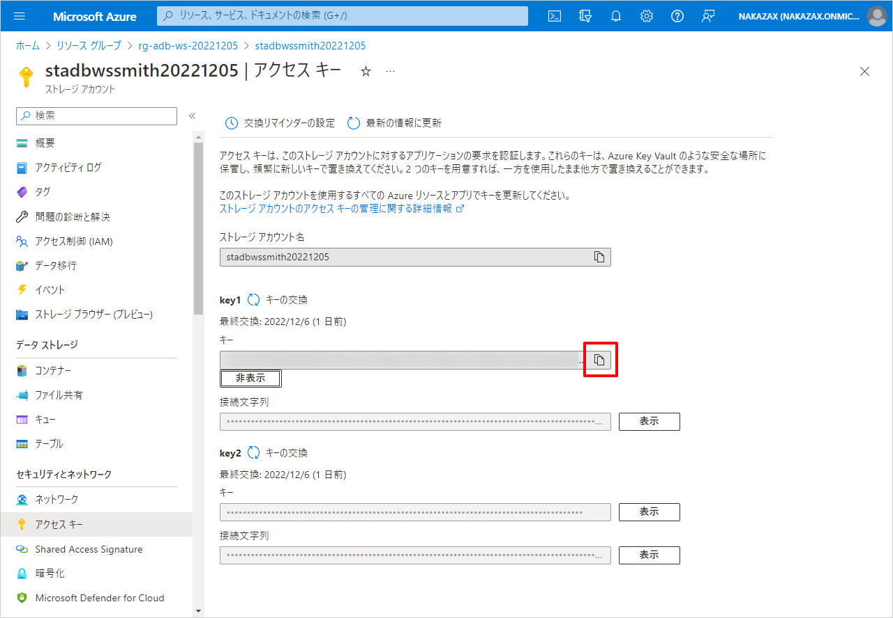

(4) コピーしたアカウント キーを用いて (1) の `{account-key}` を置き換えます。(置換後の文字列に `{}` を含める必要はありません)

### **2. Databricks SQL ウェアハウスの設定**
(1) Databricks ワークスペースの画面左上のペルソナ スイッチャーから **[SQL]** を選択します。


<aside class="positive">
<b>💡 ペルソナとペルソナ スイッチャー</b>

Databricks ではユーザーの役割に応じて画面が分かれています。それぞれの画面を**ペルソナ**と呼び、画面を切り替える機能を**ペルソナ スイッチャー**と呼びます。現時点で用意されているペルソナは以下の 3 つです。よく使うペルソナをピン留めすることができます。

1. **Data Science & Engieering** : データ エンジニアリング、データ サイエンス向けのペルソナです。既定ではこのペルソナが表示されます。Jupyter ライクなノートブックを利用したデータの処理や分析、Spark ジョブの実行などができます。
2. **Machine Learning** : 機械学習関連のペルソナです。機械学習のモデルや実験の管理ができます。
3. **SQL** : データ分析向けのペルソナです。SQL クエリを実行したり、ダッシュボードでデータを可視化したりできます。
</aside>

(2) 画面右上のユーザー名を選択し、**[SQL 管理コンソール]** > **[SQL ウェアハウスの設定]** を選択します。


(3) **[データ アクセス設定]** にテキスト エディターの内容をコピー & ペーストし、**[変更を保存]** をクリックします。

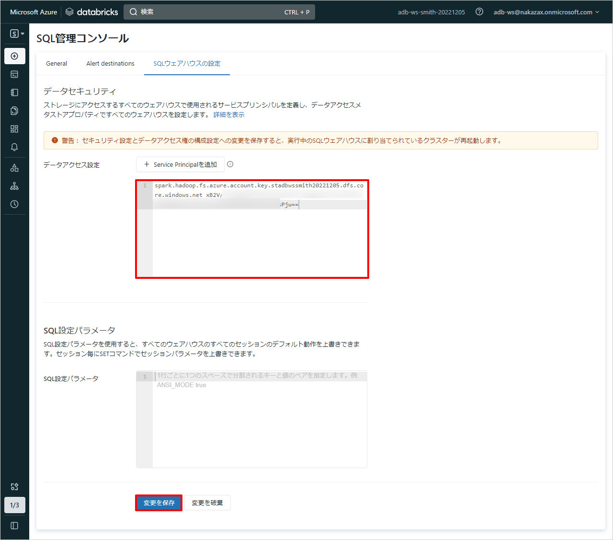

(4) Databricks ワークスペースの左側メニューから **[SQL ウェアハウス]** を選択します。最初から存在するウェアハウス `Starter Warehouse` の三点をクリックし **[編集]** を選択します。

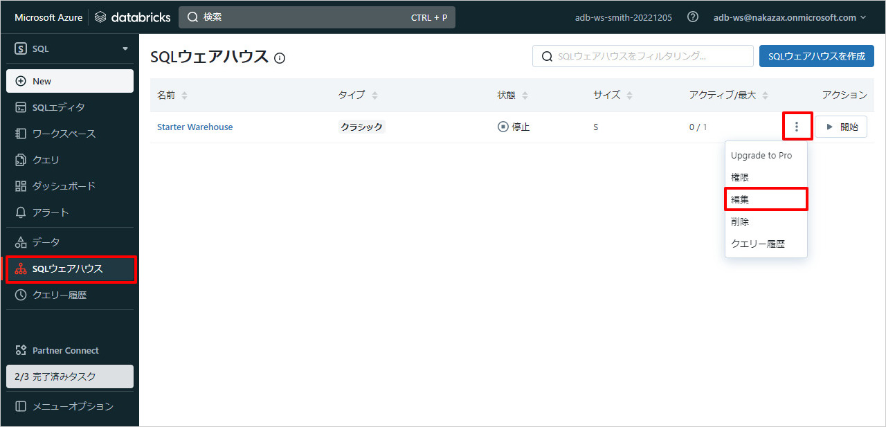

(5) **[クラスター サイズ]** を最も小さいサイズである **XXS** に変更し、**[Type]** を安価かつ基本的な機能を備えた **クラシック** に変更します。Type 変更時に `Workloads will be inpacted!` という警告のダイアログが出ますが、**[Confirm]** をクリックします。右上の **[保存]** をクリックします。

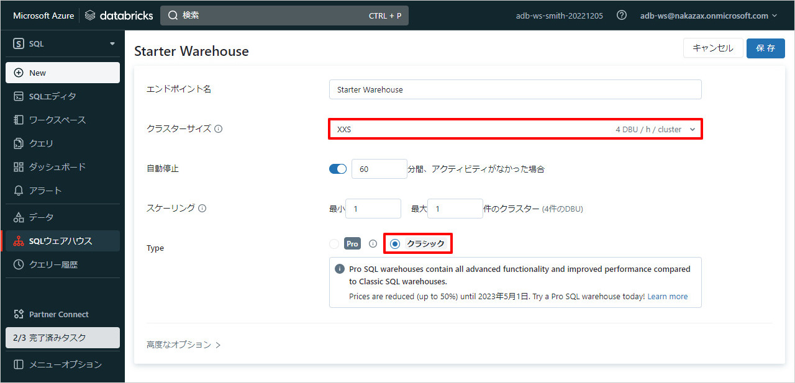

(6) **[開始]** をクリックします。ステータスが **開始中** になります。約 3-5 分で **実行中** になります。

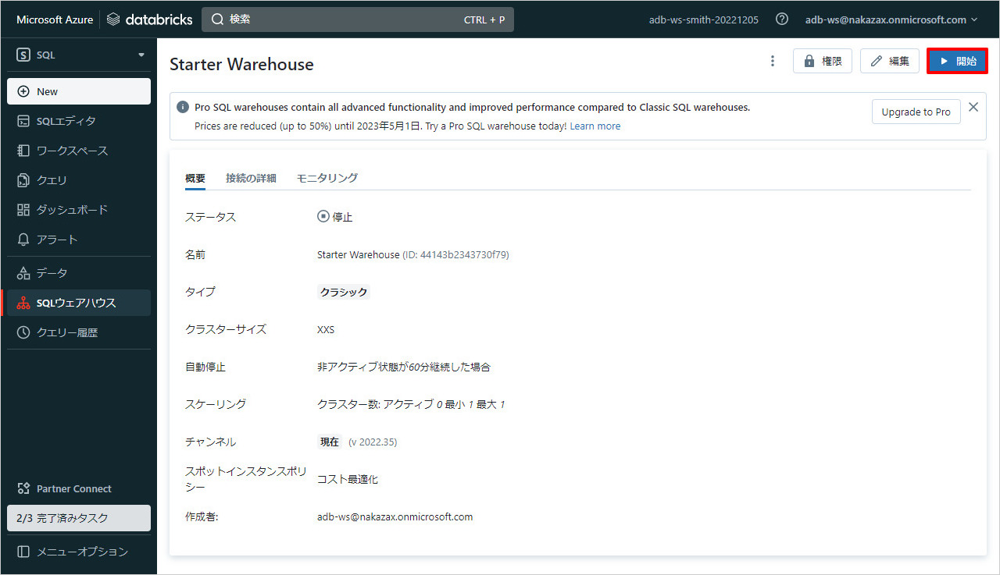

<aside class="negative">
<b>⚡ SQL ウェアハウスの起動に失敗する場合</b>

SQL ウェアハウスの開始直後に以下のようなエラーが表示される場合があります。SQL ウェアハウスで利用される Azure 仮想マシンの vCPU 数がサブスクリプションで定められた上限 (クォータ) を超えていることが原因です。5 分ほど経っても SQL ウェアハウスのステータスが実行中にならない場合、クォータを増やす必要があります。

増加対象のクォータについては最初の章 **[始める前に]** の前提条件のセクションを参照してください。

```
Clusters are failing to launch. Cluster launch will be retried.
Details for the latest failure: Error: Error code: QuotaExceeded, error message: Operation could not be completed as it results in exceeding approved Total Regional Cores quota. Additional details - Deployment Model: Resource Manager, Location: japaneast, Current Limit: 20, Current Usage: 16, Additional Required: 8, (Minimum) New Limit Required: 24.
```

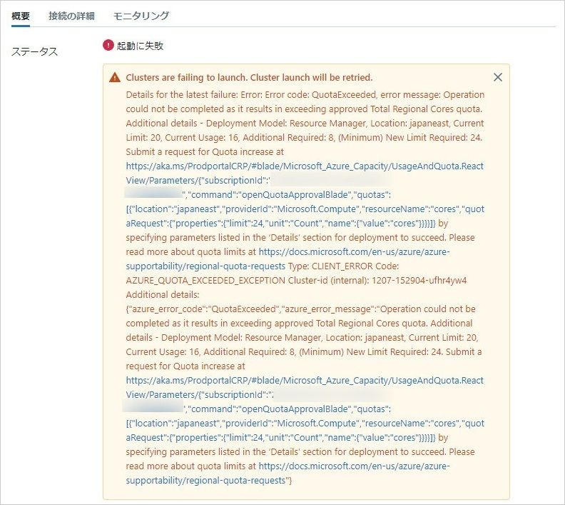
</aside>

### **3. Databricks SQL でのクエリ実行**
(1) SQL ウェアハウスのステータスが **実行中** になったら、画面左側メニューの **[SQL エディタ]** にアクセスします。以下のクエリをコピー & ペーストして LOCATION 句の `{storage-account-name}` 2 か所を書き換え、**[すべてを実行]** をクリックします。これらのクエリにより、`olist_raw` データベース (またはスキーマとも呼びます) および `orders` テーブル、`order_items` テーブルが作成されます。

```sql
CREATE DATABASE IF NOT EXISTS olist_raw;

CREATE TABLE IF NOT EXISTS olist_raw.orders
USING CSV
OPTIONS (HEADER true, INFERSCHEMA true)
LOCATION 'abfss://olist-brazilian-ecommerce@{storage-account-name}.dfs.core.windows.net/raw/olist_orders_dataset.csv';

CREATE TABLE IF NOT EXISTS olist_raw.order_items
USING CSV
OPTIONS (HEADER true, INFERSCHEMA true)
LOCATION 'abfss://olist-brazilian-ecommerce@{storage-account-name}.dfs.core.windows.net/raw/olist_order_items_dataset.csv';
```

(2) スキーマ ブラウザーに作成したデータベースとテーブルが表示されることを確認します。(データベース名が表示されない場合はキャプチャ赤枠のボタンをクリックして表示を更新します)

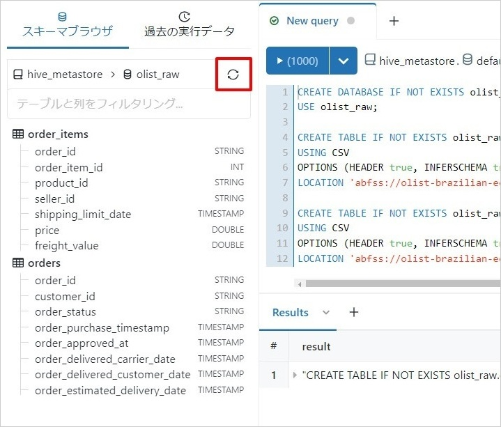

(3) `olist_raw.orders` テーブルに対して以下のクエリを 1 つずつ実行して、データ内容と件数が取得できることを確認します。Shift キーを押しながら実行したい SQL を選択して Enter キーを押すと、選択した SQL のみを実行できます。

```sql
SELECT * FROM olist_raw.orders LIMIT 5;

-- カウント結果として 99441 件が表示されることを確認
SELECT COUNT(*) FROM olist_raw.orders;
```

(4) `olist_raw.order_items` テーブルに対して以下のクエリを 1 つずつ実行して、データ内容と件数が取得できることを確認します。

```sql
SELECT * FROM olist_raw.order_items LIMIT 5;

-- カウント結果として 112650 件が表示されることを確認
SELECT COUNT(*) FROM olist_raw.order_items;
```

(5) Databricks SQL ではクエリに名前を付けて保存することができます。`Create orders & order_items table` などと名前を付けて **[保存]** をクリックします。

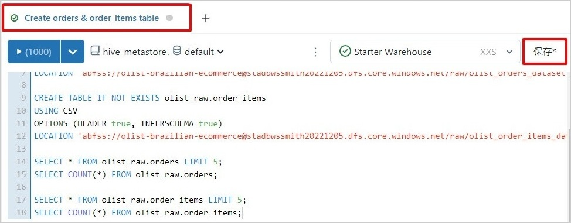

### **🎉 まとめ**
この章では、Databricks SQL から ADLS Gen2 に接続し、前の章で配置した CSV ファイル群に対して SQL クエリを実行しました。また、ストレージ アカウントのアカウント キーを Databricks SQL で直接利用して認証を行いました。次の章に進みましょう。

## Databricks SQL から ADLS Gen2 への接続 #2
Duration: 00:20:00

この章では、ストレージ アカウントのアカウント キーを Azure Key Vault にシークレットとして登録します。Databricks SQL から Key Vault に登録されたシークレットをシークレット スコープを経由して参照し、ADLS Gen2 上の CSV ファイル群に対して SQL クエリを実行します。

<aside class="positive">
<b>💡 シークレット スコープと Key Vault</b>

シークレット スコープとは、Databricks 上でシークレットを管理するためのコレクション、要は入れ物のようなものです。Databricks 上でシークレットを扱うには、まずシークレット スコープを作成して、それからシークレット スコープを指定してシークレットを作成します。

Azure Databricks ならではの特長として、Key Vault を参照専用のシークレット スコープとして登録できます。これにより、Key Vault の画面から登録したシークレットを Databricks ワークスペースから簡単に参照できるようになります。

シークレット スコープの概要については以下ドキュメントを参照してください。<br>
[https://learn.microsoft.com/ja-jp/azure/databricks/security/secrets/secret-scopes](https://learn.microsoft.com/ja-jp/azure/databricks/security/secrets/secret-scopes)
</aside>

### **1. Key Vault へのシークレットの登録**
(1) Azure ポータルにアクセスし、ワークショップで利用するリソース グループを選択します。リソース グループから自身が利用する Key Vault (日本語の場合はキー コンテナー) を選択します。

(2) 左側メニューの **[シークレット]** を選択した後、画面上部の **[+ 生成/インポート]** をクリックします。

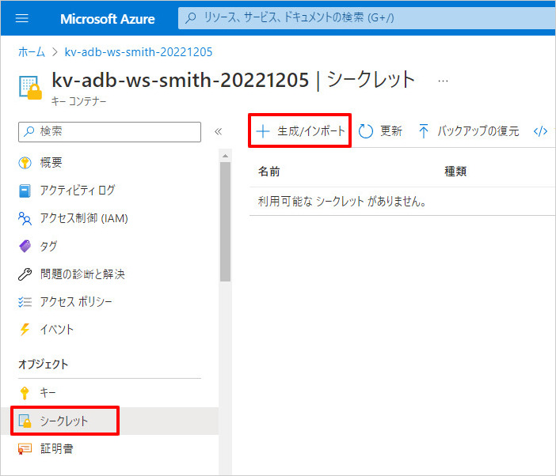

(3) シークレットの作成画面で以下の項目を設定 (他の項目は変更不要) し、 **[作成]** をクリックします。

**項目** | **設定値**
--- | ---
名前 | 任意の名前を入力します。このワークショップでは **`secret-storage-account-key`** とします。
シークレット値 | ストレージ アカウントのアカウント キーを貼り付けます。

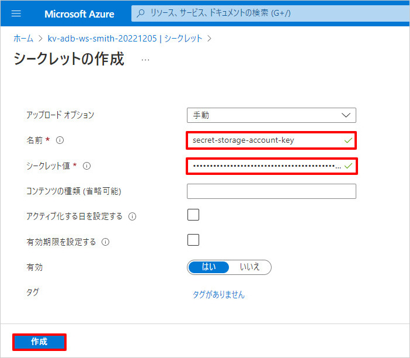

### **2. Databricks のシークレット スコープの作成**
(1) Databricks のシークレット スコープの作成画面 `https://{my-databricks-workspace-url}#secrets/createScope` にアクセスします。

- `{my-databricks-workspace-url}` は自身の Databricks ワークスペースの URL に置き換えてください。
- 例: `https://adb-1234567890.1.azuredatabricks.net#secrets/createScope`

(2) Databricks のシークレット スコープの作成画面で以下の項目を設定し、 **[Create]** をクリックします。

**項目** | **設定値**
--- | ---
Scope Name | 任意の名前を入力します。このワークショップでは **`my-secret-scope`** とします。
Manage Principal | **`Creator`** を選択します。
DNS Name | Key Vault の左側メニューの **[プロパティ]** > **[コンテナーの URI]** の値をコピーして貼り付けます。
Resource ID | Key Vault の左側メニューの **[プロパティ]** > **[リソース ID]** の値をコピーして貼り付けます。

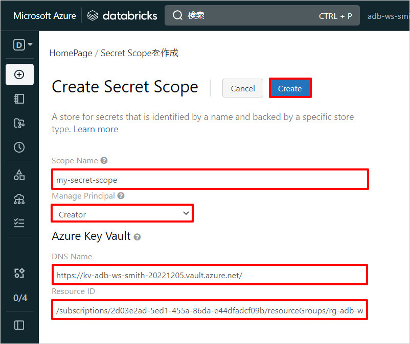

(3) 以下のようなダイアログが表示されたらシークレット スコープの作成は完了です。**[OK]** をクリックします。Web ブラウザのこのタブは閉じても構いません。

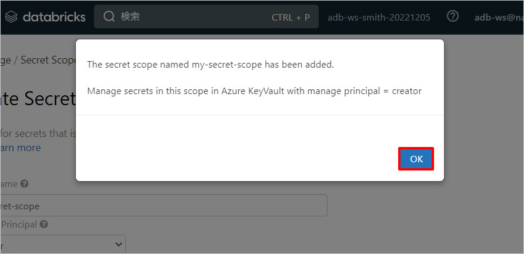

### **3. Databricks SQL ウェアハウスの設定とクエリの実行**
(1) Databricks SQL にアクセスし、画面右上のユーザー名を選択し、**[SQL 管理コンソール]** > **[SQL ウェアハウスの設定]** を選択します。

(2) データ アクセス設定の現在の記述は削除した上で、以下のスニペットをコピー & ペーストし、`{storage-account}` を以前の章で作成したストレージ アカウント名に置き換えます。画面下部の **[変更を保存]** をクリックします。これにより SQL ウェアハウスが再起動されます。

```
spark.hadoop.fs.azure.account.key.{storage-account}.dfs.core.windows.net {{secrets/my-secret-scope/secret-storage-account-key}}
```

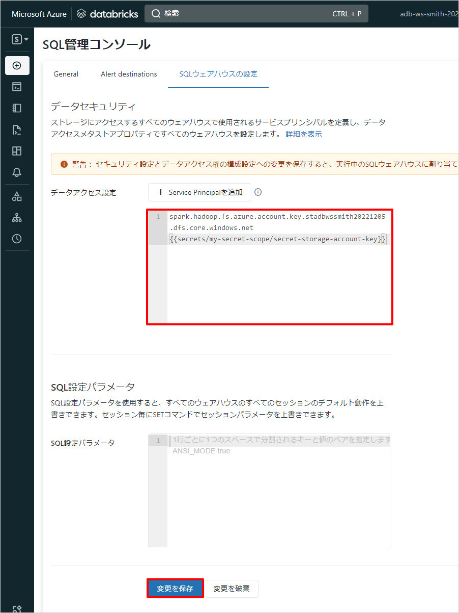

(3) SQL ウェアハウスの再起動完了後、Databricks SQL の左側メニューの **[クエリ]** にアクセスし、以前の章で保存したクエリを開きます。

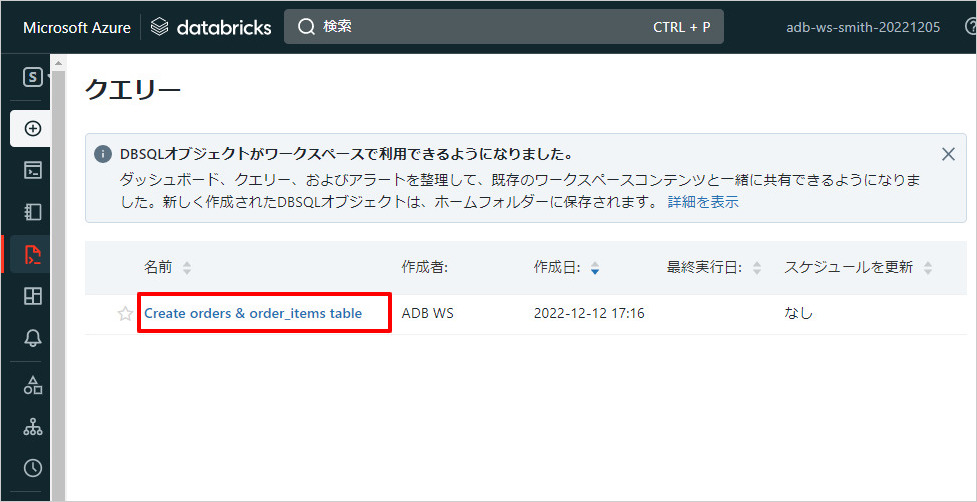

(4) クエリのうち適当な SELECT 文を選択して実行します。結果が返ってくれば、SQL ウェアハウスのデータ アクセス設定が正しく設定されていることが確認できます。

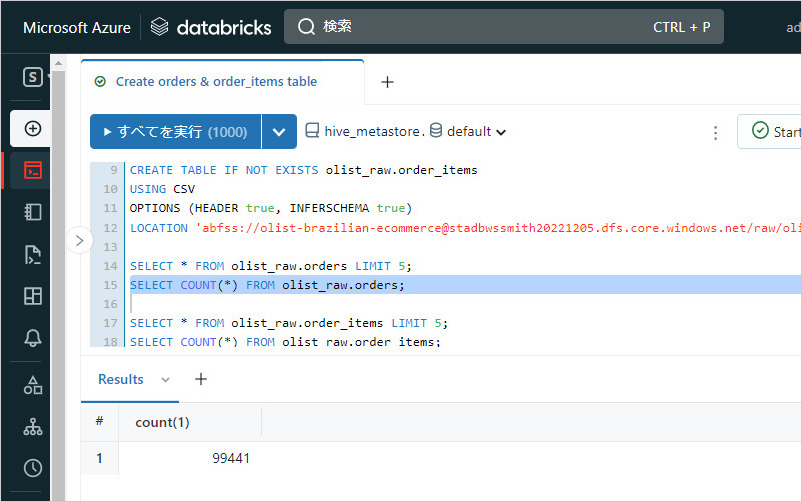

### **🎉 まとめ**
この章では、ストレージ アカウントのアカウント キーを Azure Key Vault にシークレットとして登録した後、Databricks SQL から Key Vault に登録されたシークレットをシークレット スコープを経由して参照し、ADLS Gen2 上の CSV ファイル群に対して SQL クエリを実行しました。次の章に進みましょう。

## Delta Lake 形式への変換 #1 (Orders)
Duration: 00:40:00

この章では、Azure Synapse Analytics のマッピング データ フローを用いて Orders の CSV ファイル (`olist_orders_dataset.csv`) を Delta Lake 形式に変換します。変換の前後で CSV 形式のデータと Delta Lake 形式のデータを Databricks SQL のクエリとデータ エクスプローラーで概観します。

### **🔎 データ変換の流れ**
この章で実現するデータ変換の流れは以下の通りです。

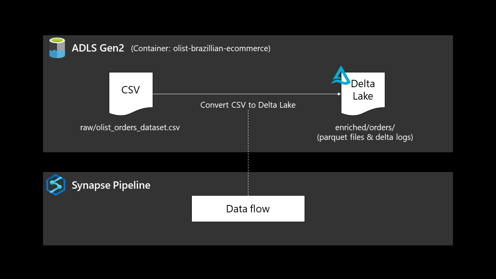

### **1. Databricks SQL による CSV データの概観**
(1) Databricks SQL の左側メニューの **[データ]** にアクセスします。データ エクスプローラーと呼ばれる画面が表示されます。`olist_raw` データベースの `orders` テーブルの **[スキーマ]** を選択し、列名やデータ型を確認します。`order_id` がキー項目です。

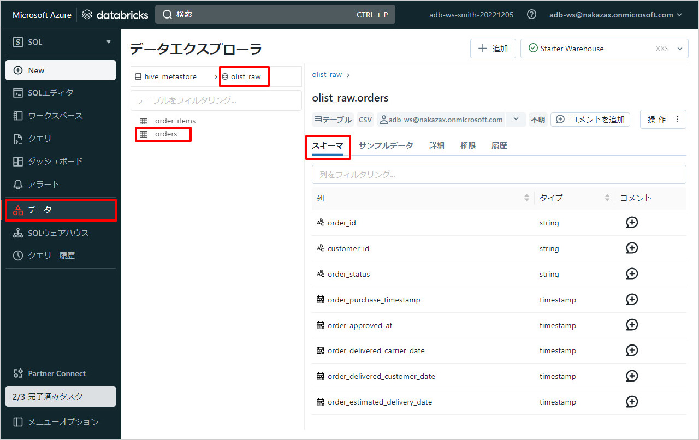

(2) 続けて **[サンプル データ]** をクリックし、データの内容を確認します。

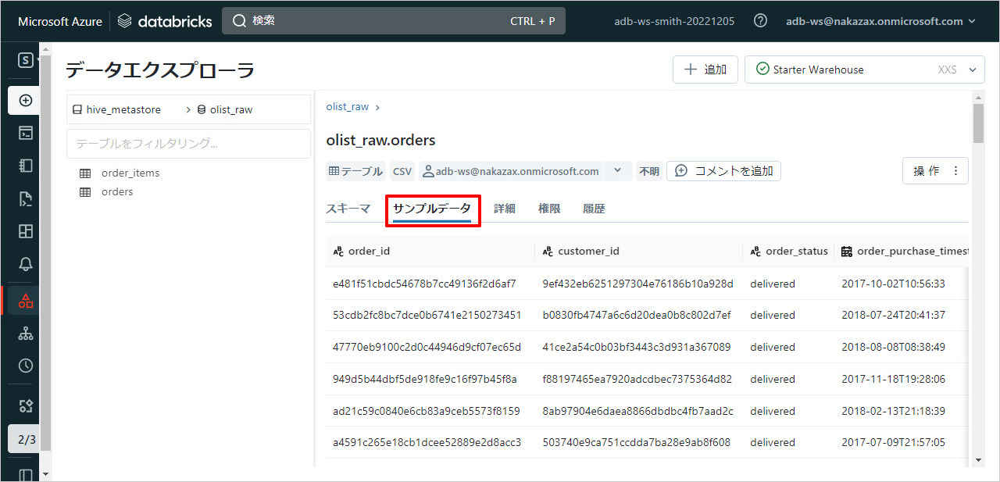

### **2. マッピング データ フローによる Delta Lake 形式への変換**
Azure Synapse Analytics のマッピング データ フローを用いて Orders の CSV ファイルを Delta Lake 形式に変換します。

具体的な手順として、Synapse Studio にてデータ フローのデバッグを有効化、データ フローとパイプラインを作成、パイプラインにデータ フロー アクティビティを定義してパイプラインを実行します。

#### **データ フローの完成形**
データ フローの完成形は以下キャプチャの通りです。ソース変換で ADLS Gen2 上の Orders の CSV ファイルを読み取り、行の変更変換を挟んで、シンク変換で ADLS Gen2 に Delta Lake 形式で出力します。

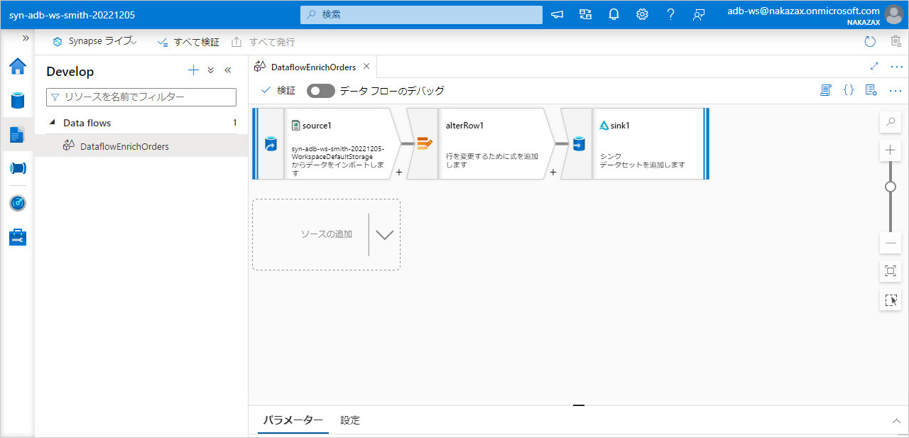

<aside class="positive">
<b>💡 データ フローの「変換」(Transformation)</b>

データ フローのキャンバス内の一つ一つのボックスを**変換** (Transformation) と呼びます。データ フローは 1 つ以上の**ソース変換**から開始してデータを読み込み、色々な変換を使ってデータを変換し、最後に 1 つ以上の**シンク変換**でデータを出力します。
</aside>

<aside class="positive">
<b>💡 シンク変換でのアップサートと行の変更変換</b>

Delta Lake 形式のテーブルに対して変更を行う際、新しい行の挿入はもちろん、既存の行の更新、両者を組み合わせたアップサート、そして既存の行の削除を行うことができます。(Apache Parquet 形式の場合は新しい行の挿入のみ対応)

Delta Lake テーブルに対して行う変更について、シンク変換では挿入、削除、アップサート、更新のどれに該当するかを指定できます。本ワークショップでは、データ フローを複数回実行した場合でも、キー列 (Orders の場合は `order_id`) の値が同じ行が複数回テーブルに挿入されないようにしたいため、アップサートを指定します。

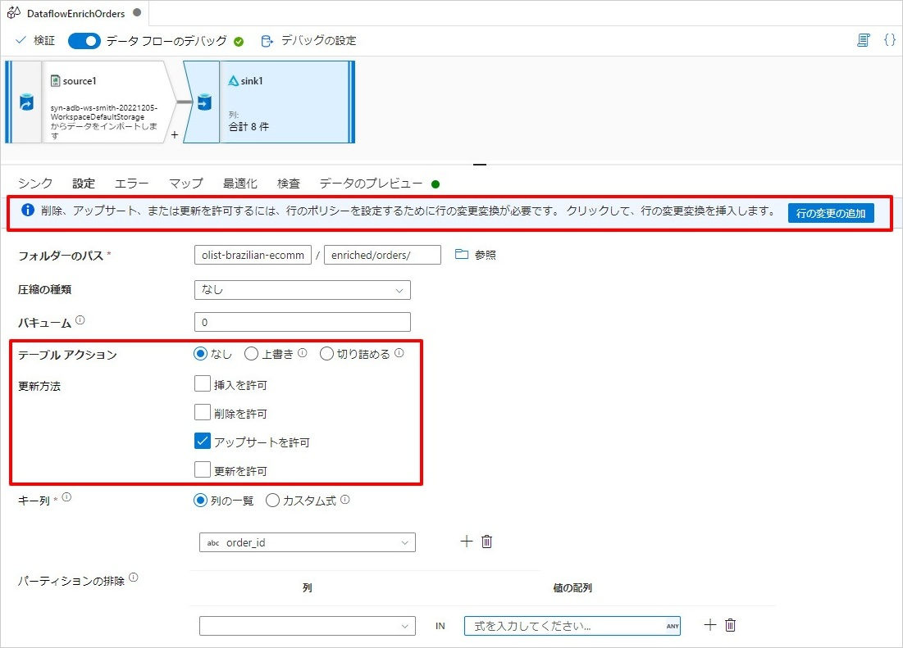

シンク変換で削除、アップサート、更新にチェックすると、シンク変換の前に**行の変更変換**を組み込むよう求められます。行の変更変換では、シンク変換での挿入、削除、アップサート、更新の対象とする行を絞り込むための条件を記述します。実際のユースケースでは `Year > 2000` の行だけを更新対象にするといった使い方をします。

具体的な設定手順については後ほど記載しますが、本ワークショップでは特定の行に絞り込まずに全行をアップサートの対象とします。

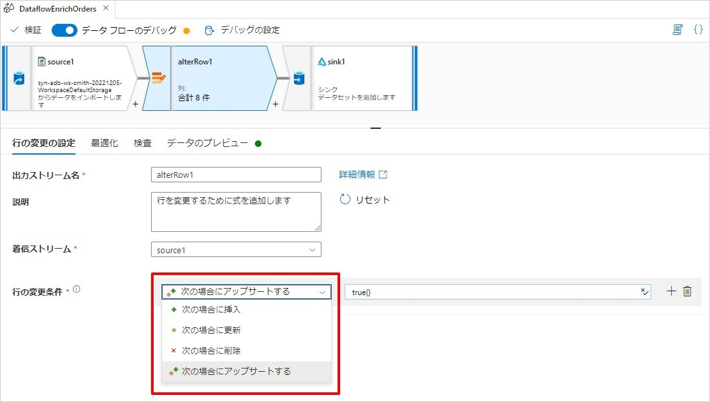
</aside>

#### **2-1. データ フローのデバッグの有効化**
まずはデバッグ用の Spark クラスターを起動します。これにより、各変換でデータがどのように変更されるかをプレビューしながら作業を行えるようになります。

(1) Synapse スタジオで **[Develop]** ハブにアクセスした後、**[+]** ボタンをクリックし **[データ フロー]** を選択します。

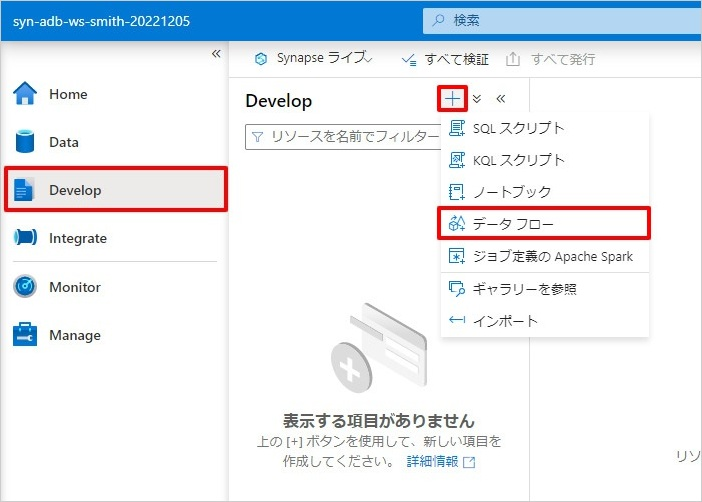

(2) データ フローのプロパティで **[名前]** に `DataflowEnrichOrders` を入力します。作業領域を広くするため以下の画面キャプチャ内の赤枠で囲んだボタンをクリックしてプロパティを折りたたみます。

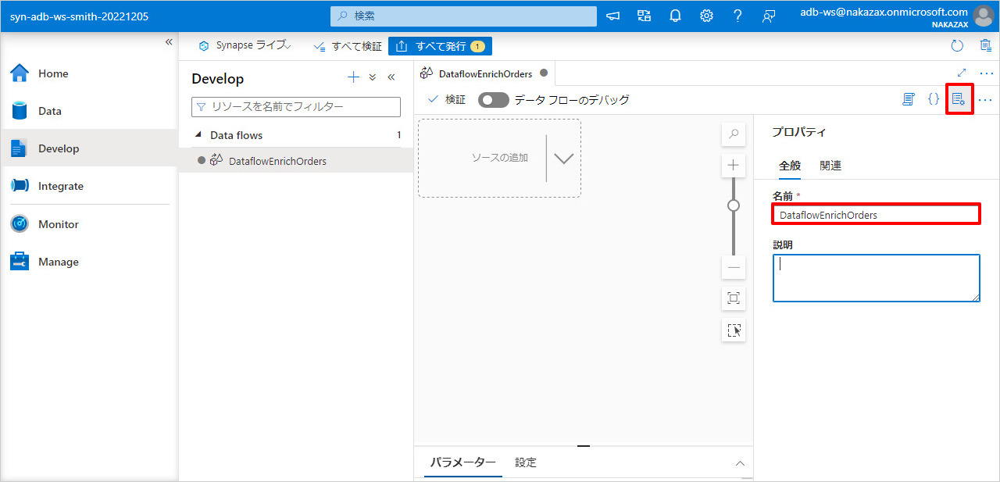

(3) **[データ フローのデバッグ]** のトグルをオンにします。

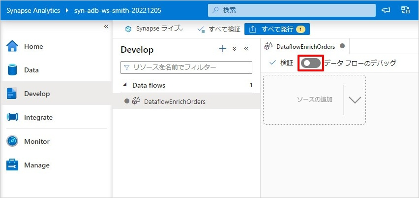

(4) 以下のような確認のダイアログが出ますので **[OK]** をクリックします。通常 5 分程度でデバッグ用のクラスターの起動が完了します。起動の完了を待たずに次のステップに進みましょう。

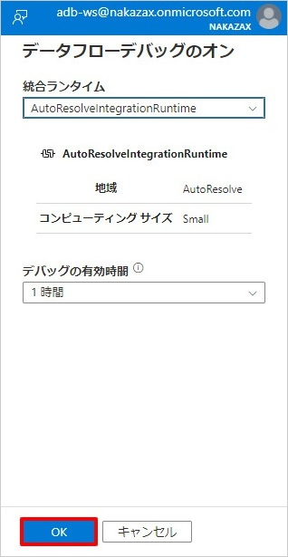

#### **2-2. データ フロー > ソース変換**
(1) データ フローのキャンバス内の **[ソースの追加]** の下向き矢印をクリックし、**[ソースの追加]** を選択します。

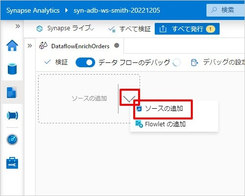

(2) ソース変換をクリックし、画面下部に表示された **[ソースの設定]** タブを開き、以下の項目を設定します。

**項目** | **設定値**
--- | ---
ソースの種類 | **`インライン`** を選択します。
インライン データセットの種類 | **`DelimitedText`** を選択します。
リンク サービス | **`{Synapse ワークスペース名}-WorkspaceDefaultStorage`** を選択します。

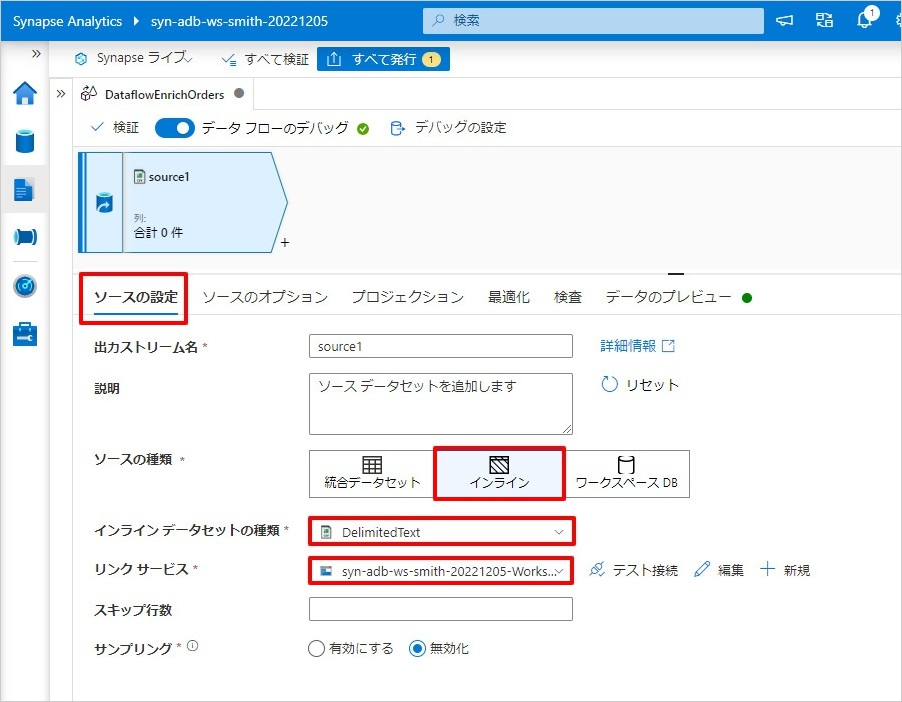

(3) 続いて **[ソースのオプション]** タブを開き、以下の項目を設定します。

**項目** | **設定値**
--- | ---
ファイル パス | コンテナ名に **`olist-brazillian-ecommerce`**、フォルダ名に **`raw`**、ファイル名に **`olist_orders_dataset.csv`** を入力します。(「参照」からファイルを選択する方法でも OK です)
先頭行をヘッダーとして | チェックします。

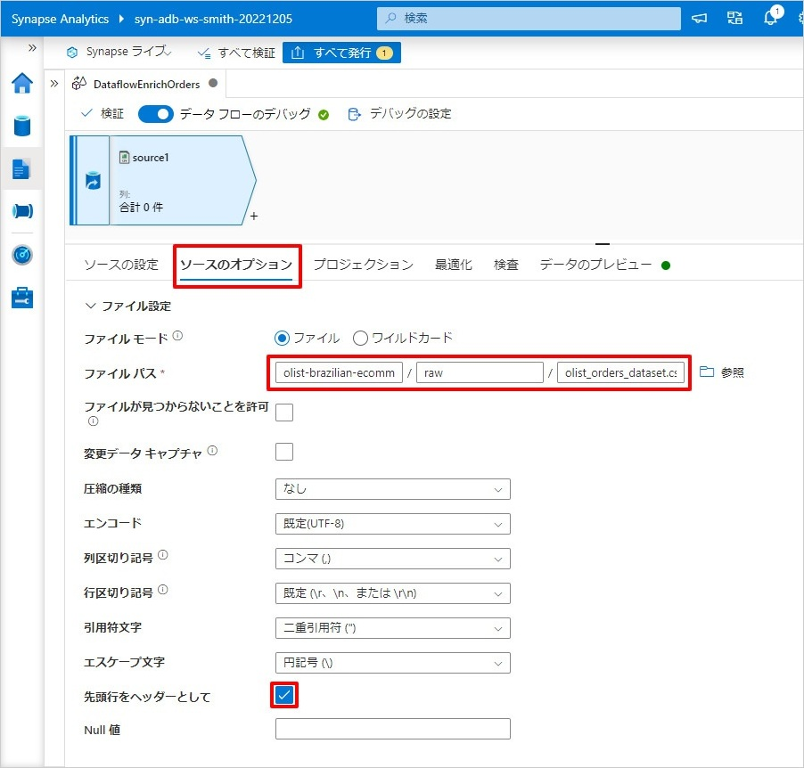

(4) 続いて **[プロジェクション]** タブを開き、**[スキーマのインポート]** をクリックします。この操作を完了するにはデータ フローのデバッグ用クラスターが起動している必要があります。

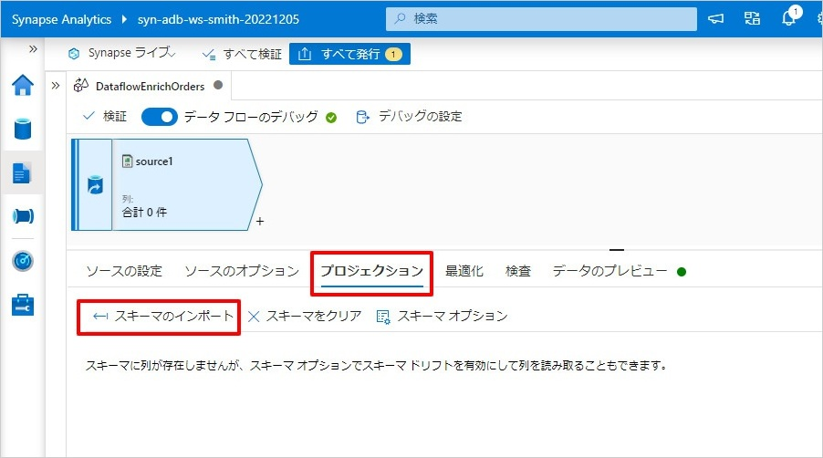

(5) スキーマのインポート動作の画面では何も入力せずに **[インポート]** をクリックします。


(6) スキーマのインポートが完了するまで待機します。完了すると以下のように表示されます。

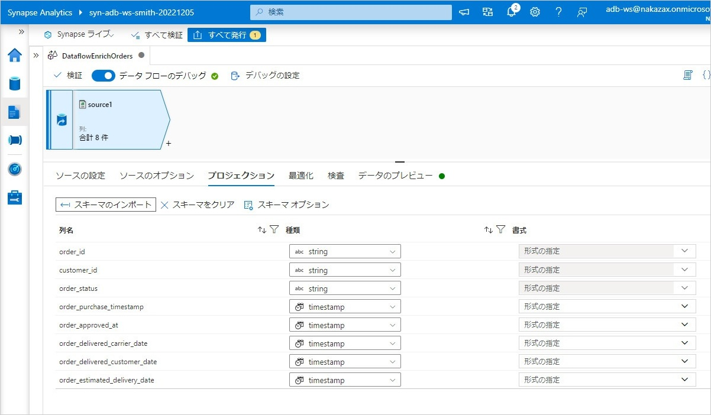

(7) 続いて **[データのプレビュー]** タブを開き、**[最新の情報に更新]** をクリックします。完了すると以下のように表示されます。

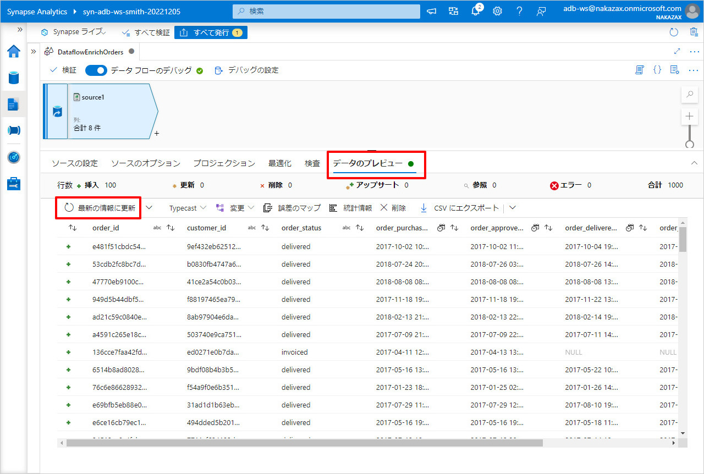

ソース変換の編集はこれで完了です。

#### **2-3. データ フロー > 行の変更変換**
(1) ソース変換の後ろに「行の変更」変換を追加します。

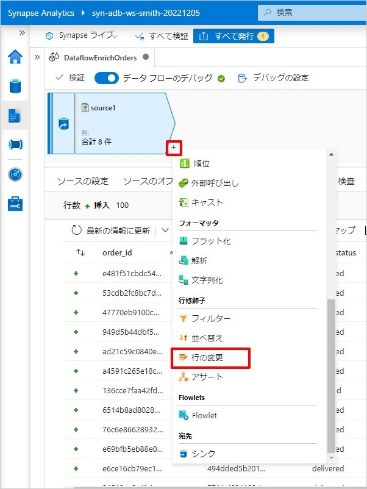

(2) 行の変更変換をクリックし、画面下部に表示された **[行の変更の設定]**　タブを開き、以下の項目を設定します。

**項目** | **設定値**
--- | ---
行の変更条件 | **`次の場合にアップサートする`** を選択し、値に **`true()`** を入力します。

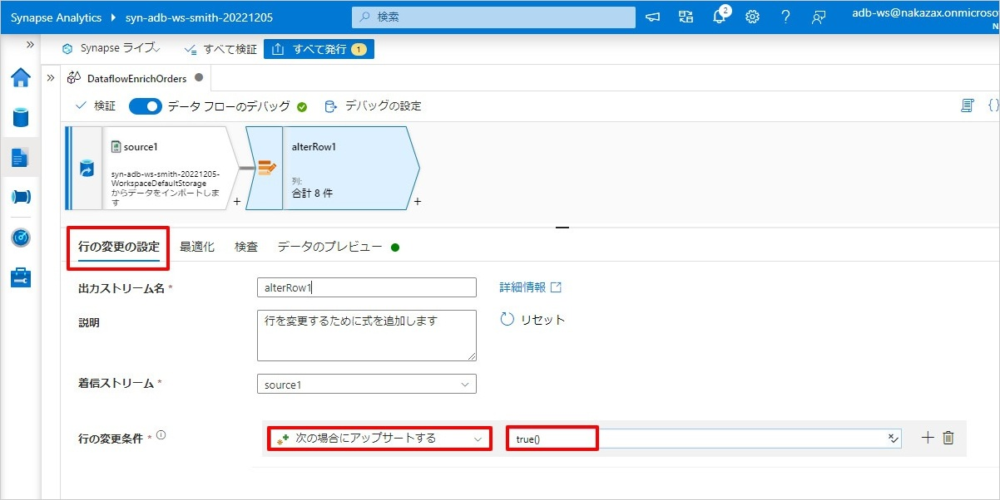

行の変更変換の編集はこれで完了です。

#### **2-4. データ フロー > シンク変換**
(1) 行の変更変換の後ろにシンク変換を追加します。


(2) シンク変換をクリックし、画面下部に表示された **[シンク]**　タブを開き、以下の項目を設定します。

**項目** | **設定値**
--- | ---
シンクの種類 | **`インライン`** を選択します。
インライン データセットの種類 | **`Delta`** を選択します。
リンク サービス | **`{Synapse ワークスペース名}-WorkspaceDefaultStorage`** を選択します。

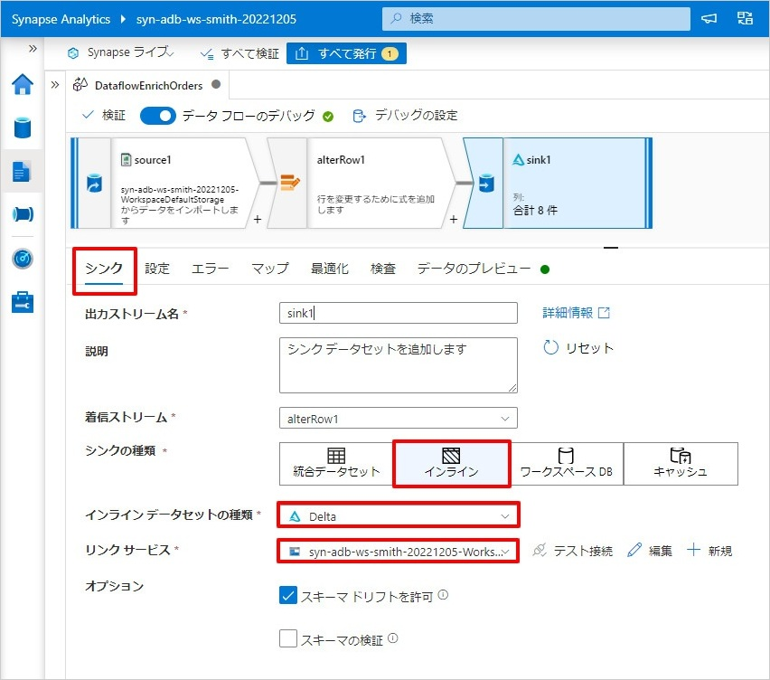

(3) 続いて **[設定]** タブを開き、以下の項目を設定します。

**項目** | **設定値**
--- | ---
フォルダーのパス | コンテナ名に **`olist-brazillian-ecommerce`**、フォルダー名に **`enriched/orders/`** を入力します。
更新方法 | **`アップサートを許可`** を選択します。
キー列 | **`order_id`** を選択します。
デルタ オプション > 自動圧縮 | チェックします。
デルタ オプション > 書き込みの最適化 | チェックします。

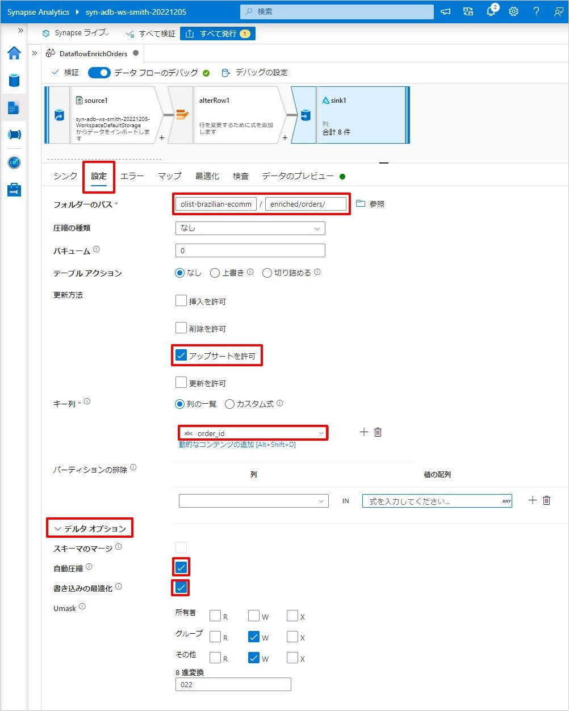

シンク変換およびデータ フローの編集はこれで完了です。発行を行っておきましょう。

#### **2-5. パイプラインの作成と実行**
最後にデータ フロー アクティビティを含むパイプラインを作成した後、パイプラインを実行します。

(1) Synapse スタジオで **[Integrate]** ハブにアクセスした後、**[+]** ボタンをクリックし、**[パイプライン]** を選択します。

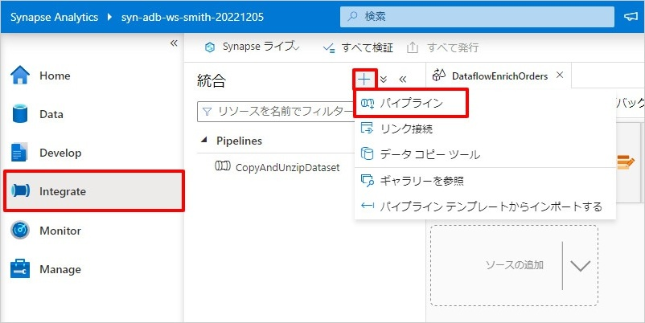

(2) パイプラインのプロパティで **[名前]** に `PipelineEnrichOrders` を入力します。作業領域を広くするため以下の画面キャプチャ内の赤枠で囲んだボタンをクリックしてプロパティを折りたたみます。

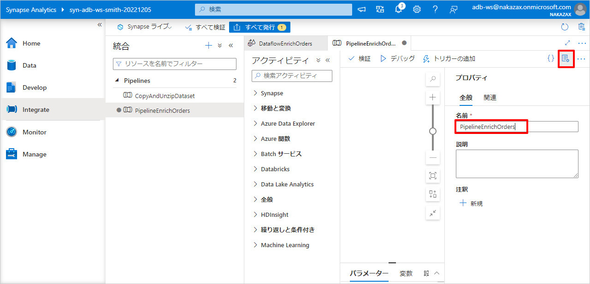

(3) パイプラインのアクティビティ一覧の **[移動と変換]** セクションを展開し **[データ フロー]** を右側のキャンバスにドラッグ & ドロップします。

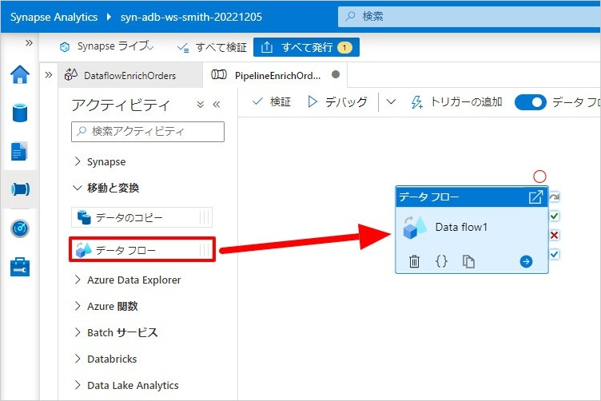

(4) キャンバス上のデータ フロー アクティビティを選択し、**[設定]** タブを開き、以下の項目を設定します。

**項目** | **設定値**
--- | ---
データ フロー | 先ほど作成した **`DataflowEnrichOrders`** を選択します。

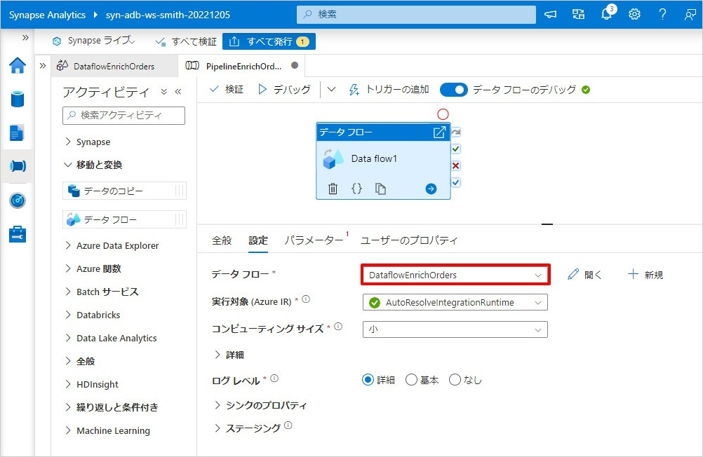

(5) 以上でパイプラインの作成は完了です。画面上部の **[デバッグ]** をクリックします。パイプラインが実行されますので、リフレッシュ ボタンを定期的にクリックして表示を更新し、状態が `成功` になるまで待ちます。

(6) 状態が `成功` になったらパイプラインの実行結果を確認します。以下の画面キャプチャ内の赤枠で囲んだアイコン (マウスを近づけると表示されます) をクリックします。

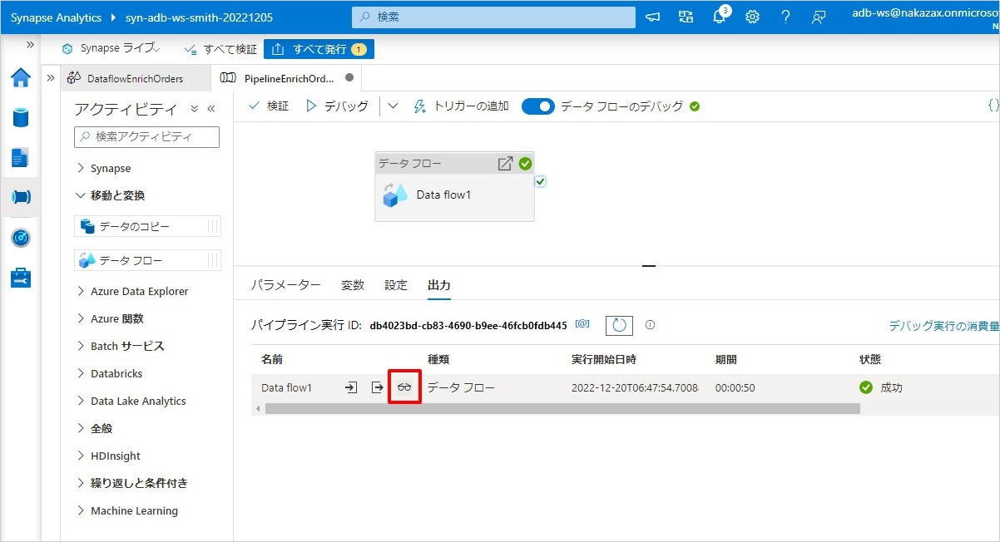

(7) パイプラインの実行結果が表示されます。書き込まれた行数が以下キャプチャの内容と一致することを確認します。

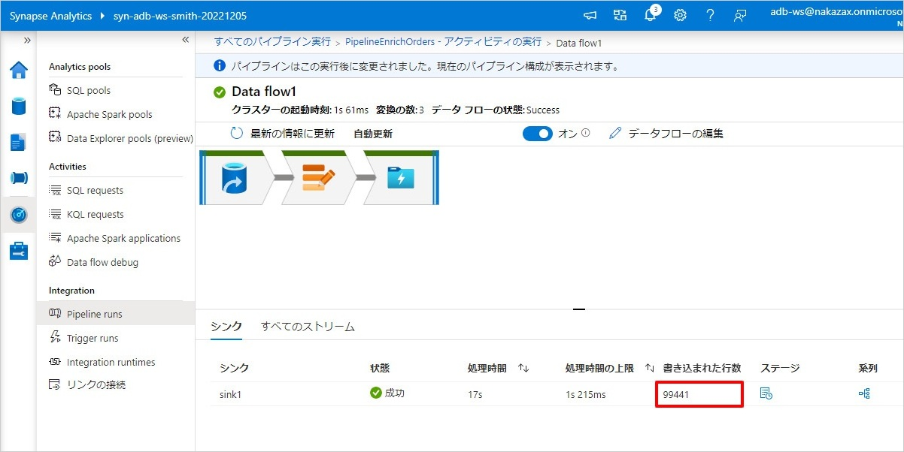

(8) Synapse スタジオの **[Data]** ハブを開き、以下キャプチャの通り、ADLS Gen2 に `_delta_log` フォルダと Parquet ファイルが作成されていることを確認します。

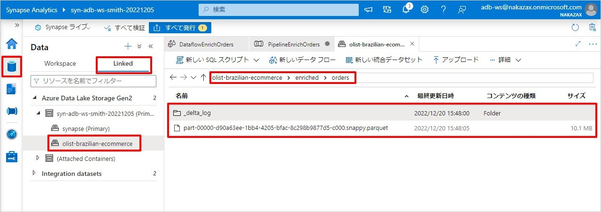

パイプラインの編集はこれで完了です。発行を行っておきましょう。

### **3. Databricks SQL による Delta Lake データの概観**
(1) Databricks SQL の左側メニューの **[SQL エディタ]** にアクセスします。以下のクエリをコピー & ペーストして LOCATION 句の `{storage-account-name}` を書き換え、**[すべてを実行]** を選択します。これらのクエリにより、`olist_enriched` データベースおよび `orders` テーブルが作成されます。

```sql
CREATE DATABASE IF NOT EXISTS olist_enriched;

CREATE TABLE IF NOT EXISTS olist_enriched.orders
LOCATION 'abfss://olist-brazilian-ecommerce@{storage-account-name}.dfs.core.windows.net/enriched/orders/';
```

(2) スキーマ ブラウザーに作成したデータベースとテーブルが表示されることを確認します。(データベース名が表示されない場合はリフレッシュ ボタンを選択して表示を更新します)

(3) `olist_enriched.orders` テーブルに対して以下のクエリを 1 つずつ実行して、データ内容と件数が取得できることを確認します。

```sql
-- カウント結果として 99441 件が表示されることを確認
SELECT COUNT(*) FROM olist_enriched.orders;

SELECT * FROM olist_enriched.orders;
```

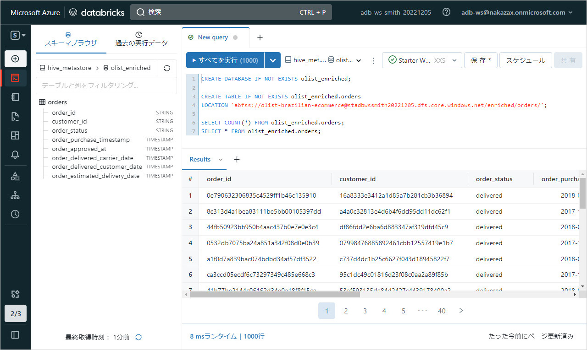

(5) クエリについて `Create enriched orders table` などと名前を付けて **[保存]** を選択します。

### **🎉 まとめ**
この章では、Azure Synapse Analytics のマッピング データ フローを用いて Orders の CSV ファイル (`olist_orders_dataset.csv`) を Delta Lake 形式に変換しました。変換の前後で CSV 形式のデータと Delta Lake 形式のデータを Databricks SQL のクエリとデータ エクスプローラーで概観しました。次の章に進みましょう。

## Delta Lake 形式への変換 #2 (Order Items)
Duration: 00:20:00

この章では、Azure Synapse Analytics のマッピング データ フローを用いて Orders Items の CSV ファイル (`olist_order_items_dataset.csv`) を Delta Lake 形式に変換します。変換の前後で CSV 形式のデータと Delta Lake 形式のデータを Databricks SQL のクエリとデータ エクスプローラーで概観します。

### **🔎 データ変換の流れ**
この章で実現するデータ変換の流れは以下の通りです。

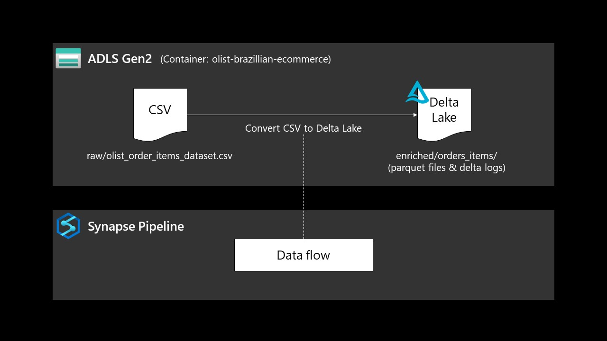

### **1. Databricks SQL による CSV データの概観**
(1) Databricks SQL の左側メニューの **[データ]** にアクセスします。データ エクスプローラーで `olist_raw` データベースの `order_items` テーブルの **[スキーマ]** を選択し、列名やデータ型を確認します。`order_id` と `order_item_id` がキー項目です。

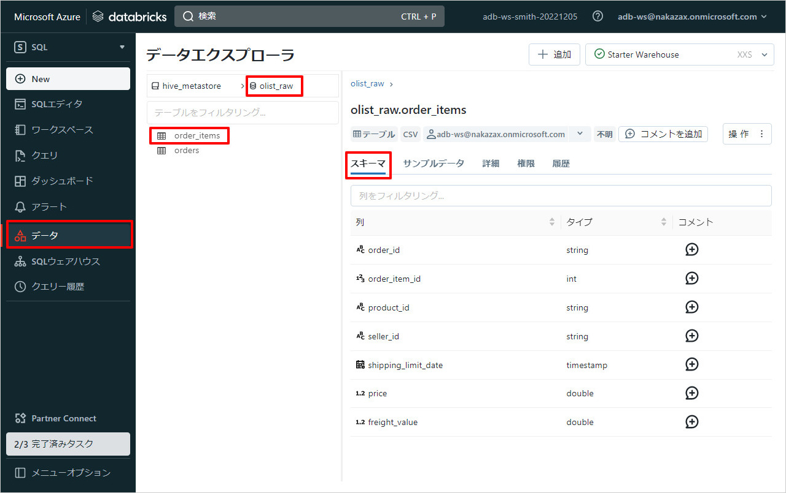

(2) 続けて **[サンプル データ]** をクリックし、データの内容を確認します。

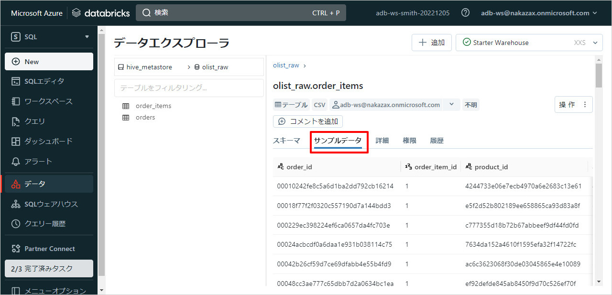

### **2. マッピング データ フローによる Delta Lake 形式への変換**
Azure Synapse Analytics のマッピング データ フローを用いて Order Items の CSV ファイルを Delta Lake 形式に変換します。

具体的な手順として、前の章で作成した Orders のデータ フローを複製して編集、パイプラインを作成、パイプラインにデータ フロー アクティビティを定義してパイプラインを実行します。

#### **データ フローの完成形**
データ フローの完成形は以下キャプチャの通りです。前章の Orders と同じ変換を利用します。


#### **2-1. データ フローの複製**
(1) Synapse スタジオで **[Develop]** ハブにアクセスした後、前章で作成したデータ フロー `DataflowEnrichOrders` を右クリックし **[複製]** を選択します。

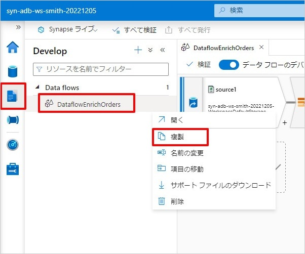

(2) データ フローのプロパティで **[名前]** に `DataflowEnrichOrderItems` を入力します。作業領域を広くするため以下の画面キャプチャ内の赤枠で囲んだボタンをクリックしてプロパティを折りたたみます。


#### **2-2. データ フロー > ソース変換**
(1) ソース変換をクリックし、**[ソースのオプション]** タブを開き、以下の項目を設定します。

**項目** | **設定値**
--- | ---
ファイル パス | コンテナ名に **`olist-brazillian-ecommerce`**、フォルダー名に **`raw`**、ファイル名に **`olist_order_items_dataset.csv`** を入力します。

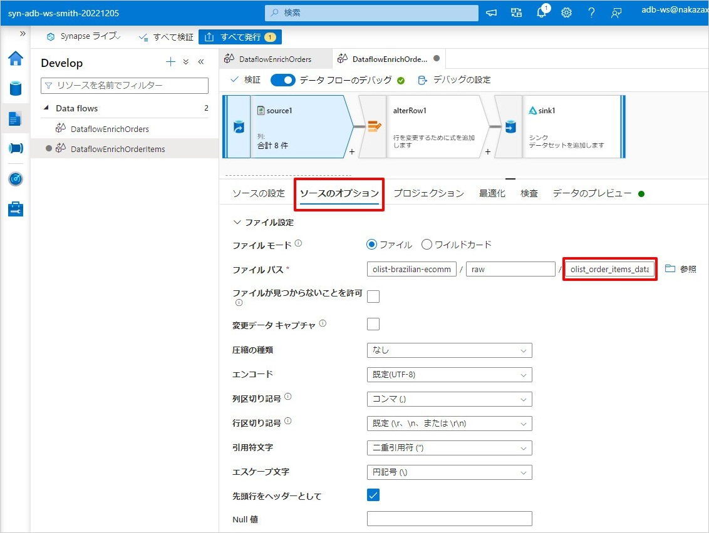

(2) 続いて **[プロジェクション]** タブを開き、**[スキーマをクリア]** をクリックします。その後、**[スキーマのインポート]** をクリックします。

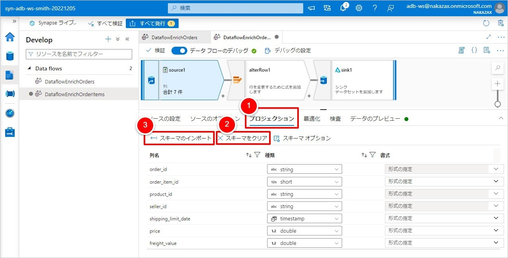

(3) スキーマのインポート動作の画面では何も入力せずに **[インポート]** をクリックし、スキーマのインポートが完了するまで待機します。

(4) 続いて **[データのプレビュー]** タブを開き、**[最新の情報に更新]** をクリックします。完了すると以下のように表示されます。

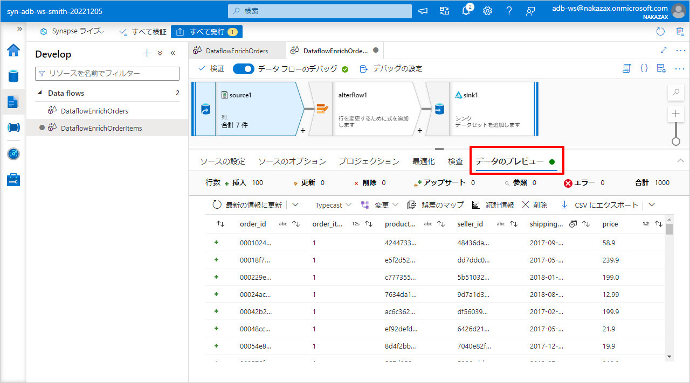

ソース変換の編集はこれで完了です。

#### **2-3. データ フロー > 行の変更変換**
行の変更変換は編集不要です。

#### **2-4. データ フロー > シンク変換**
(1) シンク変換をクリックし、**[設定]** タブを開き、以下の項目を設定します。

**項目** | **設定値**
--- | ---
フォルダーのパス | コンテナ名に **`olist-brazillian-ecommerce`**、フォルダー名に **`enriched/order_items/`** を入力します。
キー列 | **`order_id`** と **`order_item_id`** を選択します。


シンク変換およびデータ フローの編集はこれで完了です。発行を行っておきましょう。

#### **2-5. パイプラインの作成と実行**
最後にデータ フロー アクティビティを含むパイプラインを作成した後、パイプラインを実行します。

1) Synapse スタジオで **[Integrate]** ハブにアクセスした後、**[+]** ボタンをクリックし、**[パイプライン]** を選択します。

2) パイプラインのプロパティで **[名前]** に `PipelineEnrichOrderItems` を入力します。

3) パイプラインのアクティビティ一覧の **[移動と変換]** セクションを展開し **[データ フロー]** を右側のキャンバスにドラッグ & ドロップします。

4) キャンバス上のデータ フロー アクティビティを選択し、**[設定]** タブを開き、以下の項目を設定します。

**項目** | **設定値**
--- | ---
データ フロー | 先ほど作成した **`DataflowEnrichOrderItems`** を選択します。

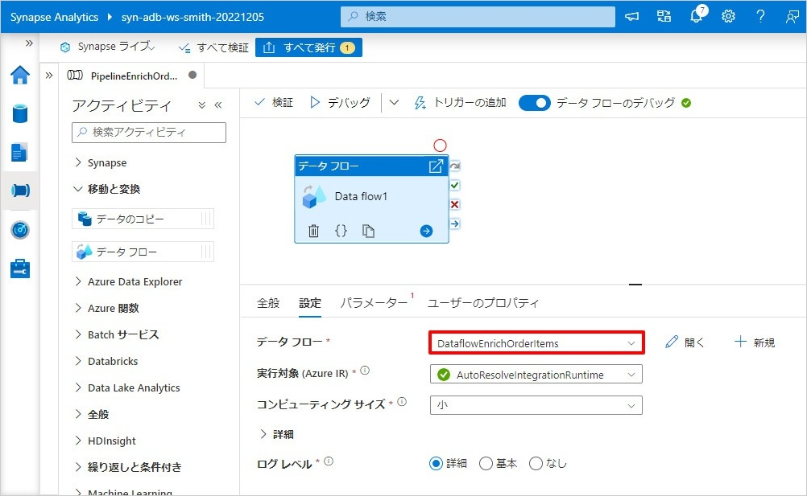

5) 以上でパイプラインの作成は完了です。画面上部の **[デバッグ]** をクリックします。パイプラインが実行されますので、リフレッシュ ボタンを定期的にクリックして表示を更新し、状態が `成功` になるまで待ちます。

6) 状態が `成功` になったらパイプラインの実行結果を確認します。書き込まれた行数が以下キャプチャの内容と一致することを確認します。

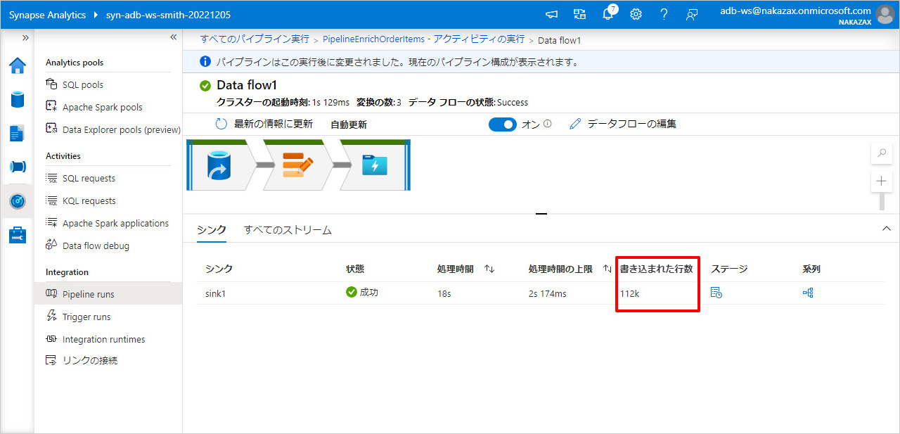

7) Synapse スタジオの **[Data]** ハブを開き、以下キャプチャの通り、ADLS Gen2 に `_delta_log` フォルダと Parquet ファイルが作成されていることを確認します。

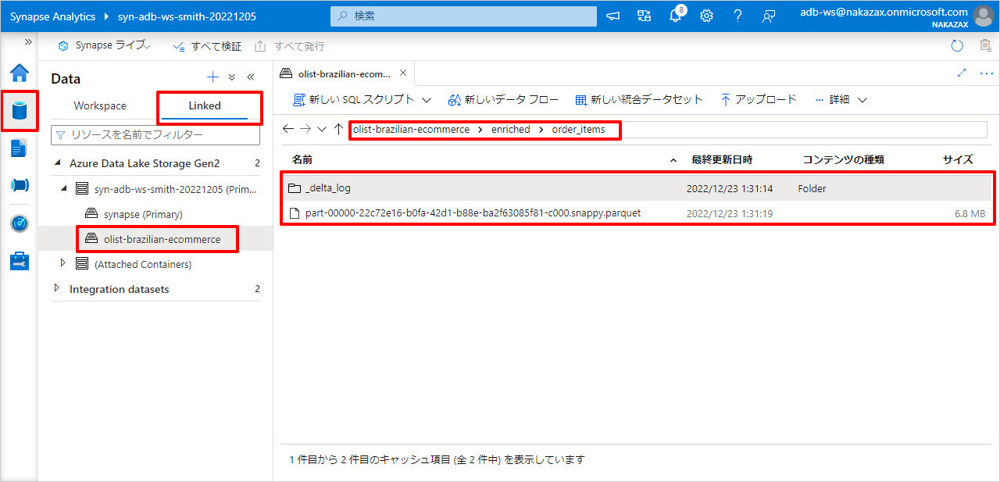

パイプラインの編集はこれで完了です。発行を行っておきましょう。

### **3. Databricks SQL による Delta Lake データの概観**
(1) Databricks SQL の左側メニューの **[SQL エディタ]** にアクセスします。以下のクエリをコピー & ペーストして LOCATION 句の `{storage-account-name}` を書き換え、**[すべてを実行]** をクリックします。これらのクエリにより、`olist_enriched` データベースおよび `order_items` テーブルが作成されます。

```sql
CREATE DATABASE IF NOT EXISTS olist_enriched;

CREATE TABLE IF NOT EXISTS olist_enriched.order_items
LOCATION 'abfss://olist-brazilian-ecommerce@{storage-account-name}.dfs.core.windows.net/enriched/order_items/';
```

(2) スキーマ ブラウザーに作成したデータベースとテーブルが表示されることを確認します。(データベース名が表示されない場合はリフレッシュ ボタンをクリックして表示を更新します)

(3) `olist_enriched.order_items` テーブルに対して以下のクエリを 1 つずつ実行して、データ内容と件数が取得できることを確認します。

```sql
-- カウント結果として 112650 件が表示されることを確認
SELECT COUNT(*) FROM olist_enriched.order_items;

SELECT * FROM olist_enriched.order_items;
```

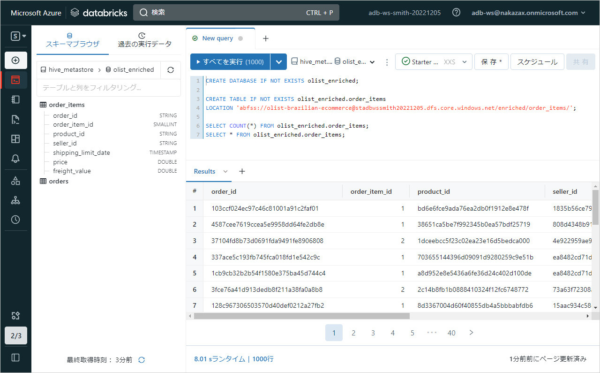

(4) クエリについて `Create enriched order_items table` などと名前を付けて **[保存]** を選択します。

### **🎉 まとめ**
この章では、Azure Synapse Analytics のマッピング データ フローを用いて Orders Items の CSV ファイル (`olist_order_items_dataset.csv`) を Delta Lake 形式に変換しました。変換の前後で CSV 形式のデータと Delta Lake 形式のデータを Databricks SQL のクエリとデータ エクスプローラーで概観しました。

休憩をあまり取らずに進めている場合はこの辺りで少し休憩してから、次の章に進みましょう。

## 日別の注文金額の集計処理
Duration: 00:30:00

この章では、Azure Synapse Analytics のマッピング データ フローを用いて Orders と Order Items の Delta Lake 形式のデータを元に日別の注文金額の集計を行い、Delta Lake 形式で出力します。その後、Databricks SQL のクエリとデータ エクスプローラーで結果を概観します。

### **🔎 データ変換の流れ**
この章で実現するデータ変換の流れは以下の通りです。

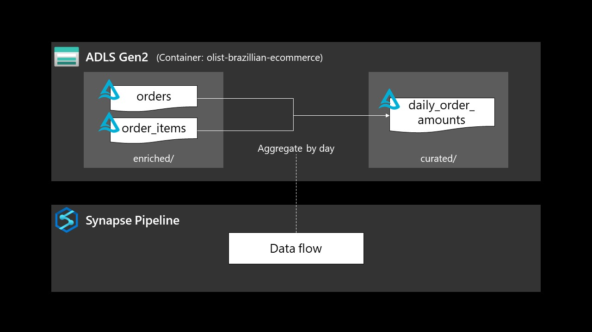

### **1. マッピング データ フローによる集計処理**
具体的な手順として、Synapse Studio にてデータ フローとパイプラインを作成、パイプラインにデータ フロー アクティビティを定義してパイプラインを実行します。

#### **データ フローの完成形**
データ フローの完成形は以下キャプチャの通りです。一つ目のソース変換で ADLS Gen2 上の Orders の Delta Lake のデータを読み取り、二つ目のソース変換で ADLS Gen2 上の Order Items の Delta Lake のデータを読み取ります。結合変換で Orders と Order Items を結合、集計変換で購入日 (`order_purchase_date`) ごとの金額を集計し、行の変更変換を挟んでシンク変換で ADLS Gen2 に Delta Lake 形式で出力します。

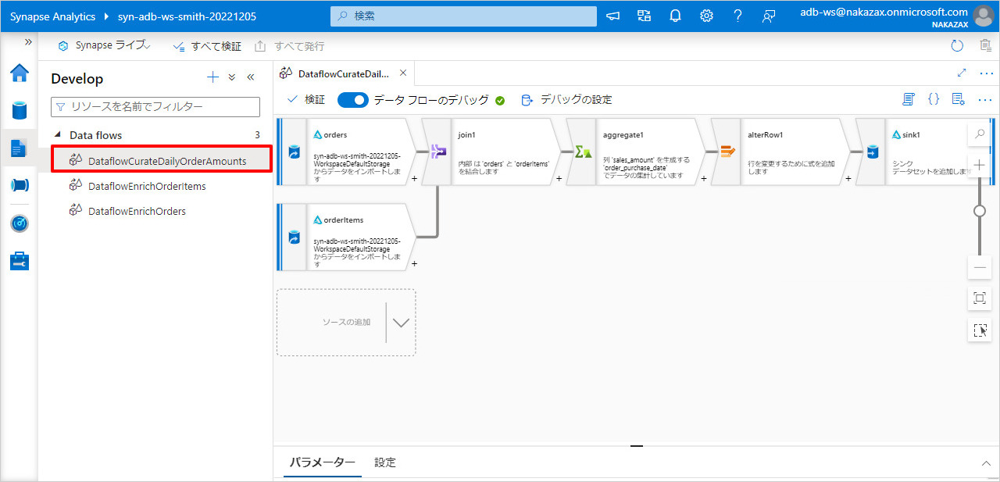

#### **1-1. データ フローの作成**
1) Synapse スタジオで **[Develop]** ハブにアクセスした後、**[+]** ボタンをクリックし **[データ フロー]** を選択します。

2) データ フローのプロパティで **[名前]** に `DataflowCurateDailyOrderAmounts` を入力します。

#### **1-2. データ フロー > ソース変換 (Orders)**
1) データ フローのキャンバス内の **[ソースの追加]** の下向き矢印をクリックし、**[ソースの追加]** を選択します。

2) ソース変換をクリックし、画面下部に表示された **[ソースの設定]** タブを開き、以下の項目を設定します。

**項目** | **設定値**
--- | ---
出力ストリーム名 | **`orders`** を入力します。
ソースの種類 | **`インライン`** を選択します。
インライン データセットの種類 | **`Delta`** を選択します。
リンク サービス | **`{Synapse ワークスペース名}-WorkspaceDefaultStorage`** を選択します。

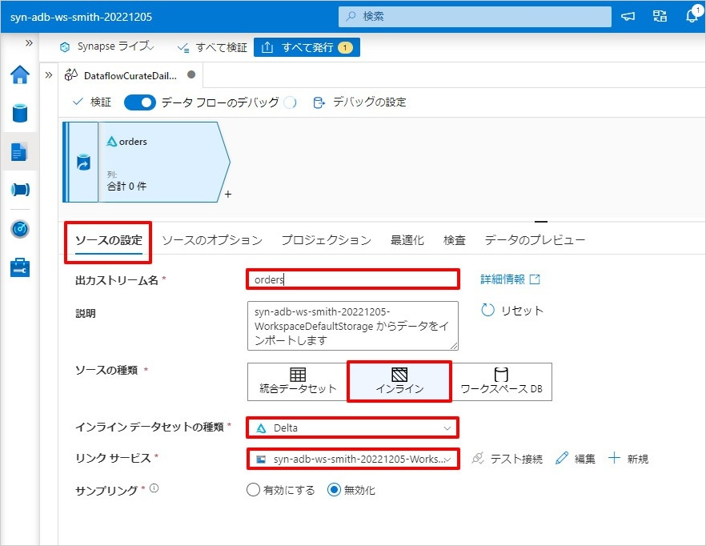

3) 続いて **[ソースのオプション]** タブを開き、以下の項目を設定します。

**項目** | **設定値**
--- | ---
フォルダーのパス | コンテナ名に **`olist-brazillian-ecommerce`**、フォルダー名に **`enriched/orders`** を入力します。

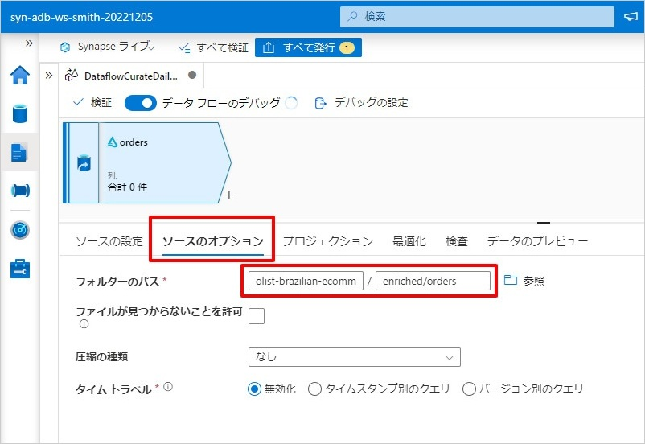

4) 続いて **[プロジェクション]** タブを開き、**[スキーマのインポート]** をクリックします。スキーマのインポート動作の画面では何も入力せずに **[インポート]** をクリックし、スキーマのインポートが完了するまで待機します。

5) 続いて **[データのプレビュー]** タブを開き、**[最新の情報に更新]** をクリックします。データが表示されることを確認します。

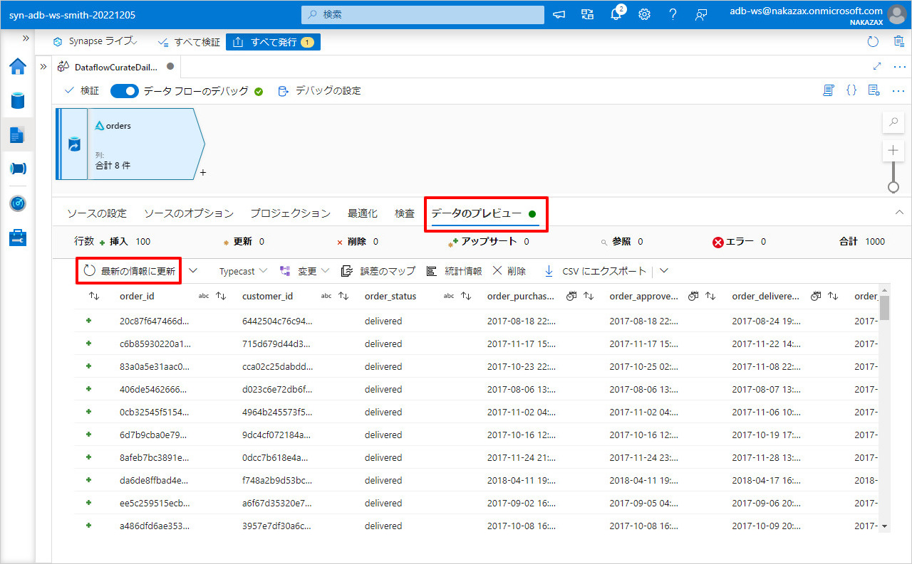

#### **1-3. データ フロー > ソース変換 (Order Items)**
1) データ フローのキャンバス内で Orders 用ソース変換の下に表示されている **[ソースの追加]** の下向き矢印をクリックし、**[ソースの追加]** を選択します。

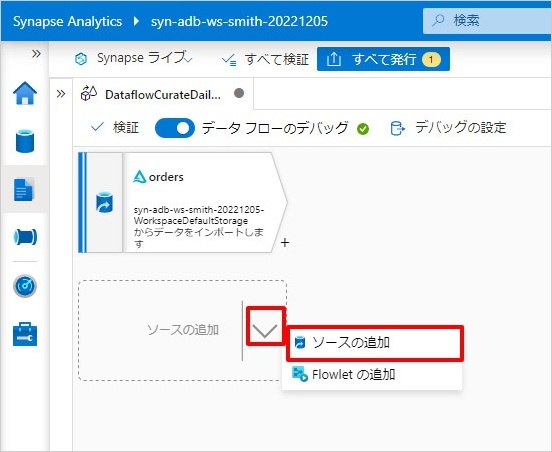

2) ソース変換をクリックし、画面下部に表示された **[ソースの設定]** タブを開き、以下の項目を設定します。

**項目** | **設定値**
--- | ---
出力ストリーム名 | **`orderItems`** を入力します。
ソースの種類 | **`インライン`** を選択します。
インライン データセットの種類 | **`Delta`** を選択します。
リンク サービス | **`{Synapse ワークスペース名}-WorkspaceDefaultStorage`** を選択します。

3) 続いて **[ソースのオプション]** タブを開き、以下の項目を設定します。

**項目** | **設定値**
--- | ---
フォルダーのパス | コンテナ名に **`olist-brazillian-ecommerce`**、フォルダー名に **`enriched/order_items`** を入力します。

4) 続いて **[プロジェクション]** タブを開き、**[スキーマのインポート]** をクリックします。スキーマのインポート動作の画面では何も入力せずに **[インポート]** をクリックし、スキーマのインポートが完了するまで待機します。

5) 続いて **[データのプレビュー]** タブを開き、**[最新の情報に更新]** をクリックします。データが表示されることを確認します。

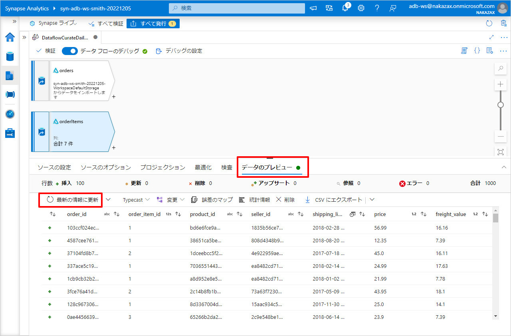

#### **1-4. データ フロー > 結合変換**
1) Orders 用のソース変換の後ろに「結合」変換を追加します。

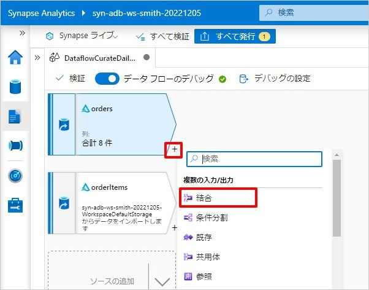

2) 結合変換をクリックし、画面下部に表示された **[結合の設定]**　タブを開き、以下の項目を設定します。

**項目** | **設定値**
--- | ---
左ストリーム | **`orders`** を選択します。
右ストリーム | **`orderItems`** を選択します。
結合の種類 | **`内部`** を選択します。
結合条件 > 左: orders の列 | **`order_id`** を選択します。
結合条件 > 右: orderItems の列 | **`order_id`** を選択します。

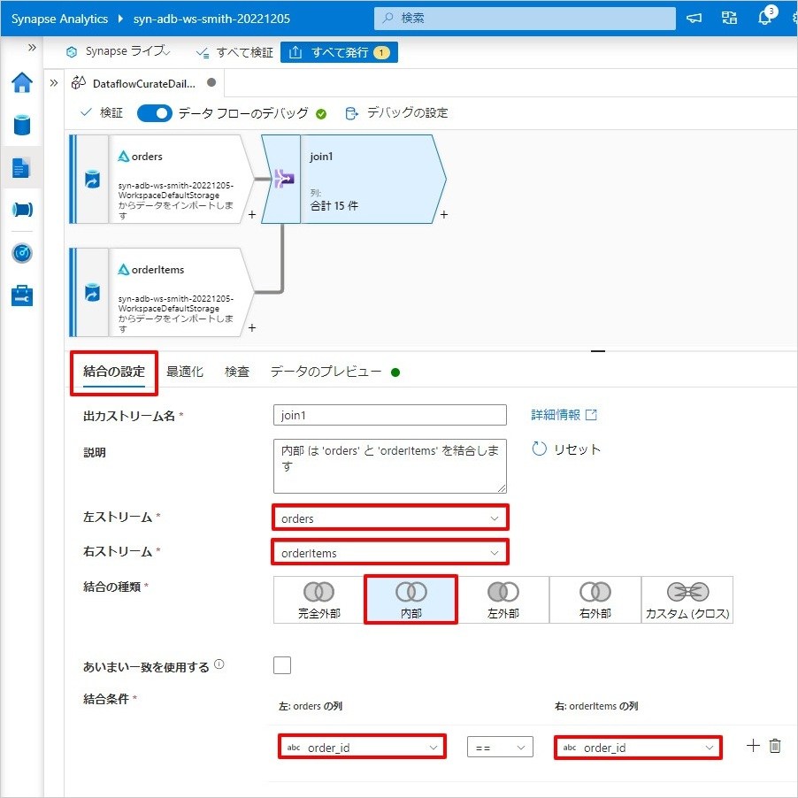

3) 続いて **[データのプレビュー]** タブを開き、**[最新の情報に更新]** をクリックします。データが表示されることを確認します。


#### **1-5. データ フロー > 集約変換**
1) 結合変換の後ろに「集約」変換を追加します。

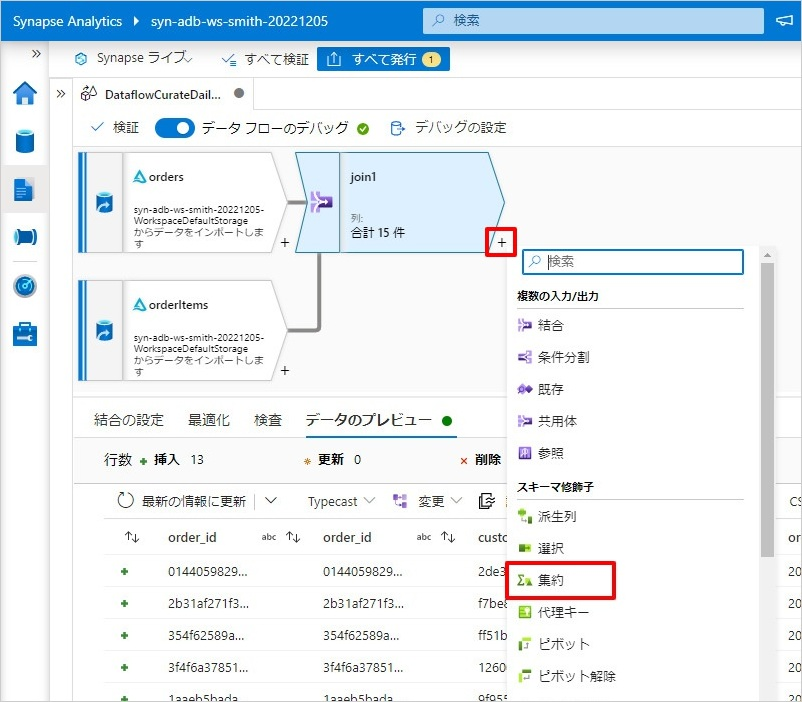

2) 集約変換をクリックし、画面下部に表示された **[集計の設定]**　タブを開き、**[列の選択]** の下の **[式ビルダ―を開く]** をクリックします。

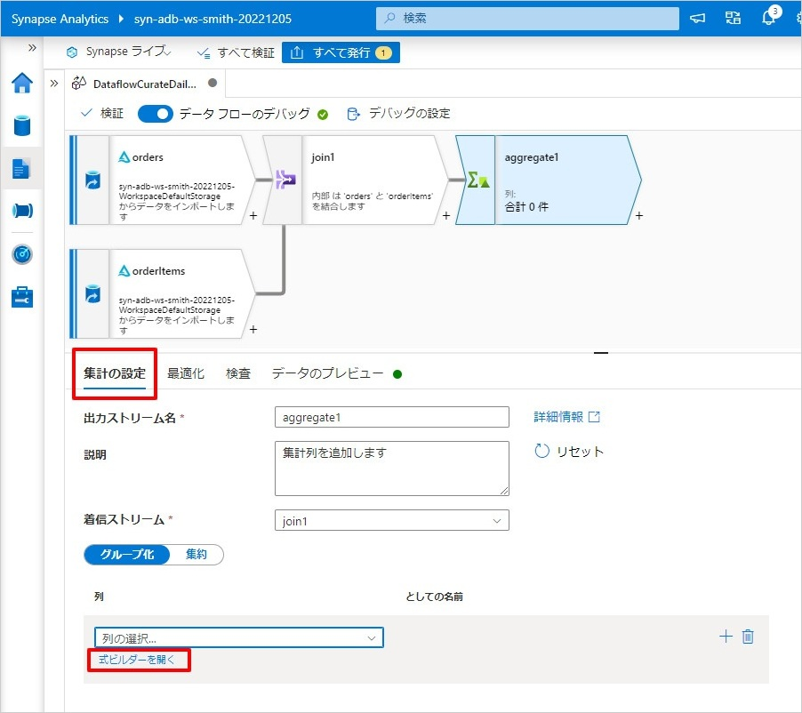

3) データフロー式ビルダー画面で以下の項目を設定し、**[保存して終了]** をクリックします。(この操作により `order_purchase_timestamp` 列から `order_purchase_date` という Date 型の列が生成されます)

**項目** | **設定値**
--- | ---
列名 | **`order_purchase_date`** を入力します。
式 | **`toDate(order_purchase_timestamp)`** を入力します。

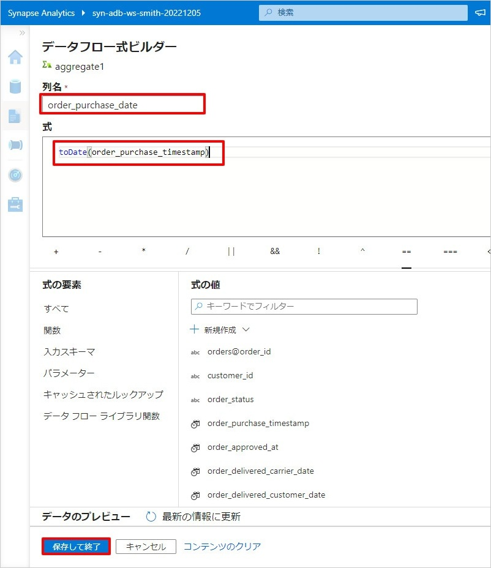

4) **[集計の設定]** 画面に戻るので、**[集約]** を選択し、以下の項目を設定します。(この操作により `price` (料金) と `freight_value` (送料) を足し合わせた `sales_amount` という Double 型の列が生成されます)

**項目** | **設定値**
--- | ---
列 | **`sales_amount`** を入力します。
式 | **`sum(price + freight_value)`** を入力します。


5) 続いて **[データのプレビュー]** タブを開き、**[最新の情報に更新]** をクリックします。データが表示されることを確認します。

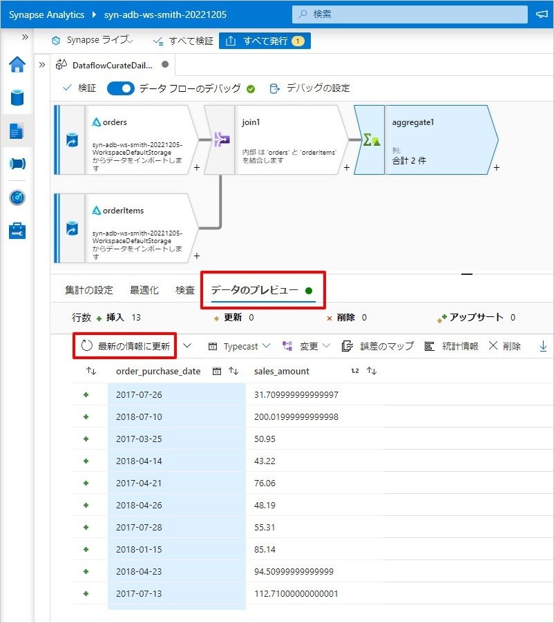

#### **1-6. データ フロー > 行の変更変換**
1) 集約変換の後ろに行の変更変換を追加します。

2) 行の変更変換をクリックし、画面下部に表示された **[行の変更の設定]**　タブを開き、以下の項目を設定します。

**項目** | **設定値**
--- | ---
行の変更条件 | **`次の場合にアップサートする`** を選択し、値に **`true()`** を入力します。

#### **1-7. データ フロー > シンク変換**
1) 行の変更変換の後ろにシンク変換を追加します。

2) シンク変換をクリックし、画面下部に表示された **[シンク]**　タブを開き、以下の項目を設定します。

**項目** | **設定値**
--- | ---
シンクの種類 | **`インライン`** を選択します。
インライン データセットの種類 | **`Delta`** を選択します。
リンク サービス | **`{Synapse ワークスペース名}-WorkspaceDefaultStorage`** を選択します。

3) 続いて **[設定]** タブを開き、以下の項目を設定します。

**項目** | **設定値**
--- | ---
フォルダーのパス | コンテナ名に **`olist-brazillian-ecommerce`**、フォルダー名に **`curated/daily_order_amounts/`** を入力します。
更新方法 | **`アップサートを許可`** を選択します。
キー列 | **`order_purchase_date`** を選択します。
デルタ オプション > 自動圧縮 | チェックします。
デルタ オプション > 書き込みの最適化 | チェックします。

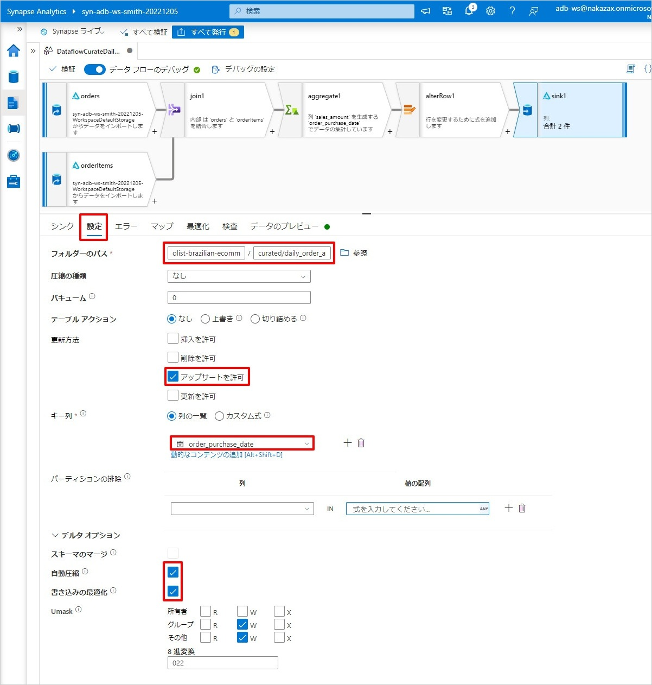

データ フローの編集はこれで完了です。発行を行っておきましょう。

#### **1-8. パイプラインの作成と実行**
1) Synapse スタジオで **[Integrate]** ハブにアクセスした後、**[+]** ボタンをクリックし、**[パイプライン]** を選択します。

2) パイプラインのプロパティで **[名前]** に `PipelineCurateDailyOrderAmounts` を入力します。

3) パイプラインのアクティビティ一覧の **[移動と変換]** セクションを展開し **[データ フロー]** を右側のキャンバスにドラッグ & ドロップします。

4) キャンバス上のデータ フロー アクティビティを選択し、**[設定]** タブを開き、以下の項目を設定します。

**項目** | **設定値**
--- | ---
データ フロー | 先ほど作成した **`DataflowCurateDailyOrderAmounts`** を選択します。

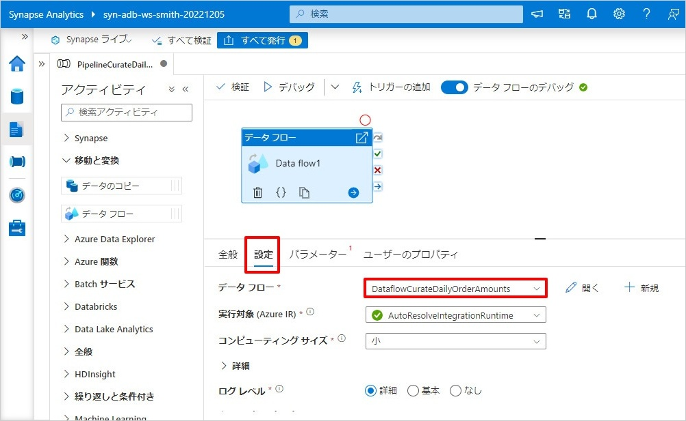

5) 以上でパイプラインの作成は完了です。画面上部の **[デバッグ]** をクリックします。パイプラインが実行されますので、リフレッシュ ボタンを定期的にクリックして表示を更新し、状態が `成功` になるまで待ちます。

6) 状態が `成功` になったらパイプラインの実行結果を確認します。書き込まれた行数が以下キャプチャの内容と一致することを確認します。

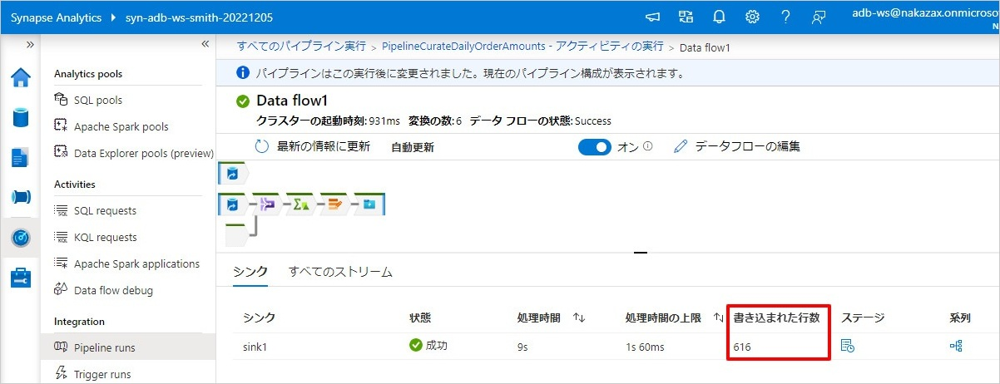

7) Synapse スタジオの **[Data]** ハブを開き、以下キャプチャの通り、ADLS Gen2 に `_delta_log` フォルダと Parquet ファイルが作成されていることを確認します。

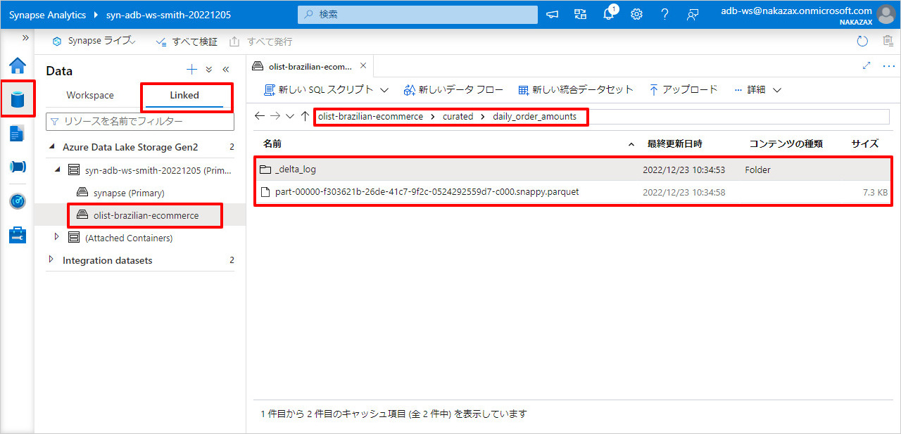

パイプラインの編集はこれで完了です。発行を行っておきましょう。

### **2. Databricks SQL による Delta Lake データの概観**
1) Databricks SQL の左側メニューの **[SQL エディタ]** にアクセスします。以下のクエリをコピー & ペーストして LOCATION 句の `{storage-account-name}` を書き換え、**[すべてを実行]** をクリックします。これらのクエリにより、`olist_curated` データベースおよび `daily_order_amounts` テーブルが作成されます。

```sql
CREATE DATABASE IF NOT EXISTS olist_curated;

CREATE TABLE IF NOT EXISTS olist_curated.daily_order_amounts
LOCATION 'abfss://olist-brazilian-ecommerce@{storage-account-name}.dfs.core.windows.net/curated/daily_order_amounts/';
```

2) スキーマ ブラウザーに作成したデータベースとテーブルが表示されることを確認します。(データベース名が表示されない場合はリフレッシュ ボタンをクリックして表示を更新します)

3) `olist_curated.daily_order_amounts` テーブルに対して以下のクエリを 1 つずつ実行して、データ内容と件数が取得できることを確認します。

```sql
-- カウント結果として 616 件が表示されることを確認
SELECT COUNT(*) FROM olist_curated.daily_order_amounts;

SELECT * FROM olist_curated.daily_order_amounts ORDER BY order_purchase_date;
```

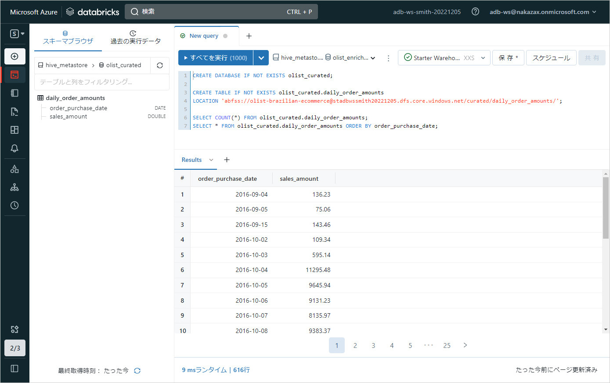

4) クエリについて `Create daily_order_amounts table` などと名前を付けて **[保存]** を選択します。

### **🎉 まとめ**
この章では、Azure Synapse Analytics のマッピング データ フローを用いて Orders と Order Items の Delta Lake 形式のデータを元に日別の注文金額の集計を行い、Delta Lake 形式で出力しました。その後、Databricks SQL のクエリとデータ エクスプローラーで結果を概観しました。次の章に進みましょう。

## Databricks SQL のダッシュボードによる可視化
Duration: 00:40:00

この章では、前章で作成した日別の注文金額の集計結果 (Daily Order Amounts) について、Databricks SQL のダッシュボードで可視化します。

### **ダッシュボードの完成形**
ダッシュボードの完成形は以下キャプチャの通りです。このダッシュボードは、日別の注文金額に関する 3 つのビジュアライゼーションと、日付範囲を絞り込むための 1 つのウィジェットを備えています。


<aside class="positive">
<b>💡 クエリとビジュアライゼーションとダッシュボード</b>

Databricks SQL のダッシュボードの作成は以下の流れで進めます。

1. クエリの作成と実行
2. クエリの実行結果からビジュアライゼーションを作成
3. ビジュアライゼーションをダッシュボードに表示

ビジュアライゼーションは Databricks SQL の日本語ドキュメントだと視覚化や可視化と表示されることがありますが、本ワークショップではビジュアライゼーションと呼称します。

本ワークショップでは数を数える**カウンター**や時系列の数の推移を表現する**折れ線グラフ**などのシンプルなビジュアライゼーションを利用しますが、他にも様々なビジュアライゼーションがサポートされています。

詳細は [視覚化の種類 - Azure Databricks - Databricks SQL | Microsoft Learn](https://learn.microsoft.com/ja-jp/azure/databricks/sql/user/visualizations/visualization-types) をご覧ください。
</aside>

### **1. ダッシュボードの作成**
(1) Databricks SQL の左側メニューの **[ダッシュボード]** にアクセスし、**[ダッシュボードを作成]** をクリックします。


(2) 新規ダッシュボードのダイアログで `Daily Order Amounts Dashboard` と入力し **[保存]** をクリックします。

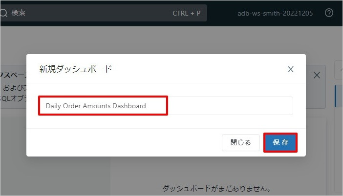

(3) 空のダッシュボードが作成されます。ダッシュボードの表示を更新する際に利用する SQL ウェアハウスとして `Starter Warehouse` を選択し **[編集完了]** をクリックします。

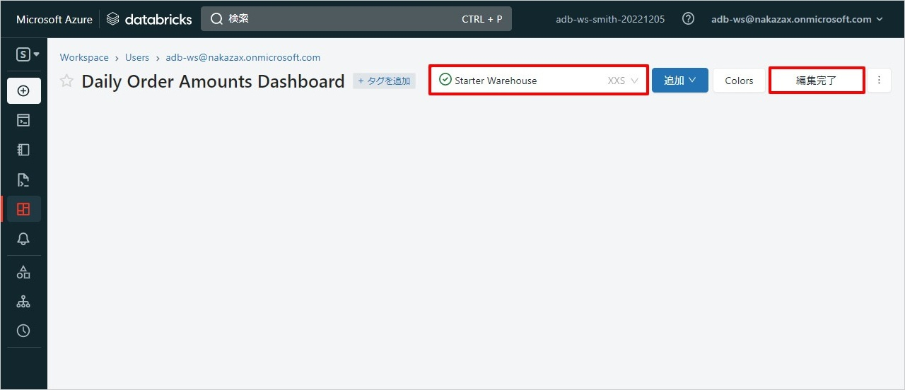

### **2. クエリとビジュアライゼーションの作成 (カウンター)**
(1) Databricks SQL の左側メニューの **[SQL エディタ]** にアクセスし、**[新規クエリを作成する]** をクリックします。

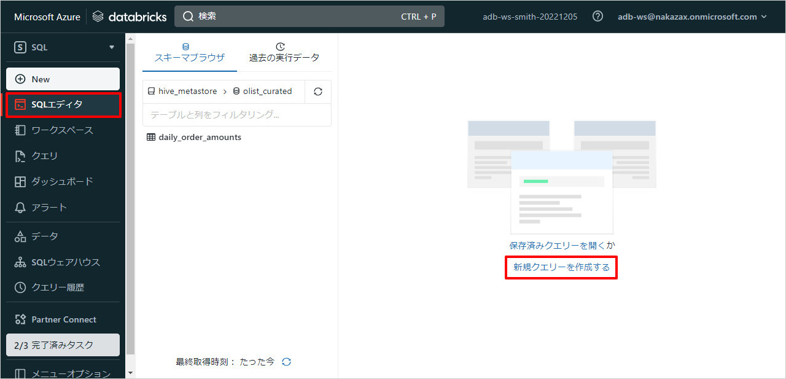

(2) クエリ名を `Daily Order Amounts - Total` に変更します。クエリ エディタに以下のスニペットを貼り付けます。画面下部に `Date Range` というクエリ パラメーターのウィジェットが表示されるのでキャプチャ赤枠で囲んだ歯車アイコンをクリックします。

```sql
SELECT
  sum(sales_amount) AS total_sales_amount
FROM
  olist_curated.daily_order_amounts
WHERE
  order_purchase_date >= '{{ Date Range.start }}'
  AND order_purchase_date < '{{ Date Range.end}}';
```

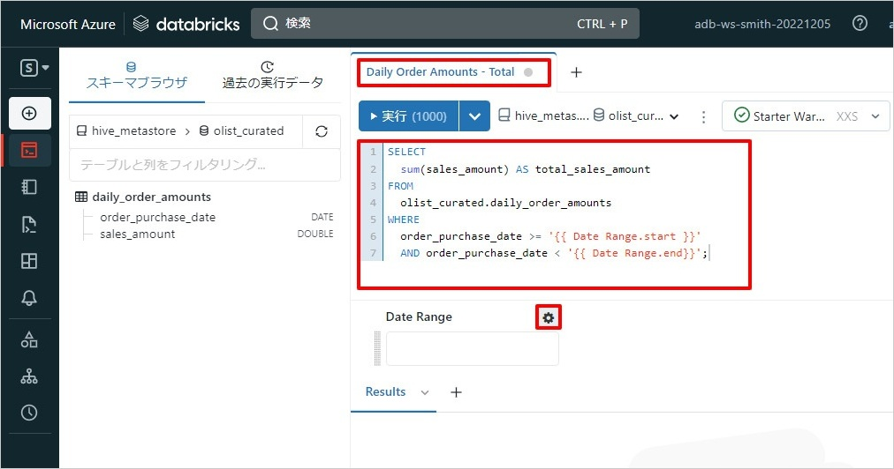

<aside class="positive">
<b>💡 Databricks SQL のクエリ パラメーター</b>

クエリ パラメーターを使用すると、実行時に値をクエリに代入することができます。二重中かっこ `{{ }}` の間の文字列はクエリ パラメーターとして扱われます。パラメーター値を設定した結果ウィンドウの上にウィジェットが表示されます。

パラメーターにはデータ型を設定することができます。既定はテキストです。

詳細は [クエリ パラメーター - Azure Databricks - Databricks SQL | Microsoft Learn](https://learn.microsoft.com/ja-jp/azure/databricks/sql/user/queries/query-parameters) をご覧ください。
</aside>

(3) クエリ パラメーターのウィジェットの編集画面で **[Type]** を `日付範囲` に変更し **[OK]** をクリックします。

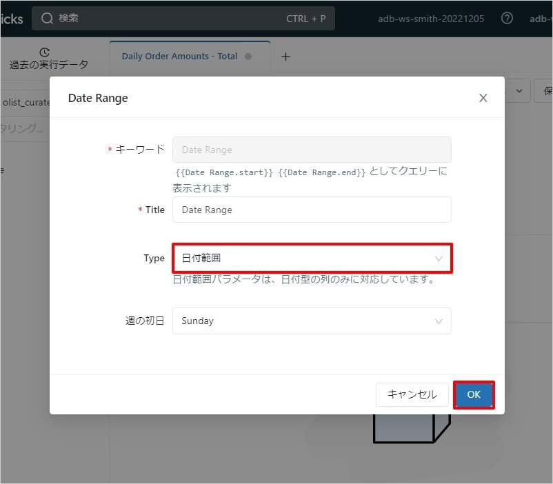

(4) これでクエリ パラメーターのウィジェットが日付範囲に変更されました。日付範囲の左側 (`start`) を `2016-01-01`、右側 (`end`) を `2019-01-01` にして **[変更を適用]** をクリックします。結果が更新されたことを確認します。


(5) 画面下の `Results` の右横の **[+]** > **[可視化]** をクリックします。

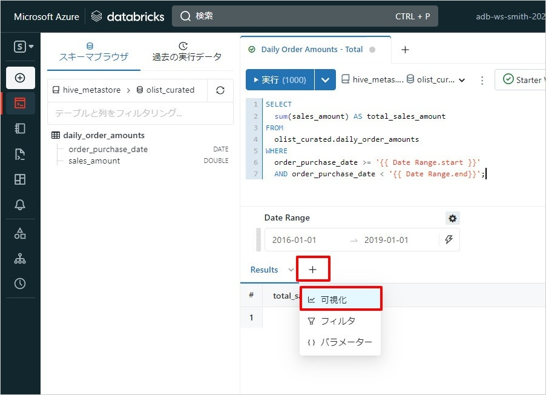

(6) ビジュアライゼーションの編集画面で以下の項目を設定し **[保存]** をクリックします。

**項目** | **設定値**
--- | ---
(画面左上のビジュアライゼーション名) | **`Counter`** を入力します。
Visualization type | **`Counter`** を選択します。
Value column | **`total_sales_amount`** を選択します。

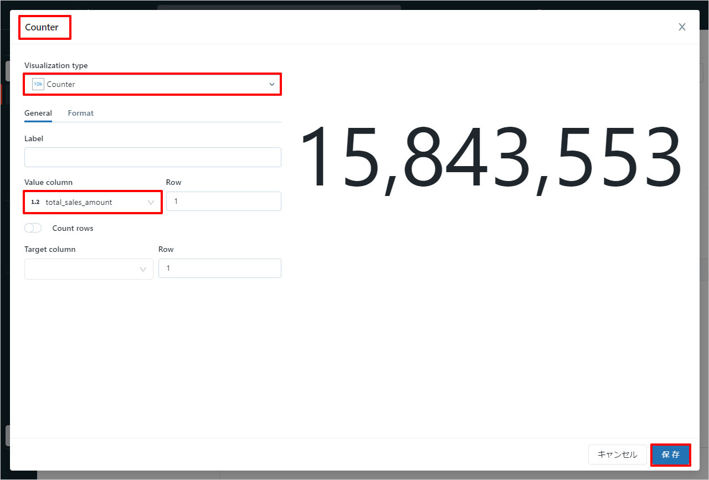

(7) 画面下の `Counter` の右横の **[+]** > **[ダッシュボードに追加]** をクリックします。

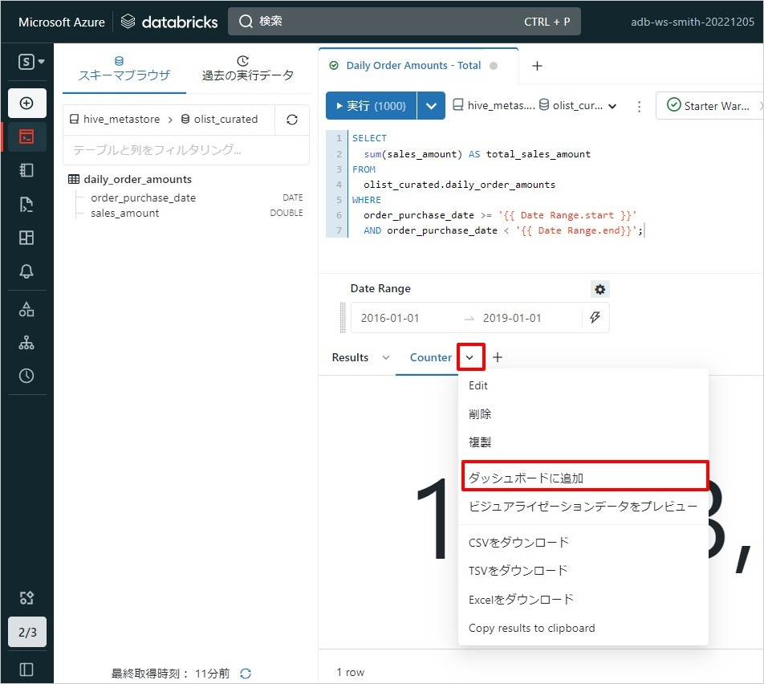

(8) 追加先のダッシュボードとして `Daily Order Amounts Dashboard` を選択し **[追加]** をクリックします。


(9) Databricks SQL の左側メニューの **[ダッシュボード]** >  `Daily Order Amounts Dashboard` にアクセスし、`Daily Order Amounts - Total` のビジュアライゼーションが追加されたことを確認します。

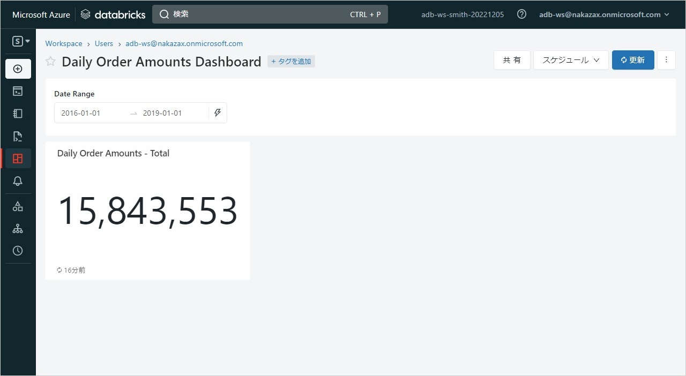

### **3. クエリとビジュアライゼーションの作成 (折れ線グラフとテーブル)**

(1) Databricks SQL の **[SQL エディタ]** で新規クエリを作成します。前のセクションと同じ要領でクエリの編集を行います。

- クエリ名を `Daily Order Amounts` に変更します
- クエリ エディタに以下のスニペットを貼り付けます
- 画面下部に `Date Range` というクエリ パラメーターのウィジェットが表示されるので歯車アイコンをクリックします
- クエリ パラメーターのウィジェットの編集画面で **[Type]** を `日付範囲` に変更し **[OK]** をクリックします
- 日付範囲の左側 (`start`) を `2016-01-01`、右側 (`end`) を `2019-01-01` にして **[変更を適用]** をクリックし、結果が更新されたことを確認します

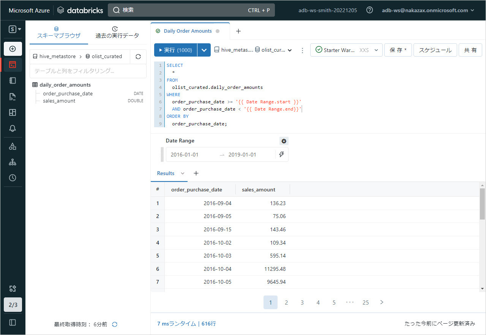

(2) 画面下の `Results` の右横の **[+]** > **[可視化]** をクリックします。ビジュアライゼーションの編集画面で以下の項目を設定し **[保存]** をクリックします。

**項目** | **設定値**
--- | ---
(画面左上のビジュアライゼーション名) | **`Line`** を入力します。
Visualization type | **`Line`** を選択します。

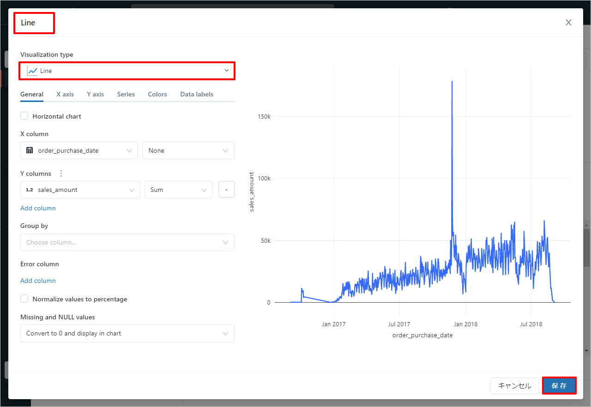

(3) 画面下の `Line` の右横の **[+]** > **[ダッシュボードに追加]** をクリックし、追加先のダッシュボードとして `Daily Order Amounts Dashboard` を選択します。

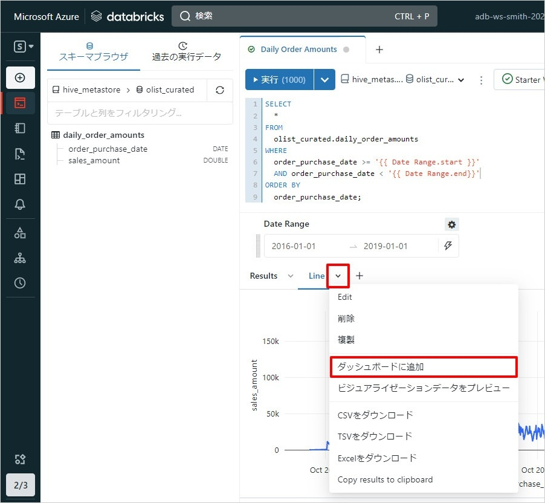

(4) ダッシュボード `Daily Order Amounts Dashboard` にアクセスし、折れ線グラフが追加されたことを確認します。

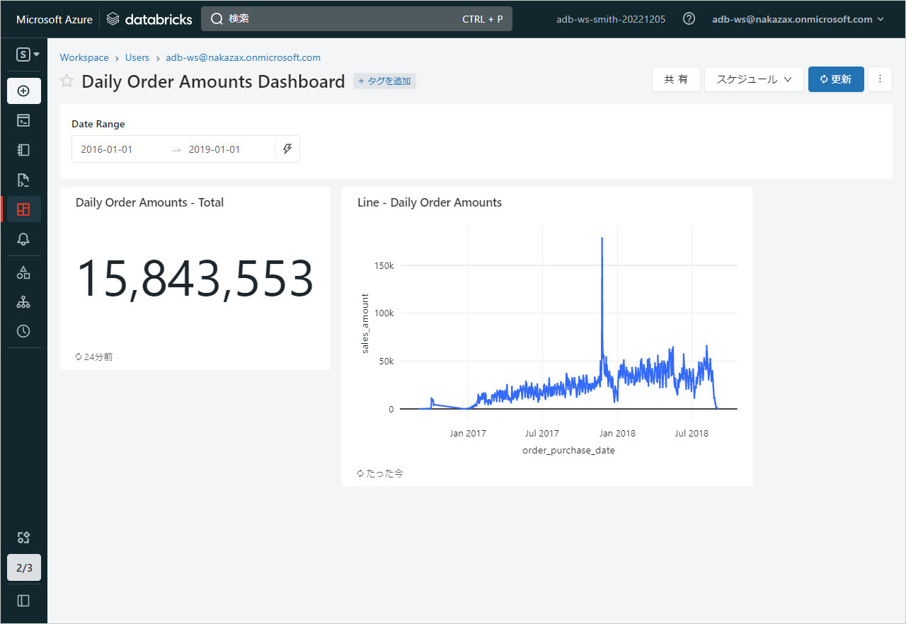

(5) クエリ `Daily Order Amounts` の画面下の `Results` の右横の **[+]** > **[ダッシュボードに追加]** を選択し、追加先のダッシュボードとして `Daily Order Amounts Dashboard` を選択します。


(6) ダッシュボード `Daily Order Amounts Dashboard` にアクセスし、表が追加されたことを確認します。画面右上の三点をクリックし **[編集]** をクリックします。

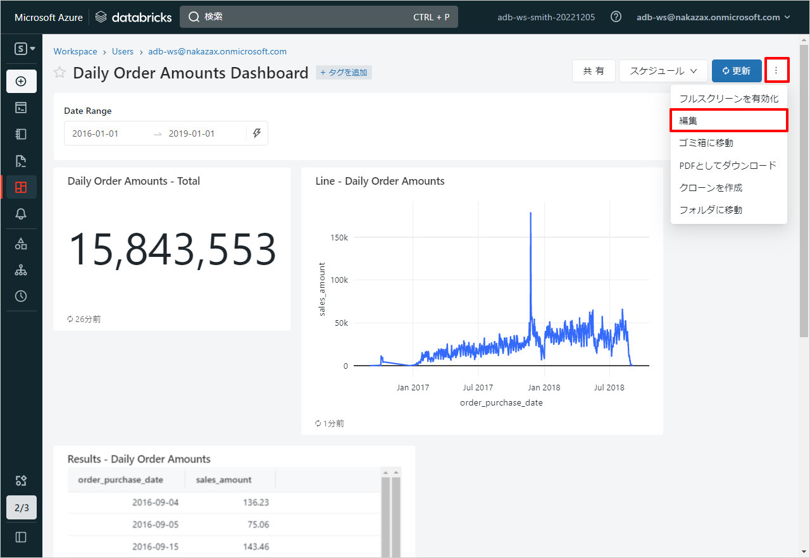

(7) 表 (`Results`) のビジュアライゼーションの右上の三点をクリックし **[ウィジェット設定を変更]** を選択します。

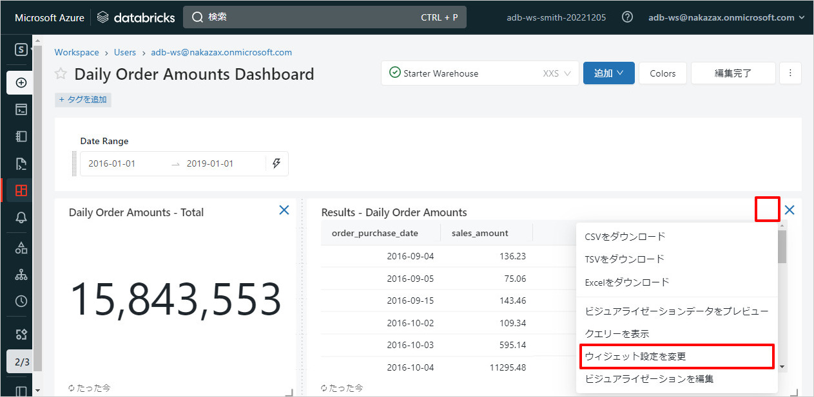

(8) ウィジェット設定画面で **[パネルの高さを動的に調整]** にチェックし **[Save]** をクリックします。

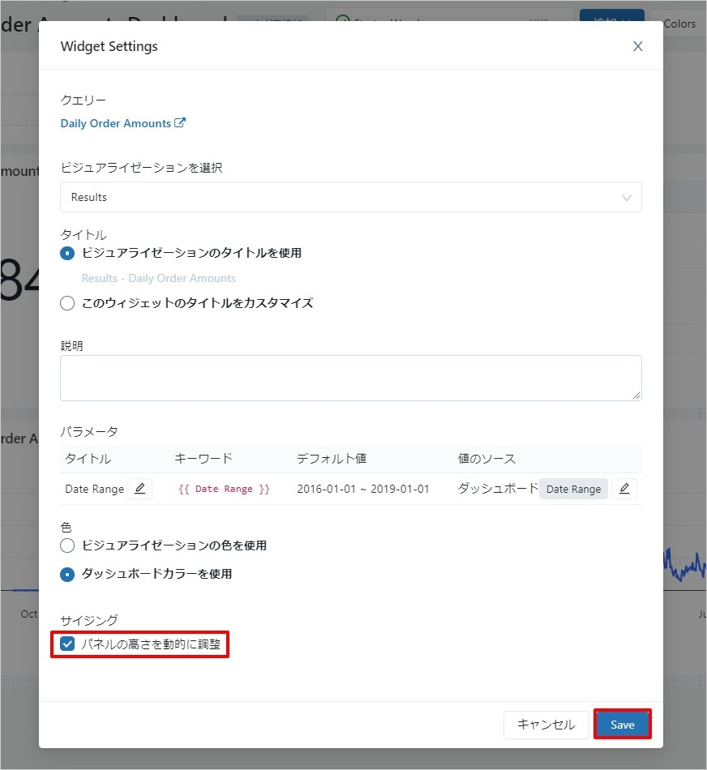

(9) ビジュアライゼーションの配置と大きさを以下キャプチャのように変更します。左上の日付範囲のウィジェットの左側 (`start`) を `2018-01-01`、右側 (`end`) を `2019-01-01` にして **[変更を適用]** をクリックし、結果が更新されることを確認します。

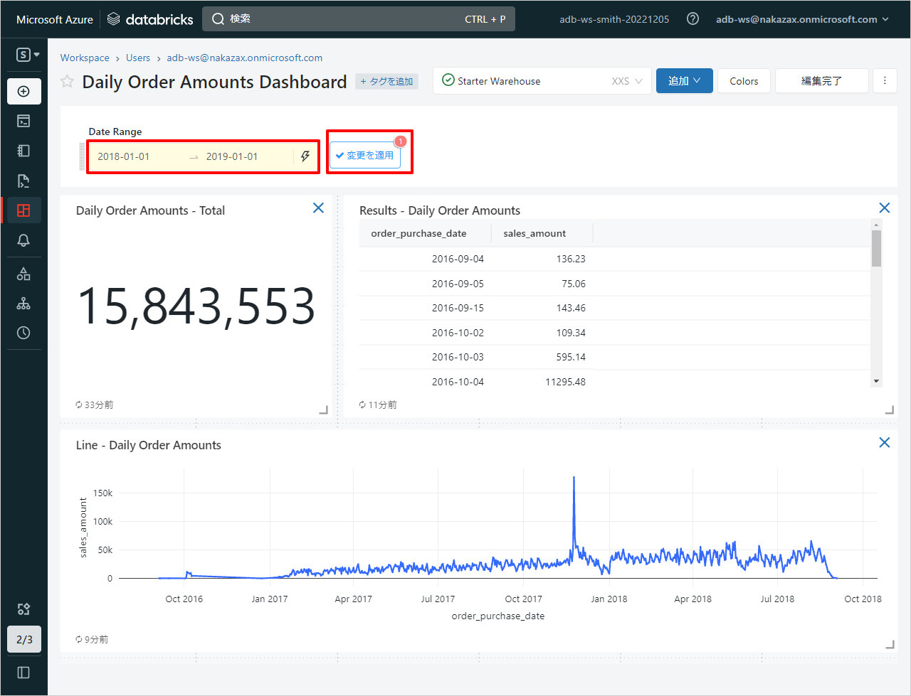

(10) **[編集完了]** をクリックします。


### **🎉 まとめ**
この章では、前章で作成した日別の注文金額の集計結果 (Daily Order Amounts) について、Databricks SQL のダッシュボードで可視化しました。次の章に進みましょう。

## Power BI Desktop による可視化
Duration: 00:30:00

この章では、前章で作成した日別の注文金額の集計結果 (Daily Order Amounts) について、Power BI Desktop のレポートで可視化します。

<aside class="negative">
<b>⚡ Power BI Desktop の対応 OS</b>

この章を実行するには Power BI Desktop が手元の PC にインストールされている必要があります。Power BI Desktop は現状 Windows でのみ利用可能です。macOS などをお使いの場合はこの章はスキップしてください。

Power BI Desktop は [Microsoft Power BI のダウンロード](https://powerbi.microsoft.com/ja-jp/downloads/) から入手できます。
</aside>

### **レポートの完成形**
レポートの完成形は以下キャプチャの通りです。前章の Databrcisk SQL のダッシュボードとほとんど同じレイアウトのレポートを作成します。

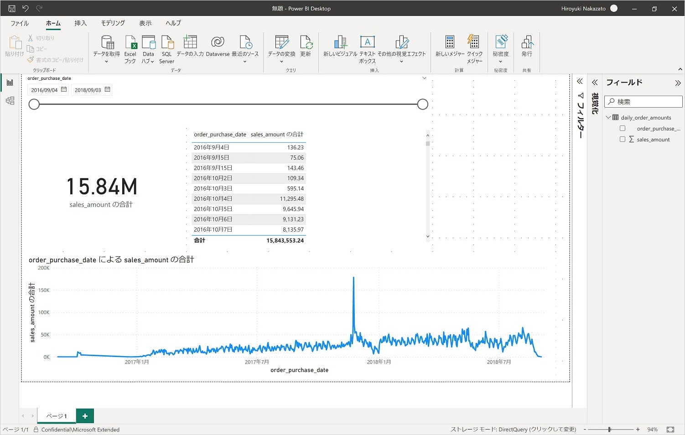

### **1. Power BI Desktop から Databricks SQL ウェアハウスへの接続**
Databricks SQL の画面から SQL ウェアハウスへの接続情報のみが定義された Power BI レポート用のファイル (拡張子 `pbids`) を数クリックでダウンロードできます。この PBIDS ファイルを使って SQL ウェアハウスに接続していきます。

1) Databricks SQL の **[SQL ウェアハウス]** のページにアクセスします。

2) `Starter Warehouse` をクリックし **[接続の詳細]** タブにアクセスします。

3) 画面下部にある **[Power BI]** のアイコンをクリックします。

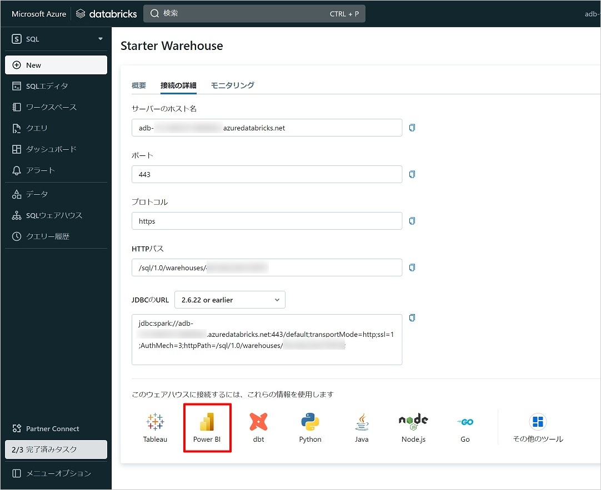

4) **[パートナーに接続]** が表示されるので **[接続ファイルをダウンロード]** をクリックします。

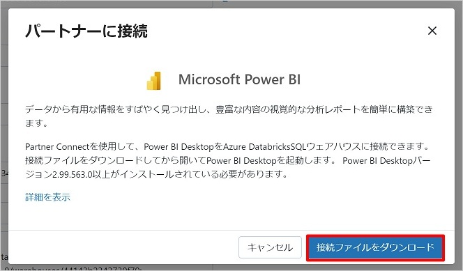

5) PBIDS ファイルを開くための前提条件を確認するダイアログが表示されるので、前提条件を問題なく満たしている場合は **[閉じる]** をクリックします。

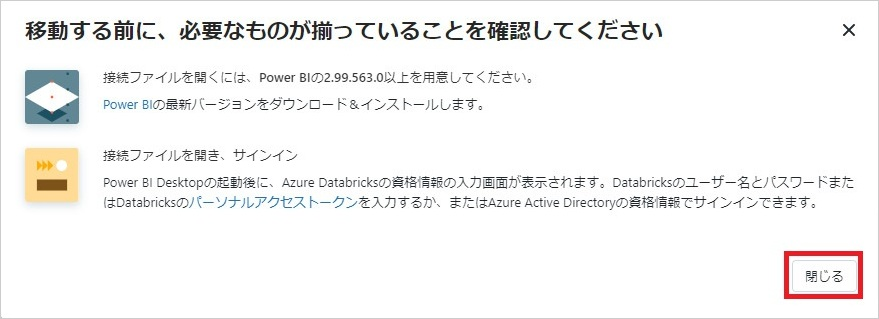

6) ダウンロードされた PBIDS ファイルを開きます。Power BI Desktop が起動するはずです。

7) PBIDS ファイルの初回オープン時に以下キャプチャのような Azure Databricks 接続の認証情報を求めるダイアログが表示されます。個人用アクセス トークンなどが選べますが、ここでは Azure Active Directory を認証情報として用います。

8) Azure Active Directory のサインインが正常に完了したら **[接続]** をクリックします。

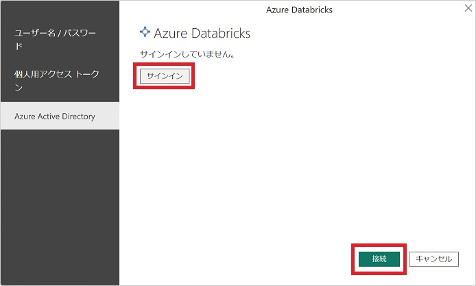

### **2. Power BI Desktop でのレポート作成**
日別の注文金額の集計結果 (Daily Order Amounts) を使って Power BI Desktop のレポートを作成します。

1) ナビゲーター画面で `daily_order_amounts` テーブルを選択して「読み込み」をクリックします。読み込みが完了するまで待ちます。(通常数十秒～ 1 分で完了します)


2) **[視覚化]** > **[カード]** をクリックします。キャンバスにカードの視覚化 (ビジュアライゼーション) が追加されます。

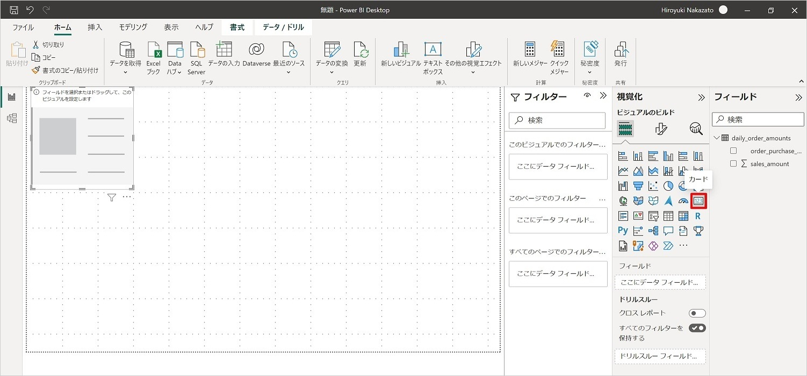

3) キャンバス上のカードの視覚化を選択した上で **[フィールド]** > `daily_order_amounts` > `sales_amount` にチェックを入れます。カードの視覚化に `sales_amount` の合計が表示されます。

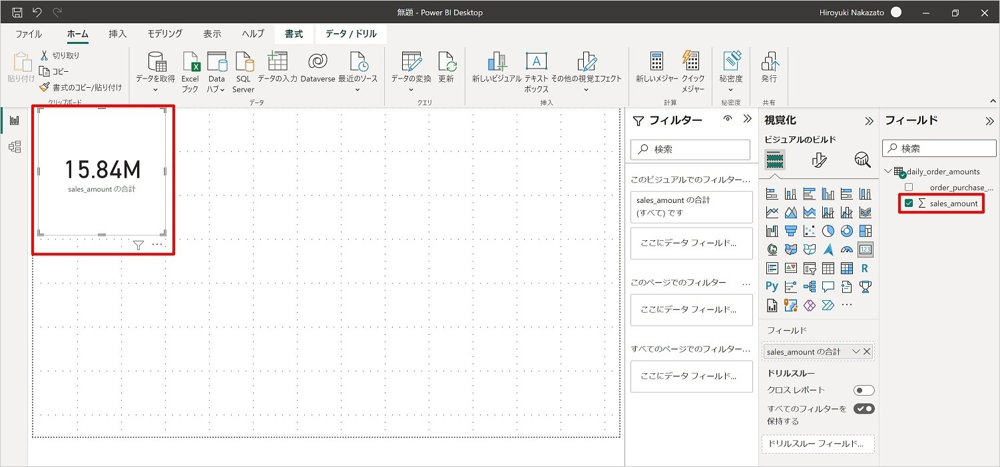

4) キャンバスの何もないところをクリックしてカードの視覚化が選択されていない状態にした上で **[視覚化]** > **[テーブル]** をクリックします。キャンバスにテーブルの視覚化が追加されます。

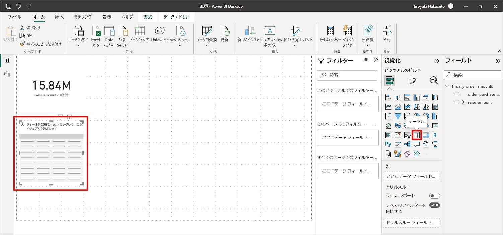

5) キャンバス上のテーブルの視覚化を選択した上で **[フィールド]** > `daily_order_amounts` > `order_purchase_date` と `sales_amount` にチェックを入れます。テーブルの視覚化に値が表示されます。

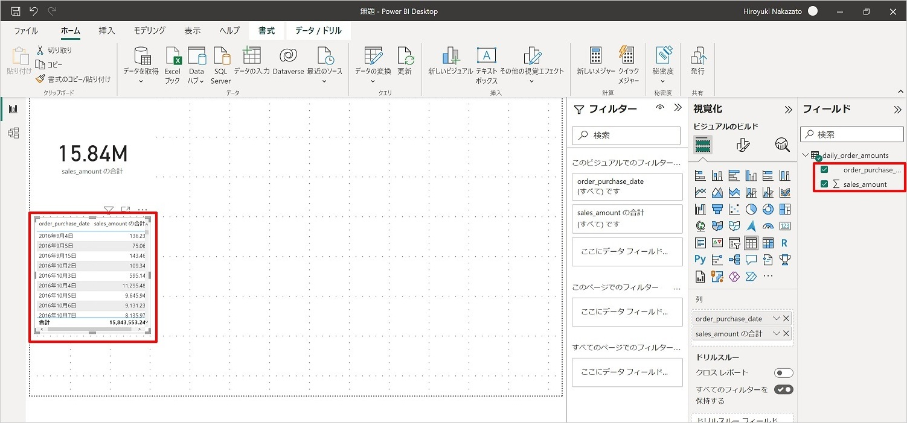

6) キャンバス上の視覚化の並びを整理します。キャンバスの何もないところをクリックして視覚化が選択されていない状態にした上で **[視覚化]** > **[折れ線グラフ]** をクリックします。キャンバスに折れ線グラフの視覚化が追加されます。

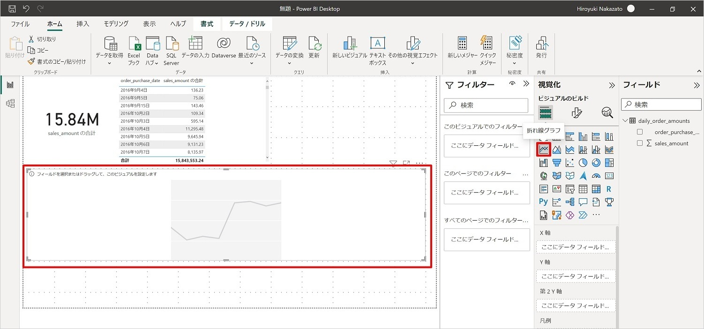

7) キャンバス上の折れ線グラフの視覚化を選択した上で **[フィールド]** > `daily_order_amounts` > `order_purchase_date` と `sales_amount` にチェックを入れます。折れ線グラフの視覚化が更新されます。

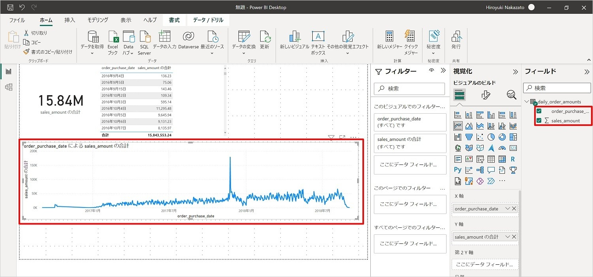

8) キャンバスの何もないところをクリックして視覚化が選択されていない状態にした上で **[視覚化]** > **[スライサー]** をクリックします。キャンバスにスライサーの視覚化が追加されます。

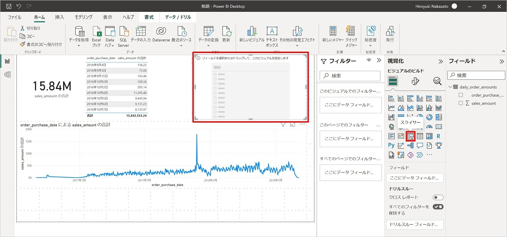

9) キャンバス上のスライサーの視覚化を選択した上で **[フィールド]** > `daily_order_amounts` > `order_purchase_date` にチェックを入れます。スライサーの視覚化が更新されます。

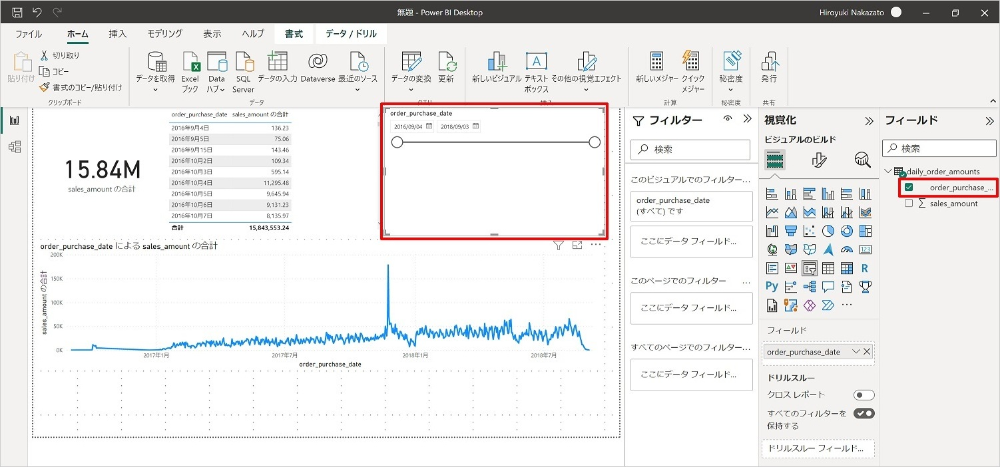

10) キャンバス上の視覚化の並びを整理します。スライサーを動かしてレポートの表示が更新されることを確認します。

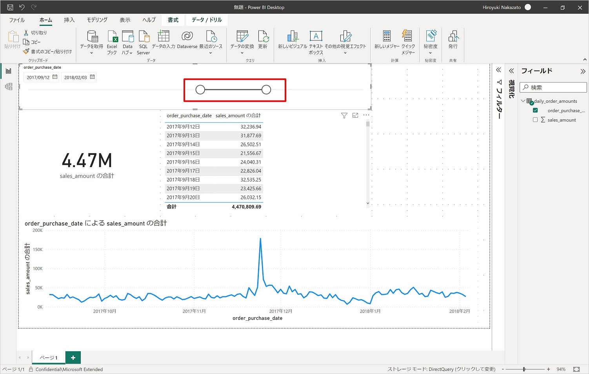

### **🎉 まとめ**
この章では、前章で作成した日別の注文金額の集計結果 (Daily Order Amounts) について、Power BI Desktop のレポートで可視化しました。

ワークショップの本編はこの章で終了です。以降の章は Appendix ですので、必要に応じて取り組んでみてください。長時間お疲れ様でした。

## [Appendix] Databricks SQL のクエリ履歴の確認
Duration: 00:10:00

この章では、Databricks SQL のクエリ履歴の確認方法を学びます。

1) Databricks SQL の左側メニューの **[クエリ履歴]** にアクセスします。これまでに実行したクエリ履歴の一覧が表示されます。

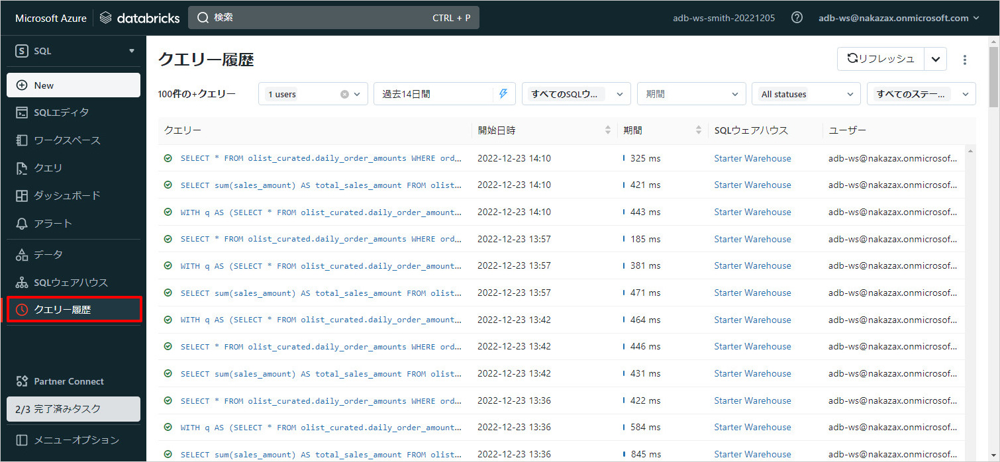

2) 適当なクエリを選択します。画面右側にクエリの概要や期間、集計タスク時間などが表示されます。**[クエリ プロファイルを表示]** をクリックします。

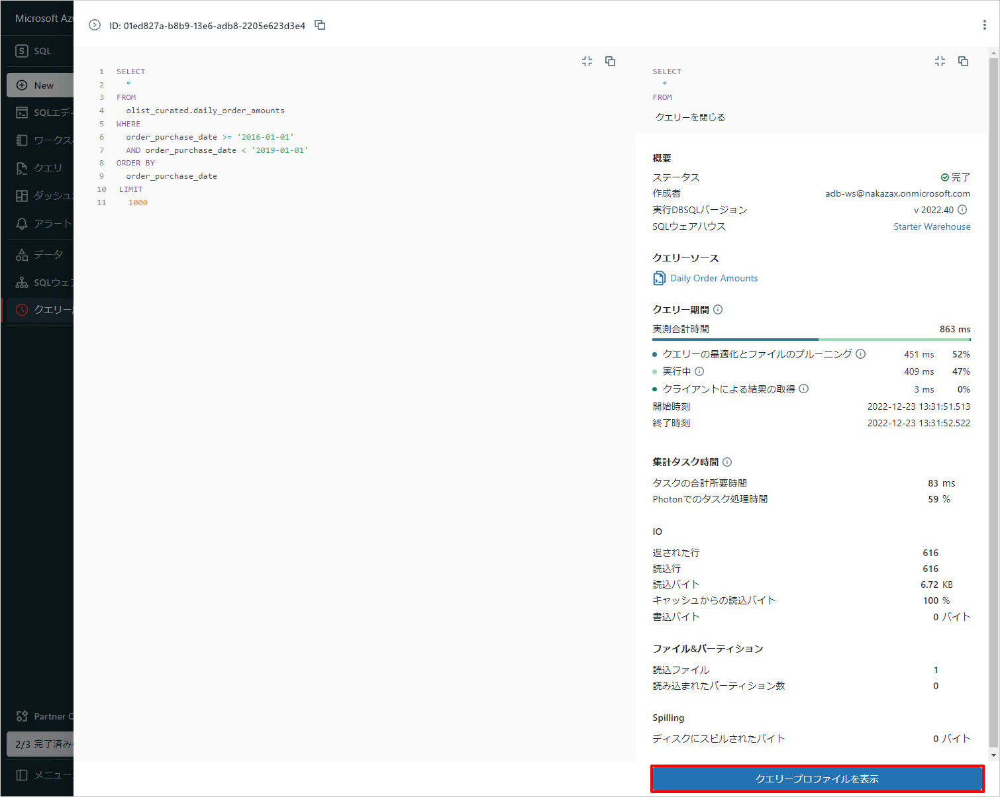

3) すると画面左側にクエリ プロファイルのグラフ ビューが表示されます。より詳細な情報が見たい場合は画面右上の三点をクリックし **[Spark UI で開く]** をクリックします。

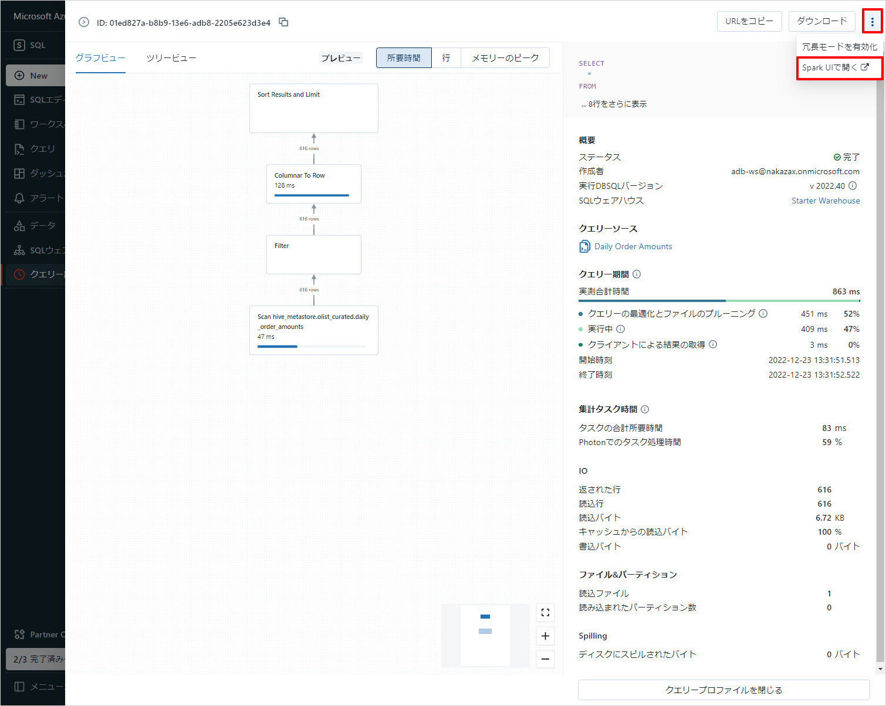

4) Spark UI が表示されますので、Spark 上でクエリがどのように実行されたかの詳細を見ることができます。

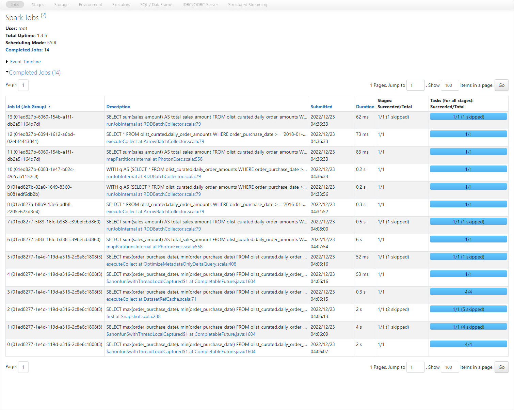

5) なお、キャッシュから結果が返されたクエリについては以下キャプチャのように、クエリ プロファイルは確認できない点に留意ください。

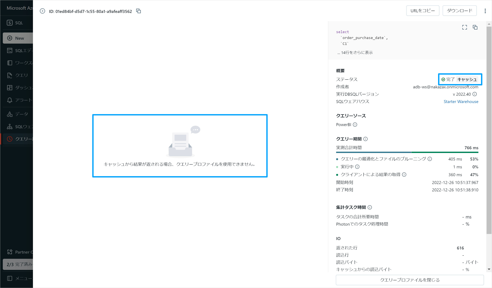

本章は以上です。

## [Appendix] Databricks ノートブックを用いた Delta Lake 形式への変換
Duration: 00:20:00

この章では、分析対象のデータセットのうち Orders と Order Items **以外** のデータセットについて、Databricks ノートブックを使って CSV から Delta Lake 形式に変換します。

### **1. クラスターの作成**
1) Databricks の Data Science & Engineering のペルソナの左側メニューの **[コンピューティング]** にアクセスし **[Personal Compute で作成]** をクリックします。

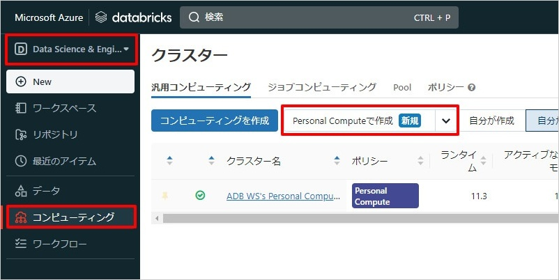

2) 新しいクラスターの作成画面で以下の項目を設定し **[クラスターを作成]** をクリックします。通常 5 分程度でクラスターの作成が完了します。完了を待たずに次のステップに進みましょう。

**項目** | **設定値**
--- | ---
Databricks Runtime のバージョン | **`Runtime: 11.3 LTS (Scala 2.12, Spark 3.3.0)`** を選択します。
ノードタイプ | **`Standard_DS3_v2`** を選択します。
非アクティブ状態が … 分継続した後に終了 | **`60`** 分に変更します。

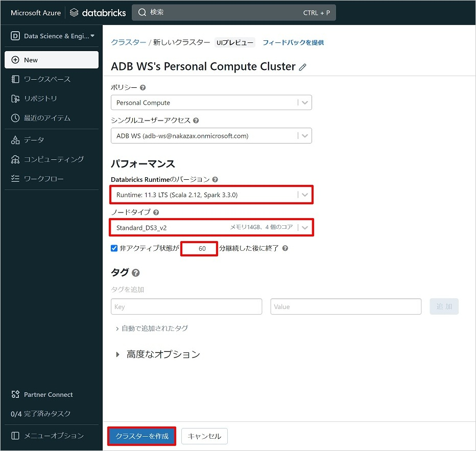

### **2. リポジトリの追加**
1) Databricks の Data Science & Engineering の左側メニューの **[リポジトリ]** にアクセスし **[リポジトリを追加]** をクリックします。

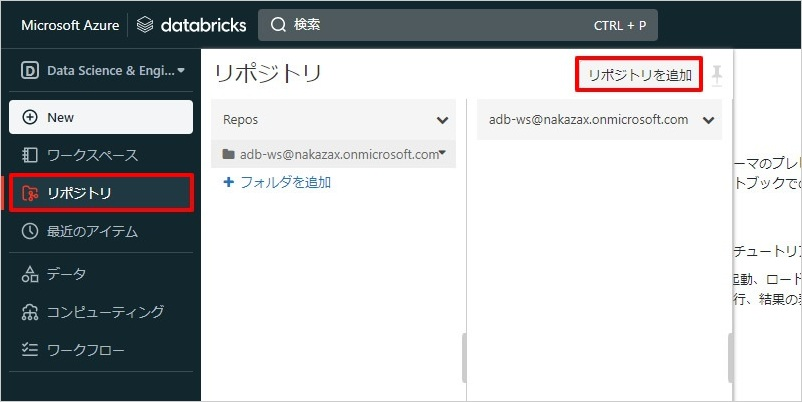

2) リポジトリの追加画面で以下の項目を設定し **[リポジトリを作成]** をクリックします。

**項目** | **設定値**
--- | ---
Git リポジトリの URL | **`https://github.com/microsoft/azure-databricks-sql-workshop-ja`** を入力します。

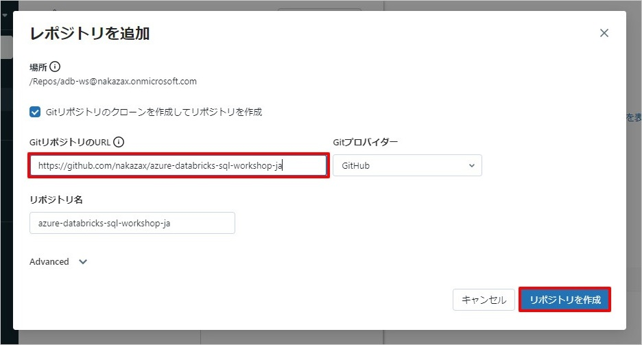

### **3. ノートブックの実行**
1) クローンした Git リポジトリ `azure-databricks-sql-workshop-ja` の `notebooks` > `Enrich Olist Datasets with ADB Notebook` を表示します。


2) 定数設定のセルの値について必要に応じて自身の環境に合わせて書き換えます。


3) **[接続]** をクリックし先ほど作成したクラスターを選択します。

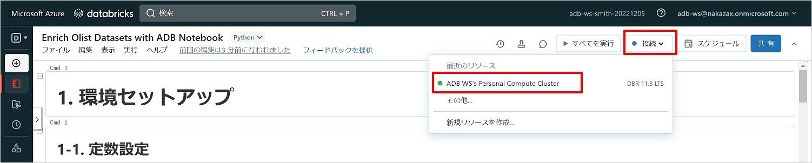

4) **[すべてを実行]** をクリックします。

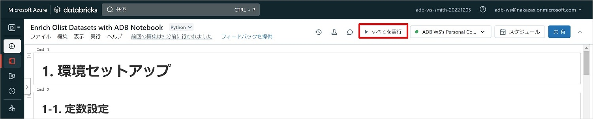

5) すべてのセルの実行が正常に完了することを確認します。

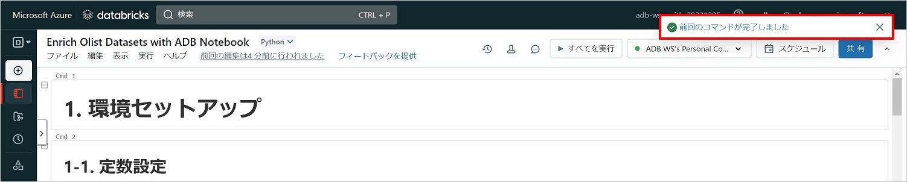

6) Databricks SQL のデータ エクスプローラーにアクセスし `olist_enriched.customers` などの Delta テーブルが作成されたことを確認します。

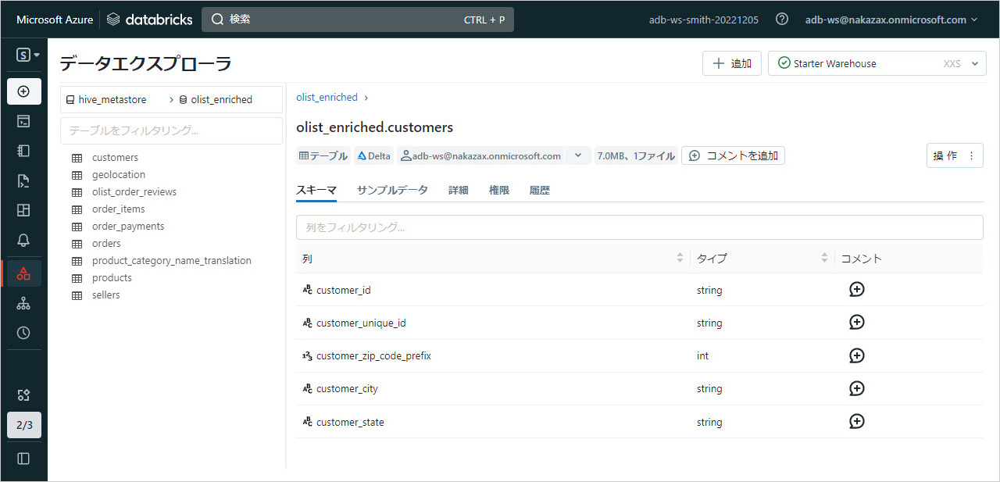

本章は以上です。
